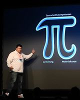
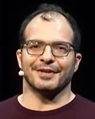
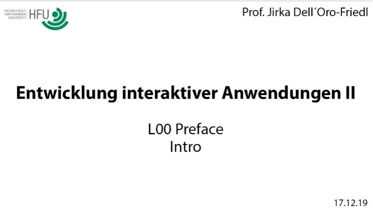

# L00_Preface  
> **Hinweis:** In den Texten dieser Lektionen wird das geschlechtergerechte Neutrum verwendet, siehe <https://jirkadelloro.github.io/Neutrum>

## Medienkonzeption und Digitale Medien  
Die grundlegendste Eigenschaft eines Konzepteris ist die Kommunikationsbereitschaft, und zwar in beide Richtungen. Es genügt bei Weitem nicht gute Ideen zu haben und sie anderen mitzuteilen. Zunächst muss es herausfinden, welches Problem überhaupt mit der Idee gelöst werden soll. Hierzu muss es vor allem die richtigen Fragen stellen! Und natürlich dann auch die Antworten aufnehmen und verstehen. Kernideen werden meist ohnehin in der Gruppe erdacht, es ist die Aufgabe des Konzepteris sie dann weiterzuentwickeln und dabei ständig in der Kommunikation mit allen Beteiligten zu bleiben. Ein Konzepteri kann nicht verharren und warten, bis ihm mitgeteilt wird, was es zu tun hat. Stattdessen ist es die Aufgabe des Konzepteris Probleme zu erkennen, zu recherchieren, fachgerechte Lösungen zu finden und sie nach den Regeln der Kunst in unterschiedlichen Formaten, insbesondere Skizzen und Diagrammen, festzuhalten und mit deren Hilfe den anderen Teammitgliedern mitzuteilen, was wie zu tun ist.  

Die Vermittlung der Inhalte in diesem Modul ist bereits eine Problemstellung und eignet sich so zur Übung:  

> **Hinweis:** mit der Checkbox werden in diesen Lektionen Übungen markiert. Es ist wichtig, dass Du diese Übungen tatsächlich selbst machst, manches erschließt sich erst dadurch und wird nicht auf andere Art vermittelt!  

- [x] Stelle dir zunächst selbst folgende Fragen: Warum studierst Du? Warum studierst Du Medienkonzeption? Warum an der Fakultät Digitale Medien?
- [x] Recherchiere: Was sind Medien? Was sind digitale Medien? Was bedeutet digital überhaupt? Was ist der Unterschied zwischen digitalen und analogen Medien? Welche Medienerlebnisse kann man mit digitalen Medien erschaffen, die mit analogen Medien nicht möglich sind oder nur mit unverhältnismäßig hohem Aufwand?
- [x] Recherchiere: Was ist ein Konzepteri? Was macht ein Konzepteri im Bereich der digitalen oder "neuen" Medien? Was sind weitere ggf. englische Bezeichnungen für das Konzepteri in diesem Bereich?
- [x] Diskutiere mit deinen Kommilitonis: welche Fähigkeiten und Eigenschaften braucht das Konzepteri im Bereich der Digitalen Medien außer der oben beschriebenen Kommunikationsbereitschaft? Wie können diese vermittelt werden? Was muss ein Studenti tun um sie sich anzueignen, was ist seine Aufgabe im Lernprozess?
- [x] Stelle deine Ergebnisse im Workshop vor!

  

    Anforderungen an Medienkonzepteri im Bereich der digitalen Medien
  

  <ul>
<li> Arbeitet sich sehr schnell auch in komplexe Sachverhalte selbständig ein.</li>
<li> Kommuniziert intensiv und strukturiert mit allen Projektbeteiligten.</li>
<li> Bereitet Information auf und macht sie für Nutzeris auf unterschiedlichen Kanälen zugänglich.</li>
<li> Entwirft und beschreibt Algorithmen und Datenstrukturen für interaktive Anwendungen.</li>
<li> Verfügt über tiefgreifende und weitreichende Kenntnisse in allen Bereichen der Konzeption, Produktion, Distribution und Anwendung des Medienprodukts.</li>
  </ul>

  

    Ziele bezüglich fachlicher und berufsfeldorientierter Kompetenzen laut Studiengangsbeschreibung MKB
  

  <ol>
<li> Kenntnisse der Kommunikationstheorien, -Prozesse und Mediensysteme</li>
<li> Methodische Kenntnisse von Kreativ- und Konzeptionsprozessen</li>
<li> Anwendung dieser auf (multi)mediale Konzepte und Mediensysteme</li>
<li> Tiefergehende Kenntnisse von Medienproduktionsprozessen</li>
<li> Weitreichende Kenntnisse der Technologie von Mediensystemen</li>
<li> Kenntnisse des Selbstmanagements, Teambuildings und Projektmanagements</li>
<li> Erwerb erster Praxiserfahrungen im Feld der Medienkonzeption</li>
<li> Verantwortliche Tätigkeit in der Konzeption von Mediensystemen und medialen Kommunikationsinstrumenten im Umfeld von Agenturen, Unternehmen oder Institutionen</li>
<li> Mitarbeit in bzw. Leitung von Konzeptionsteams und Schnittstelle zu Marketingstrategen, Entwicklern, Programmierern, Designern und Artworkern</li>
<li> Schaffung der erforderlichen Grundlagen für eine spätere Existenzgründung in einem der oben beschriebenen Bereiche</li>
  </ol>
Alle diese Ziele werden in EIA2 adressiert. Um die erforderlichen weitreichenden und tiefergehenden Kenntnisse zu erlangen, ist sehr viel eigenverantwortliches Lernen und Üben über die Präsenzveranstaltungen hinaus nötig. Dabei kann und muss die EIA-Reihe lediglich ein unverzichtbares Verständnis einiger der wichtigsten Grundlagen erwirken, im Hauptstudium werden damit praxisnahe Anwendungen konzipiert und entwickelt und damit die Kompetenz weiter gesteigert.

 

## Motivation  
- [x] Klicke auf die Startsymbole und schaue dir die Videos an. Sie geben dir einen Einblick in die Möglichkeiten, die sich durch den Kurs für dich eröffnen werden, wenn Du aktiv mitarbeitest, und sie vermitteln dir, wie dringlich die Inhalte sind. Verlasse die Rolle des Konsumentis und werde zum Macheri! Du stehst am Scheideweg: wirst Du zu denen gehören, die Maschinen beherrschen, oder zu jenen, die Maschinen beherrschen? (kleines Kōan zum Meditieren)

<a href="https://www.youtube.com/watch?v=y-t8SWdogGo&t=1439s"> Digital Designer | Dr. Marcus Trapp | UX-DAY KONFERENZ 2018</a>    

Wenn Du Digital Designer werden willst, wenn Du das wirklich richtig machen willst, musst Du sowohl diese Gestaltungskompetenz mitbringen, als auch diese Materialkunde. Und in unserem Fall ist das Material eben halt digital. "Kenne ich die Methoden? Kenne ich die Tools? Weiß ich was das bedeutet? Kenne ich die Technologien?"

  

<a href="https://youtu.be/-jRREn6ifEQ"> The poetry of programming | Linda Liukas | TEDxCERN</a>    

When I was a girl, I wanted to be a storyteller. I loved make-believe worlds and my favorite thing to do was to wake up in the mornings in Moominvalley, in afternoons I would roam around the Tatooines, and in the evenings I would go to sleep in Narnia. And programming turned out to be the perfect profession for me. I still create worlds. Instead of stories, I create them with code. Programming gives me this amazing power to build my whole little universe with its own rules and paradigms and practices. Create something out of nothing with the pure power of logic. And that probably makes me into a poet. 

  

<a href="../X01_Appendix/Crawford/Crawford.html"> Algorithms and Art | Chris Crawford</a>    

Good artists have never been intimidated by some technology. They figure a technology is a tool to express myself with. They roll up their sleeves, they get their hands dirty and they use the tool to get the job done! Wether it's a welding torch, the intestines of a cat, oil paint, whatever. You use the technology to get the job done. And the computer is far and away the most expressive and the most powerful medium of expression that we ever had, and if you want to use it, you've got to speak its language... sorry.

  

<a href="https://www.youtube.com/watch?v=MvTSPwftvyo"> Learning to Code is Not Just for Coders| Ali Partovi | TEDxSausalito</a>   

Learning how to write isn't just for people who grow up to become writers, math isn't just for mathematicians. Every public school teaches these topics because they're foundational for other pursuits. Once you know how to read and write, you use those skills to learn new ideas and more importantly, to create your own ideas and to share them. Computer science isn't simply about learning how to code. Learning how to code is a start. Once you know the language, that's when your imagination takes over. That's when you can begin to take on complex problems and to create new things.

  

## Überblick 

  
   
<a href="http://hdl.handle.net/10900.3/OER_XDVTECCQ"> L00 Preface: Intro</a>

### Rückblick
Im Modul "Entwicklung interaktiver Anwendungen I" (EIA1) wurdest Du zunächst an HTML und CSS heran geführt, um damit eine Grundlage für die weiteren Schritte zu schaffen. Denn als technische Plattform dienen in dieser Modulreihe Internetbrowser, da sie auf allen gängigen Geräten zur Verfügung stehen. 
Darüber hinaus hast Du tiefergehende Kenntnisse im Umgang mit einer imperativen Programmiersprache erlangt und Aufgaben mit Hilfe einfacher, prozeduraler Algorithmen gelöst. Es wurde TypeScript verwendet, da - im Vergleich zu JavaScript - einerseits die verwendeten Datenstrukturen sichtbar werden und andererseits automatische und umfassende Hilfestellung bei der Implementation gewährleistet wird. Auch erste Interaktionen konntest Du mit Hilfe der Ereignissteuerung umsetzen. Durch die Manipulation des "Document Object Model" (DOM) konntest Du die Reaktionen des Systems für Nutzeris planvoll sichtbar machen. Hierzu hast Du ein gutes Verständnis der DOM-Klassenhierarchie und des Laufzeitverhaltens erlangt.

### Einblick
Es ist erforderlich, dass sämtliche Inhalte des Moduls EIA1 verinnerlicht sind und angewendet werden können, insbesondere
- Die Arbeit mit Github und Visual Studio Code
- Die Informationsrepräsentation im binären und hexadezimalen System
- Die grundlegenden in JavaScript und TypeScript verwendeten Datentypen
- Einfache und assoziative Arrays
- Die Sprachkonstrukte imperativer
Programmiersprachen: Anweisungen, Operatoren, Kontrollstrukturen, Funktionen
- Generierung dynamischer Webseiten
- DOM-Klassen- und Laufzeit-Hierarchie
- Problemlösungsstrategie
- Die Arbeit mit der Browserkonsole und Debugging im Browser

### Ausblick
In EIA2 lernst Du, auch komplizierte Aufgabenstellungen anzugehen, wobei die Konzeption im Vordergrund steht. Hierzu wirst Du Diagrammformen der "Unified Modelling Language" (UML) verwenden, um mit deren Hilfe Probleme zu durchdringen und Lösungen zu konzipieren. Ihre nachfolgenden Implementationen mit TypeScript stellen lediglich Nachweise der erfolgreichen Konzeption dar.  

## Veranstaltungskonzept
[Use Case Diagram](../X01_Appendix/UML/UCD_EIA2-Contact.svg)  
[Activity Diagram - Woche](../X01_Appendix/UML/AD_EIA2-Week.svg)  
[Activity Diagram - Konzeption](../X01_Appendix/UML/AD_Konzeption.svg)  

- [x] Untersuche die Diagramme. Kannst Du schon etwas nachvollziehen, was sie vermitteln? Alle Symbole sind genormt und haben besondere Bedeutung, grobe Zusammenhänge erschließen sich aber vielleicht schon intuitiv. In diesem Kurs geht es vordringlich darum dich in die Lage zu versetzen, solche Diagramme korrekt und sinnvoll selbst zu zeichnen.

### Sektionen
#### Sektion 1
besteht aus den Lektionen 01 bis 03 und behandelt tiefergehend die Arbeit mit HTML-Elementen und dem DOM, um komplexere und vor allem dynamische interaktive Anwendungen auf dieser Basis planen und entwickeln zu können. Außerdem werden die interaktiven Formularelemente des HTML-Standards eingesetzt und ausgewertet.  

#### Sektion 2
besteht aus den Lektionen 04 bis 06 und behandelt die Verteilung einer Anwendung auf Client-Server-Datenbank-Systeme, so dass Du moderne Anwendungen konzipieren kannst, welche Informationen im Internet dynamisch verarbeiten und verwalten und den Nutzern zur Interaktion bereit stellen. Die Komplexität liegt hier weniger in den Algorithmen als in der Vielzahl der Systeme und der Kommunikation zwischen ihnen. Lektion 07 ist in Lektion 06 aufgegangen.

#### Sektion 3
besteht aus den Lektionen 08 bis 11 und behandelt die Frage, was überhaupt diese "Objekte" sind, mit denen die ganze Zeit gearbeitet wurde, wie man solche selbst erstellt und was man damit noch machen kann. Hier öffnet sich ein intuitiver Zugang zur Entwicklung interaktiver Anwendungen der unabhängig von Betriebssystemen, Plattformen und dergleichen ist. Mit den erlangten Kenntnissen lassen sich nicht nur klassische Websites, sondern Anwendungen in völlig anderen Bereichen planen und entwickeln, von der nativen Smartphone-App bis zu voll ausgereiften Konsolengames. Es wird mit animierter und interaktiver Grafik und dem HTMLCanvasElement gearbeitet, was eine freie Gestaltung zulässt.

### Vorbereitung
Eine Lektion wird im Zeitraum von ein bis zwei Wochen bearbeitet. Du arbeitest vordringlich selbständig und bereitest dich dadurch auf die Workshops vor. Dabei ist es wichtig, dass Du die Übungen, die in den Lektionen angegeben sind auch tatsächlich machst und bei den Videos parallel selbst mitarbeitest. Das gilt sowohl für die Konzeption, insbesondere das Zeichnen der Diagramme, als auch die Codierung. Allein das Durchlesen und Anschauen der Lektionen wird dir nicht den erforderlichen Lernerfolg bescheren. Pflege deine Ergebnisse in dein eigenes EIA2-Repository auf Github ein.

### Fragensammlung
Mache dir bei der Vorbereitung Notizen (am besten nicht am Computer sondern auf Papier, so lernst Du besser ) und formuliere Fragen für den Workshop. Notiere dabei möglichst genau die Situation, um die es geht und gegebenfalls was erforderlich ist, um sie zu reproduzieren. Poste deine Fragen gerne vorab auf Github oder auf Discord. So entsteht eine Sammlung von Fragen, die im Workshop diskutiert und beantwortet werden. Gerne kann dies aber auch schon im Vorfeld auf diesen Plattformen stattfinden, insbesondere wenn es erforderlich ist, um die Lektion überhaupt weiter bearbeiten zu können. Neben dem Dozenten und den Betreueris tummeln sich dort auch fortgeschrittene Studentis und Alumni, die Spaß daran haben, dir zu helfen.

Spiellabor Server auf Discord: <https://discord.gg/xTWvup8A5j>  
EIA2-Repository Issues: <https://github.com/JirkaDellOro/EIA2-Inverted/issues>

### Workshop 
Im Workshop werden Fragen beantwortet und Unklarheiten beseitigt. Dabei steht der Austausch mit deinen Kommilitonis im Vordergrund. Im Idealfall klärt ihr die Dinge selbst, anstatt nur die Antworten eines Dozenten zu rezipieren. Der Dozent ist aber dabei um Irrwege und Ineffizienz zu vermeiden und im Zweifelsfall zu klären. **Achtung:** es gilt die strenge Regel, dass im Workshop nur Detailfragen zur aktuellen Lektion bearbeitet werden!

### Wochenaufgabe
Jede Woche ist eine Aufgabe zur Lektion zu bearbeiten, die in der Regel am Ende des Workshops präsentiert wird (tretet dem Dozenten virtuell auf die Füße, wenn er nicht bis zum Abend eine schriftliche Version vorlegt!). Bei Lektionen, die über zwei Wochen bearbeitet werden, wird eine Aufgabe zum Einstieg und in der zweiten Woche eine weitergehende Aufgabe formuliert. Daran sollen die Inhalte geübt und verinnerlicht werden. Mache dich mit den Regeln zu den Wochenaufgaben vertraut: <https://github.com/JirkaDellOro/EIA2-Inverted/wiki>

### Praktikum
Im Praktikum werden eure Ansätze zur Lösung der aktuellen Aufgabe diskutiert, Ideen gesammelt und Rückmeldung zu euren Formulierungen gegeben. Daher musst Du zu diesem Zeitpunkt wenigstens ein Minimalkonzept vorlegen können oder im Idealfall bereits mit der Lösung der Aufgabe etwas fortgeschritten sein, um dort qualifizierte Fragen stellen zu können. Hast Du die Aufgabe bereits vollständig gelöst, freuen wir uns trotzdem über deine Mitwirkung.
**Achtung:** während des Praktikums wird nur die aktuelle Aufgabe bearbeitet und Fragen zum Code oder zur Programmierung können nur beantwortet werden, wenn ein sinnvolles Konzept vorliegt. Wir können dir nicht helfen, wenn wir nicht erkennen können, was Du eigentlich vorhast. Und häufig genügt bereits dein Versuch, dein Vorhaben klar zu formulieren (das ist Konzeptarbeit!), um dein Problem zu lösen.

### Hilfe
Auch zu der Bearbeitung der Aufgaben freuen sich Dozent und die studentischen Hilfskräfte über qualifizierte Fragen. Nutze die oben genannten Kontaktmöglichkeiten auf Discord oder Github. Wir versuchen so schnell wie möglich zu antworten. Du selbst bist herzlich eingelaen, dich an der Beantwortung der Fragen anderer zu beteiligen, auch wenn Du dir nicht ganz sicher bist. Auch eine falsche Antwort ist wertvoll, wenn sie korrigiert wird. **Achtung:** nimm diese Hilfe in Anspruch, wenn Du für ein Problem innerhalb von 15 Minuten noch keinen Lösungsansatz findest! Es ist unklug, erst Stunden an einer Stelle hängen zu bleiben, die mit einem kleinen Stupser leicht überwunden werden kann. Wir erwarten nicht, dass Du gut coden kannst, aber wir erwarten, dass Du offen kommunizierst und fragst! Wenn Du doch selbst auf die Lösung kommst, bevor jemand antwortet, beschreibe sie bitte kurz und schließe den Issue.  

## Tipps
Um diesen Kurs erfolgreich bestehen zu können, ist ein wenig Planung sicher äußerst hilfreich. Mach' dir einen Zeitplan für die Auseinandersetzung mit dem Stoff. Plane mindestens fünf Stunden für die Vorbereitung zum Workshop ein, in denen Du in Ruhe daran arbeiten kannst. Vielleicht verteilt auf die beiden Tage vor dem Workshop. **Beachte dabei, dass es unbedingt erforderlich ist, dass Du auch die Übungen innerhalb der Lektionen machst.** Trage in deinem Stundenplan noch einmal zwei Stunden zwischen dem Workshop und dem Praktikum ein, um die Wochenaufgabe zu beginnen und schließlich mit entsprechend vorbereitetem Material und sinnvollen Fragen ins Praktikum zu kommen. Wieviel Zeit Du dann noch brauchst um die Aufgabe abzuschließen ist natürlich sehr individuell, aber auch hierfür solltest Du einiges reservieren.
