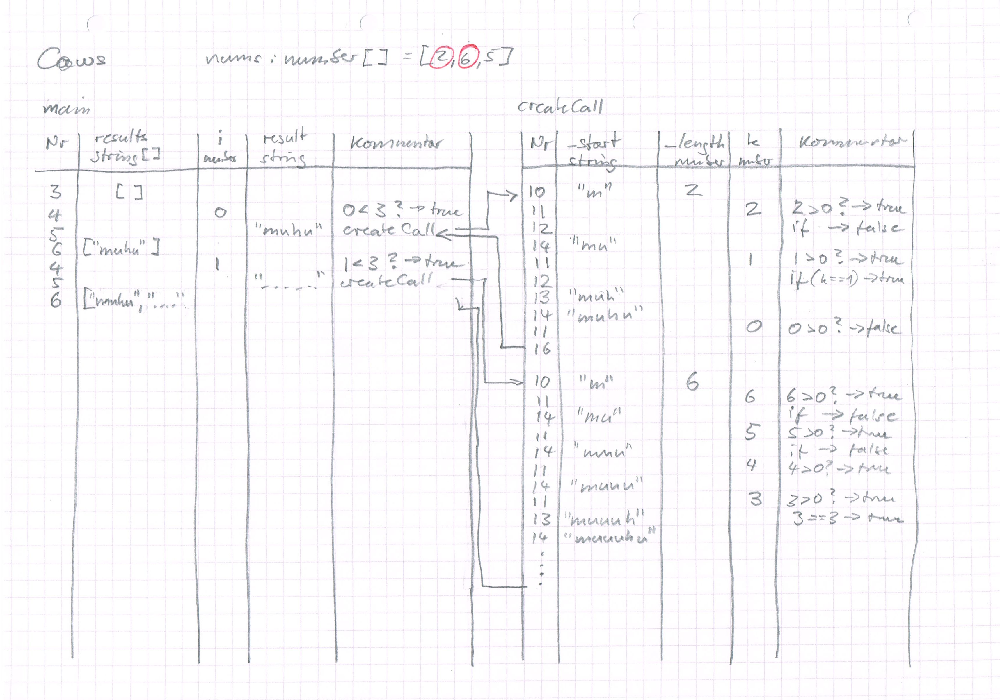
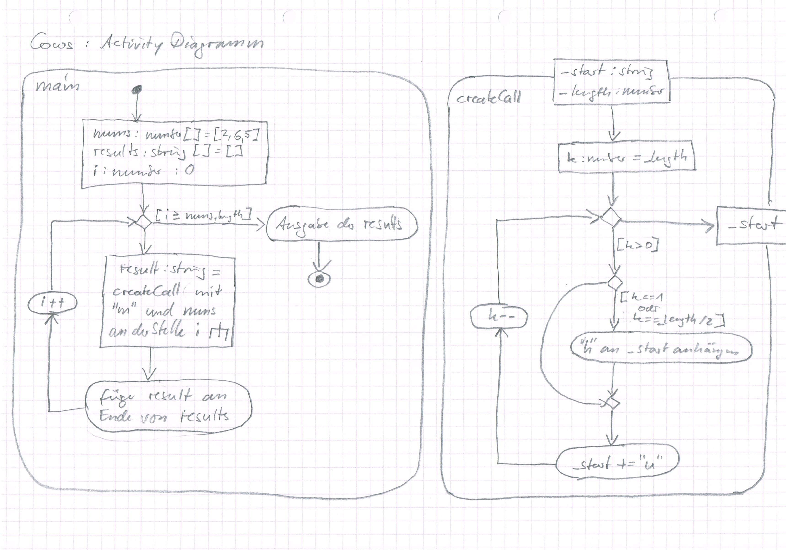

# L01 Recap & Foundation

<small>Quelle: <a href="https://www.challengecharterschool.net/wp-content/uploads/2017/07/Steve-Jobs.jpg">https://www.challengecharterschool.net/wp-content/uploads/2017/07/Steve-Jobs.jpg</a></small>

## Einleitung
In diesem Kapitel wiederholst und festigst Du einige Inhalte der Veranstaltung "Entwicklung interaktiver Anwendungen I". Ein tiefes Verständnis dieser und ein sicherer Umgang mit diesen ist Voraussetzung für die folgenden Kapitel.
Außerdem wirst Du die Aktivitätsdiagramme der "Unified Modelling Language" (UML2.5) kennen lernen, mit deren Hilfe Du im weiteren Verlauf der Veranstaltung Algorithmen beschreiben und konzipieren wirst.
Darüber hinaus lernst Du mit Verfolgungstabellen (Trace Tables) und dem browserinternen Debugger umzugehen, welche wichtige Werkzeuge für die Fehlersuche während der Implementation deiner konzipierten Anwendungen sind.  

## Rückblick
Aus "Entwicklung interaktiver Anwendungen I" sind dir bekannt:
- Grundlagen imperativer, prozeduraler Programmierung
  - Anweisungen und Anweisungsfolgen
  - Variablen und Datentypen, primitiv und komplex
  - Kontrollstrukturen wie Bedingungen und Schleifen
  - Funktionen und Parameter  
- Document Object Modell
  - Klassenhierarchie, welche die Vererbungsbeziehungen beschreibt und wie die Funktionalitäten der Elementtypen erweitert werden.
  - Objekthierarchie der Elemente und wie damit ein Dokument beschrieben und manipuliert werden kann (Parent-Child-Relation).
- Standard JavaScript Objects
    - Array
    - Math
    - ggf. weitere
- Standard Browser Objects
    - Window
    - Document
    - ggf. weitere
- Globale JavaScript Functions
    - parseInt(...)
    - parseFloat(...)
    - ggf. weitere

## Einblick
Ein Computer kann, sehr vereinfacht ausgedrückt, eigentlich nicht viel mehr, als Information aus einem Speicher auszulesen, sie mit einer anderen Information zu verknüpfen, beispielsweise mit Hilfe einer mathematischen Operation, und das Ergebnis wieder im Speicher abzulegen. Der Code
```typescript
v = v + 1;
```
schaut an der Stelle im Speicher, die mit `v` bezeichnet ist nach dem dort hinterlegten Wert, addiert den literal angegebenen Wert `1` dazu und speichert das Ergebnis wiederum an die Stelle `v` zurück.  

>**Achtung:** bei Verwendung des Zuweisungsoperators `=` wird zuerst der Ausdruck auf der rechten Seite ausgewertet und das Ergebnis der linken Seite zugewiesen.  

## Variablen
Die mit `v` bezeichnete Speicherstelle kann also unterschiedliche Werte halten, ihr Wert ist variabel. Vereinfachend spricht man meist schlicht von der "Variablen `v`".  
Damit das obige Programm laufen kann, muss also diese Variable überhaupt erst existieren.

- [x] Öffne einen Browsertab, bzw. eine beliebige Seite (z.B. hs-furtwangen.de), und darin die Konsole. Tippe die obige Programmzeile ein und drücke die Enter-Taste, Du solltest so einen 'ReferenceError' provozieren können.  

Eine Variable wird mit Hilfe des Schlüsselworts `let` angelegt. Diesen Vorgang nennt man **Deklaration**.
```typescript
let v;
```

- [x] Tippe in die Browserkonsole `let v;`. Was passiert jetzt? Mit Hilfe der Pfeiltasten kannst Du nun die zuvor getippte Zeile wieder hervorholen und erneut ausführen lassen. Was ist das Ergebnis?  

NaN bedeutet "Not a Number", das Ergebnis ist also keine Zahl. Das liegt daran, das `v` zwar existiert, aber den Wert `undefined` hatte. Das Ergebnis von `undefined + 1` ist sicher keine Zahl sondern `NaN`.  
Was bislang noch fehlt ist die **Definition** von `v` so dass diese Variable einen Wert besitzt, bevor damit gerechnet wird. Das erreicht man einfach mit dem Zuweisungsoperator und einem literalen Wert.  

>**Achtung:** 
> Ganz wichtig: `=` bedeutet nicht, wie Du es aus Mathe kennst "ist gleich", sondern es ist die Anweisung, die rechte Seite auszuwerten und das Ergebnis der linken Seite zuzuweisen. Daher der Name "Zuweisungsoperator". 

- [x] Tippe `v = 1` in die Browserkonsole und lasse dann die Programmzeile erneut ausführen. Was geschieht nun?  

Das vollständige Programm inklusive einer Zeile für die Ausgabe in der Konsole sieht nun also folgendermaßen aus:
```typescript
let v = 1;
v = v + 1;
console.log(v);
```  

- [x] Erstelle das Programm mit TypeScript in VSCode und teste es im Browser.

>**Achtung:** 
> - Du weißt nun, was Deklaration und was Definition bedeutet und kennst den Unterschied.
> - Deklaration und Definition können in eine Zeile geschrieben werden.
> - Neben `let` wird auch, und wurde vor allem früher, das Schlüsselwort `var` verwendet, dass aber eine etwas andere Wirkung hat. Wir verwenden konsequent `let`! 
> - Daneben gibt es noch `const`, wobei die Definition zusammen mit der Deklaration geschehen muss. Damit kannst Du angeben, dass der Wert der Veriablen danach nicht mehr verändert werden darf, sie ist also eine Konstante. Beim Versuch sie zu verändern wird durch eine Fehlermeldung darauf aufmerksam gemacht.  

- [x] Probiere das Programm vorübergehend mit `const` statt `let` und schau was passiert.

## Datentypen
Die heute gebräuchlichen Computer speichern Informationen als lange Serien von Bits, kleinste Informationseinheiten, die nur zwei Zustände aufweisen können: an und aus. Damit werden aber ganz unterschiedliche Typen von Informationen kodiert: Zahlen, Texte, Bilder, Musik, Videos usw.  
Damit der Rechner nun aber die Informationen korrekt verarbeiten kann, muss bekannt sein, welchen Typ eine Bitfolge darstellen soll.  

- [x] Zeige mit dem Mauscursor in VSCode auf `v` in dem zuvor eingegebenen Programm. Was erscheint im Tooltip?

Typescript erkennt aus dem Zusammenhang, dass `v` vom Typ `number` sein soll. Diese Erkennung nennt man "inference".  

- [x] Setze die `1` bei der ersten Definition von `v` in Anführungszeichen. Welcher Typ wird nun angezeigt? Was wird ausgegeben, wenn das Programm nun läuft?

Typescript hat erkannt, dass `v` nun eine Zeichenkette darstellen soll, auch wenn nur ein Zeichen, die Ziffer 1, darin enthalten ist. Damit hat sich aber auch die Programmlogik geändert, denn der Additionsoperator `+` ist für Zeichenketten ganz anders definiert als für Zahlen.

- [x] Definiere `v` mit dem Schlüsselwort `true`. Welcher Typ wird nun angezeigt? Was ist nun zusätzlich zu sehen? Und was geschieht, wenn Du das Programm laufen lässt? (sofern es überhaupt kompiliert wurde...prüfe  hierzu das entstandene js-File, es sollte identisch sein)

>**Achtung:** Du erkennst, dass Datentypen essentiell wichtig sind und die ganze Logik eines Programms verändern! JavaScript geht allerdings sehr lax damit um und ändert, wenn man nicht sehr aufpasst, durchaus auch Datentypen während des Programmlaufs, weshalb hier viele Fehler passieren. TypeScript schafft Abhilfe...

So angenehm es auch ist, dass TypeScript die Typen aus dem Kontext inferieren kann und in der Folge auf Typfehler aufmerksam macht: noch besser ist es, sich bereits bei der Konzeption Gedanken um die gewünschten Datentypen zu machen und diese festzulegen!  
Daher ist in diesem Kurs die **explizite Annotation** der Typen vorgeschrieben. Das bedeutet, dass bei der Deklaration der geforderte Typ durch Doppelpunkt getrennt hinter den Variablenbezeichner geschrieben werden muss. Eine vollständige Deklaration und Definition mit Typannotation folgt also diesem Muster:  
`let/const name: type = value;`

## Primitive Datentypen
In Programmiersprachen gibt es oft eine große Zahl von fundamentalen Datentypen, mit denen man sich gut auskennen muss. Bei TS/JS ist dies sehr vereinfacht und von Bedeutung für uns sind nur die drei primitiven Typen 
- `number`,
- `string` und 
- `boolean`  

- [x] Annotiere `v` in der Deklaration als `number`. Wie verändert sich nun die Anzeige des Codes?

Eine andere Zuweisung als die eines Zahlenwertes ist nun gar nicht mehr erlaubt, Du wirst schon darauf hingewiesen, während Du das Programm noch schreibst. 

- [x] Setze nun statt `true` wieder die Zahl `1` ein, aber verändere den Addenden in Zeile 2 zu einer Zeichenkette, so dass das Programm nun wie untenstehend aussieht.  

```typescript
let v: number = 1;
v = v + "1";
console.log(v);
```
`v` ist vom Typ `number` und es soll das Ergebnis der Addition einer Zeichenkette und einer Zahl (dem aktuellen Wert von `v`) zugewiesen werden.
- [x] Warum funktioniert das nicht, und warum hat so etwas ähnliches vorhin funktioniert, als `v` mit `"1"` definiert wurde?

## Komplexe Datentypen
Neben den einfachen Datentypen wie `number`, `boolean` und `string` gibt es noch komplexe Datentypen. Diese kannst Du dir einfach vorstellen als Sammlungen von Informationen. Diese Informationen können von primitiven Typ, aber auch selbst wieder von komplexen Typ sein. Im zweiten Fall hast Du dann eine Sammlung von Sammlungen. Das kannst Du beliebig tief verschachteln.  
Man kann dabei unterscheiden zwischen homogenen Datenstrukturen, bei denen die darin verwalteten Informationseinheiten alle vom gleichen Typ sind, und heterogenen, bei denen unterschiedliche Datentypen verwaltet werden. Eine weitere Unterscheidung wird getroffen aufgrund unterschiedlicher Art der Adressierung der Informationen. Diese kann über einen Index erfolgen, also eine Zahl, welche die Position der Information in einer Reihe angibt, oder einen Schlüssel, der mit der Information assoziiert ist und den Zugang darstellt. Meist ist dieser Schlüssel vom Typ `string`, es sind aber auch andere Typen möglich. Schließlich ist es noch möglich zwischen vordefinierten Schlüsseln und solchen, die zur Laufzeit des Programms erzeugt werden zu unterscheiden.
### Array
Ein Array ist eine Datenstruktur, in der die enthaltenen Informationen, dann Elemente genannt, mit Indizes adressiert werden. In JavaScript sind Arrays grundsätzlich heterogen. Ein Array kann mit den Anweisungen `[ ]` oder `new Array()` erzeugt werden. In die Klammern kann bereits bei der Erzeugung eine Liste von Elementen, durch Komma getrennt, angegeben sein.  

- [x] Schreibe in die Konsole `let a = [7, true, "Hallo"]`. Lasse dir `a` ausgeben und versuche mit der Syntax `a[index]` auf einzelne Elemente zuzugreifen, wobei Du `index` mit einer Zahl ersetzt. Was geschieht, wenn Du hier eine Zahl kleiner als 0 oder größer als 2 benutzt?
- [x] Gib ein `a[4] = [101, 102]`. Was siehst Du nun, wenn Du dir das Array ausgeben lässt, was bei a[3] und a[4]?  

Es lässt sich also alles Mögliche an beliebige Stellen in das Array 'reinwerfen', sogar andere Arrays (dann hast Du die oben erwähnte Sammlung von Sammlungen). Mit TypeScript kann immerhin der Bereich der Typen der Elemente bis zur Homogenität eingeschränkt werden, wodurch eine wichtige Fehlerquelle reduziert wird. 
```typescript
let a: number[] = [7, true, "Hallo"];
```
Im obigen Beispiel wird sofort ein Fehler angezeigt, da die Werte auf Position 1 und 2 nicht vom Typ `number` sind. Nur die 7 auf Position 0 ist akzeptabel.

### Assoziatives Array
Bei einem assoziativen Array werden die Elemente mit sogenannten Schlüsseln verknüpft. Ein solches assoziatives Array wird in der Regel mit Hilfe geschweifter Klammern erzeugt, wobei innerhalb der Klammern bereits Schlüssel-Werte-Paare angegeben werden können. Die Assoziation wird durch den Doppelpunkt `:` dargestellt.  

- [x] Schreibe in die Konsole `let s = {"zahl": 7, "wahr": true, text: "Hallo"}`. Lasse dir `s` ausgeben und versuche mit der Klammersyntax `s["key"]` und der Punktsyntax `s.key` auf einzelne Elemente zuzugreifen, wobei Du `key` mit der Zeichenkette ersetzt, die den Schlüssel darstellt. Was geschieht, wenn Du hier einen unbekannten Schlüssel benutzt?
- [x] Gib ein `s[4] = [101, 102]`. Was siehst Du nun, wenn Du dir das Array ausgeben lässt? Welche Bedeutung hat die Ziffer 4 jetzt und wie kommst Du gezielt an die Information, die damit assoziiert wurde?  

### Interface
Nicht nur die Datentypen sind heterogen, sondern auch die Schlüssel können beliebig gewählt werden. Das ermöglicht große Flexibilität, aber auch Fehler, die schwer zu finden sind. Um assoziative Arrays stringenter zu strukturieren, stellt TypeScript `interface`s zur Verfügung. Damit lassen sich Schlüssel vordefinieren und die Datentypen für Werte und Schlüssel einschränken.  

Im folgenden Beispiel sind die Schlüssel frei wählbar, sind aber auf den Typ `string` beschränkt, und das Array ist auf Wahrheitswerte homogenisiert.
```typescript
interface MapStringToBoolean {
    [key: string]: boolean;
}
let a: MapStringToBoolean = {"wert1": true, "wert2": false};
```  

Im nächsten Beispiel sind die Schlüssel vordefiniert und die zugeordneten Werte müssen von bestimmten Typen sein.
```typescript
interface VectorWithMeaning {
    x: number;
    y: number;
    meaning: string;
}
let vector: VectorWithMeaning = {x: 12.4, y: -7.2, meaning: "Ortsvektor"};
```    

Beides lässt sich auch kombinieren. Das folgende Beispiel zeigt einen Aufbau, mit dem man die Notenspiegel vieler Studentis verwalten könnte und einen ersten Datensatz dafür.
```typescript
interface Student {
    name: string;
    matrikel: number;
    grades: {[module: string]: number};
}
let students: Student[] = [];

students.push({name: "Big Brain", matrikel: 123456, grades: {"EIA1": 1.3, "EIA2": 1.0}});
```    

>**Hinweis:** Mit Hilfe von Interfaces kannst Du also eigene komplexe Datentypen erschaffen. 

- [x] Implementiere die Beispiel und experimentiere damit. 
- [x] Schau dir den kompilierten JavaScript-Code an und was von deinen Interfaces übrig bleibt. Überlege was dies mit dem Unterschied von JavaScript und TypeScript zu tun hat.

## Funktion
Eine Funktion ist ein Stückchen Code innerhalb eines Programms, das ein eigenes kleines Programm darstellt, einen eigenen Namen hat, eingehende Daten verarbeiten und ausgehende Daten erzeugen kann. Eine solche Funktion kann dann von anderen Programmteilen genutzt werden, indem der Name zusammen mit den zu verarbeitenden Daten aufgerufen wird. Liefert die Funktion Daten zurück, können sie zum Beispiel einfach mit Hilfe des Zuweisungsoperators `=` einer Variablen zugewiesen werden und stehen damit zur Weiterverarbeitung zur Verfügung.  
Eine Funktion definierst Du mit Hilfe des Schlüsselwortes `function` gefolgt von einem frei wählbaren Namen und einer Liste von Parametern in einer Klammer. Das Ganze ist die sogenannte Signatur. Dann folgt der Funktionskörper, in dem der eigentliche Code steht, in geschweiften Klammern. Soll die Funktion einen Wert zurückliefern, wird dieser nach dem Schlüsselwort `return` angegeben.

- [x] Schreibe in die Konsole  
`function isDivisible(dividend, divisor) {return (dividend % divisor == 0)}`
- [x] Schreibe nun `isDivisible(4, 3)`, welches Ergebnis wird angezeigt?
- [x] Schreibe nun `isDivisible(4, 2)`, welches Ergebnis erhältst Du jetzt?
- [x] Experimentiere mit anderen Zahlen
- [x] Erkläre, wie die Funktion `isDivisible` arbeitet. Nutze hierzu das Kapitel "Operatoren" im [EIA2-Booklet](../X01_Appendix)

Diese JavaScript-Funktion ist sehr unsicher, sie liefert zum Beispiel auch ein Ergebnis, wenn Du `isDivisible(false, true)` aufrufst, was aber keinen Sinn ergibt. Ordentlich, nach unseren Stilregeln und etwas ausführlicher in TypeScript geschrieben, sieht die Funktion so aus:  

```typescript
  function isDivisible(_dividend: number, _divisor: number): boolean {
    let result: boolean = (_dividend % _divisor == 0);
    return result;
  }
```  
Hier hat jeder der Parameter eine Typnotation erhalten, TypeScript wird sich also beschweren, wenn die Funktion mit Werten von anderem Typ als `number` aufgerufen werden soll. Außerdem wird auch festgelegt, dass die Funktion einen Wahrheitswert zurück liefern soll, dazu wurde die Signatur um die Annotation `boolean` erweitert.

> **Hinweis:** In anderen Programmiersprachen ist üblich, dass die Signatur als Ganzes eine Funktion identifiziert. Es kann also innerhalb eines Programms zwei Funktionen gleichen Namens geben, die ganz anderen Code beinhalten, solange sie sich durch ihre Parameterlisten unterscheiden. In JavaScript/TypeScript ist das nicht so. Hier ist nur der Name entscheidend, er muss also eindeutig sein.

> **Achtung:** Die Anweisung `return` führt dazu, dass die Funktion an dieser Stelle verlassen wird. Meist steht daher das `return` am Ende einer Funktion. Man kann sich diese Mechanik aber auch zu Nutze machen, um unter bestimmten Bedingungen z.B. mit Hilfe einer if-Anweisung eine Funktion frühzeitig zu verlassen ("early out"). Das kann auch eine Funktion ohne Rückgabewerte sein, dann steht das `return` alleine.

- [x] Verschaffe dir einen Überblick über das Booklet, jetzt insbesondere über das Kapitel "Coding Style". Bei der Bearbeitung der Aufgaben ist dieser Stil bindend. Vieles wird sich dir jetzt noch nicht erschließen, später solltest Du aber immer wieder hier nachschlagen.

## Objekt
Ein Objekt ist ein assoziatives Array, dem Funktionen anhaften. Diese Funktionen können die Elemente des Arrays verändern, ohne dass ihnen Informationen zu dem Objekt mitgegeben werden müssen, denn sie sind ja ein Teil davon und haben Zugriff darauf. Um diese Funktionen von den üblichen zu unterscheiden werden sie Methoden genannt. Ein Objekt verfügt also über Methoden, mit der es sich, oder auch seine Umwelt, verändern kann. In den nächsten Lektionen wirst Du vordefinierte Objekte lediglich nutzen und erzeugen, später wirst Du lernen, wie Du ganz neue Objektstrukturen definieren kannst.  
> **FunFact:** Tatsächlich ist alles in JavaScript im Kern vom Typ Objekt. Selbst die primitiven Datentypen gaukeln nur ihre Primitivität vor, wodurch sie sich einsetzen lassen wie in 'klassischen' Programmiersprachen. 

## Werte vs. Referenzen
Ein wichtiger Unterschied zwischen primitiven und komplexen Datentypen ist die Art und Weise, wie Variablen mit ihren Werten verknüpft sind.  

- [x] Deklariere zwei Variablen primitiven Typs (z.B. `v1`und `v2`). Definiere die erste und weise dann der zweiten den Wert der ersten zu (`v2 = v1`). Verändere dann den Wert der ersten und lasse beide ausgeben. Was stellst Du fest?
- [x] Deklariere nun zwei Variablen komplexen Typs. Definiere die erste mit mehreren Elementen und nutze dann den Zuweisungsoperator genau wie oben (`v2 = v1`). Verändere ein Element der ersten Variable. Lasse beide Variablen ausgeben. Was stellst Du hier fest?  

> - **Achtung:** Nicht zu beachten, dass komplexe Datentypen als Referenzen adressiert werden, mehrere Variablen also auf den gleichen Datenbestand verweisen können, ist eine häufige Fehlerquelle. Diese Referenzierung selbst aber ist kein Problem oder ein Fehler, sondern eine wichtige Grundlage für die Anwendungsentwicklung.

## Fehler
> "Aargh! Mein Programm läuft nicht mehr, dabei habe ich gar nichts gemacht!"  

Das kennen wir alle, Du bist nicht allein. Beachte folgende Regeln:
1. don't panic!
1. der Computer ist eher unkreativ und folgt nur deinen Anweisungen. Wahrscheinlich ist mit ihm oder anderer Sofware, wie dem Browser, alles in Ordnung und er kann dir helfen, den Fehler zu finden. Dabei ist er unermüdlich und wird dir nichts übel nehmen.
1. sammle Informationen zu dem Problem. Ziehe nicht wild an allen Hebeln sondern untersuche das Verhalten. Nutze dazu die zahlreichen Hilfestellungen die der Rechner dir anzeigen kann. Wende die [Lösungstrategien](#l%C3%B6sungsstrategien) an!
1. wenn Du das Problem nach 15 Minuten nicht gelöst hast, schreibe einen Issue oder nimm über Discord Kontakt auf. Poste dabei die gesammelten Infos und Links auf dein Programm, sowohl auf Pages zum Probieren als auch zum Code.

>**Hinweis:** TypeScript spielt gerade bei der Fehlervermeidung eine seiner großen Stärken aus, indem es viele Fehler zur Entwicklungszeit anzeigt. JavaScript hat hier fast nichts zu bieten, die Fehler zeigen sich erst im Betrieb... besonders gerne beim Nutzeri!

### Fehlertypen
Du hast nun schon ganz unterschiedliche Fehler kennen gelernt. Die korrekte Benennung dieser hilft anderen dabei, dir zu helfen. Ein wichtiges Unterscheidungskriterium ist dabei der Zeitpunkt, zu dem der Fehler auftritt.
#### Runtime Error
Tritt zur Laufzeit auf. Das ist ein hässlicher Fehlertyp, da er unter Umständen lange Zeit unentdeckt bleibt oder nur unter bestimmten Bedingungen reproduzierbar ist. Laufzeitfehler werden in der Browserkonsole angezeigt und müssen unbedingt beachtet werden, auch wenn das Programm weiterlaufen sollte.
#### Compiletime Error
Tritt auf, wenn das TypeScript-Programm in ein JavaScript-Programm übersetzt wird. Von diesen Fehlern wirst Du zunächst weitestgehend verschont bleiben, sofern Du dein Projekt ordentlich anlegst. Dieser Fehlertyp wird in der Konsole des Compilers, in der Regel also im VSCode-Terminal angezeigt. 
#### Designtime Error
Das sind Fehler, die bereits angezeigt werden während Du den Code schreibst und zwar direkt im Code selbst. In VSCode werden hierzu rote Wellenlinien im Text und rote Kästchen am Rand angezeigt. Außerdem wird in der Console der "Problem"-Tab gefüllt. So kannst Du sofort reagieren und schnell experimentieren um den Fehler zu beheben. Außerdem werden beim Zeigen mit der Maus Fehlerbeschreibungen angezeigt und per QuickFix sogar Lösungen vorgeschlagen.
#### Logical Error
Logikfehler sind nicht auf eine falsche Programmierung zurückzuführen, sondern auf schlechte Konzeption. Diese Fehler kann der Computer meistens gar nicht aufzeigen, da er nicht weiß, was Du eigentlich vorhattest. Solange das Programm ausführbar ist und keiner der anderen Fehlertypen auftritt, wird er es ausführen und davon ausgehen, dass er tut was Du dir vorgestellt hast. Hier hilft nur nachdenken, aber es gibt einige Hilfsmittel, die man dabei einsetzen kann!  

### Lösungsstrategien
1. Schließe die "Klassiker" aus, an denen wir alle hängen bleiben, die da z.B. sind 
   - nicht kompiliert
   - Script nicht in der HTML-Datei verlinkt oder eine TypeScript- statt einer JavaScript-Datei verlinkt
   - Klammern beim Funktionsaufruf vergessen oder bei der Funktionsreferenz geschrieben
   - falsche Datei getestet oder im falschen Ordner oder eine Kopie
1. Setze einen Breakpoint an die Stelle im Programm an welcher der Fehler auftritt und starte es neu. Schaue dir die Werte der Variablen an, kurz bevor der Fehler auftritt. Hilft vor allem bei Runtime Errors.
1. Lies bei Design- und Compiletime Errors aufmerksam die Hinweise, die TypeScript dir gibt, meist steht dort schon eine akkurate Beschreibung des Problems. Frag' nach, wenn Du sie nicht verstehst.
1. Aus- und Entkommentieren: Wandle nacheinander einzelne Zeilen in Kommentare um (Windows: Strg+#, Mac: ⌘+K ⌘+U) und schaue wie sich das Programmverhalten verändert. Oder wandle ganze Blöcke von Code in einen Kommentar und entkommentiere nacheinander einzelne Zeilen wieder zu Code. Schau, wann der Fehler auftritt oder verschwindet.
1. Lasse dir an verschiedenen Stellen Ausgaben mit sinnvollen Inhalten erzeugen per `console.log(...)`. Anhand der Folge der Ausgaben kannst Du den Programmverlauf und ggf. bestimmte Speicherzustände erkennen.
1. Verfolge den Programmablauf mit dem Debugger, damit kommst Du auch den hartnäckigsten Fehlern auf die Schliche. Nutze Step-In, -Over und -Out.
1. Nutze die **Gummientenmethode** bei logischen Problemen, die auch von Profis verwendet wird. Kein Witz! Platziere eine Gummiente, zur Not tut es auch ein Stofftier oder ein WG-Mitbewohneri, in deiner Nähe und schaue zusammen mit ihr auf deinen Code. Erkläre ihr im Detail, wie der Code funktioniert. Die Wahrscheinlichkeit ist groß, dass ihr dabei gemeinsam den logischen Fehler findet. Gummienten sind sehr schlau!

### Präventive Maßnahmen
Du kannst schon beim Coden dafür sorgen, dass gar nicht erst Fehler auftreten oder dass Du die Ursachen schnell findest.
- Halte dich strikt an die Coding Guidelines, siehe [Booklet](../X01_Appendix/)
- Teste häufig! Mache immer nur kleine Änderungen und lasse das Programm wieder laufen. Damit weißt Du, dass der Fehler gerade erst implementiert wurde.
- Lasse dabei immer die Browserkonsole offen. Wie bei einer Krankheit erscheinen manche Fehler nicht gravierend und das Programm läuft zunächst weiter. Sie müssen aber behandelt werden!
- Bevor Du eine Funktion implementierst, implementiere den Aufruf und einen Rumpf aus Platzhalter-Code, der vielleicht nur aus einer Konsolenausgabe besteht. Dann weißt Du, dass die übergeordnete Struktur schon passt und kannst Details implementieren. 
- Mache häufige Commits in Git mit sinnvollen Messages und pushe sie auf dein Remote-Repository (ui...Denglisch!). Du kannst nämlich später vorangegangene Versionen wieder aufrufen und testen und alle Veränderungen nachvollziehen. So kann man genau feststellen, wann ein Fehler implementiert wurde und die Ursache schnell eingrenzen.

> **Achtung:** Passe niemals dein Konzept deinen Coding-Skills an. Erweitere stattdessen deine Fähigkeiten und setze dein Konzept um. Wenn Du Zweifel hast: Frage!

## Trace Table
Mit Hilfe einer Verfolgungstabelle kann man den Zustand eines Programms zu jeder Zeit während des Laufs ermitteln und festhalten. Solche Tabellen von Hand zu erstellen ist eine gute Übung um den Programmlauf zu verstehen. Daher exerzieren wir dies im folgenden Video gemeinsam durch. Den Code dazu findest Du hier: [Cows.ts](../X00_Code/L01_Recap&Foundation/Cows/Cows.ts)


<div align="center">
  <a href="http://hdl.handle.net/10900.3/OER_UXKQDJEI"></a>  
  <a href="Material/Cows_TraceTable.jpg"></a>
  <br/>
  <a href="http://hdl.handle.net/10900.3/OER_UXKQDJEI"> L01 Foundation: Trace Table</a>
</div>

## Debugger
Natürlich gibt es technische Hilfsmittel etwas ähnliches wie eine Verfolgungstabelle automatisch zu erzeugen. Hierzu verwendest Du den Debugger, also den "Entlauser".  

>**FunFact:** Der Begriff "Bug" für einen Programmfehler wurde übrigens von der berühmten Computerpionierin Grace Hopper geprägt, die in den 1950 Jahren tatsächlich eine in einem Relais verstorbene Motte für eine Fehlfunktion ihres Großcomputers verantwortlich machen konnte.

Mit dem Debugger kannst Du auf die Jagd nach Fehlern gehen. Da wir das Programm untersuchen, während es im Browser läuft, ist es sehr praktisch, dass der Browser einen solchen Debugger integriert hat. Unser kleines Programm weist derzeit keine Fehler auf, aber wir schauen trotzdem einmal, ob unsere Verfolgungstabelle mit den Ergebnissen des Debuggers übereinstimmt.  

<div align="center">
  <a href="http://hdl.handle.net/10900.3/OER_TVLCUNKX"></a>
  <br/>
<a href="http://hdl.handle.net/10900.3/OER_TVLCUNKX"> L01 Foundation: Debugger</a>
</div>

## Aktivitätsdiagramm
Hier wird nun noch das Cows-Programm in ein Aktivitätsdiagramm überführt und dabei die wichtigsten Knoten und Kanten erklärt.  

<div align="center">
  <a href="http://hdl.handle.net/10900.3/OER_GWJDCZNL"></a>
  <a href="Material/Cows_ActivityDiagram.jpg"></a>
  <br/>
  <a href="http://hdl.handle.net/10900.3/OER_GWJDCZNL"> L01 Foundation: Aktivitätsdiagramm</a>
</div>
