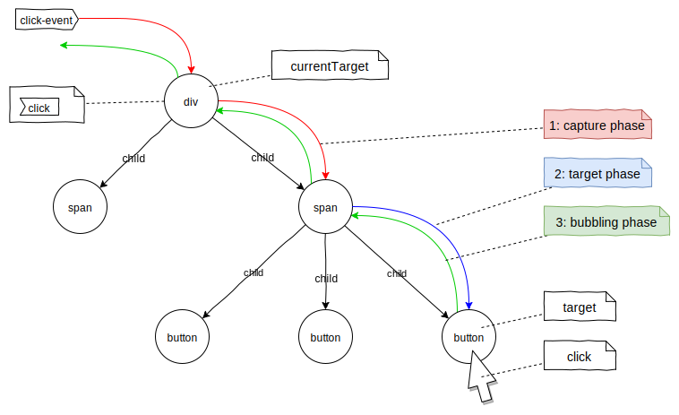
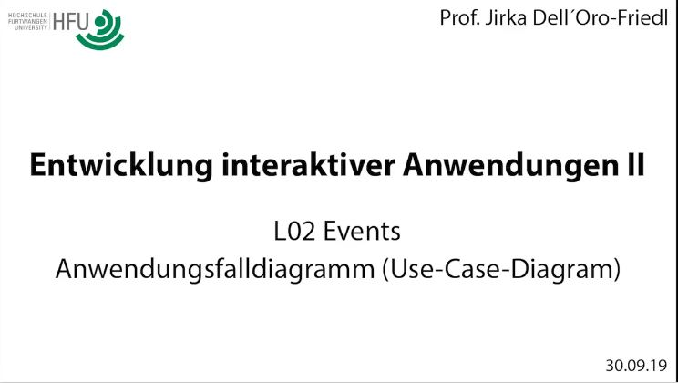
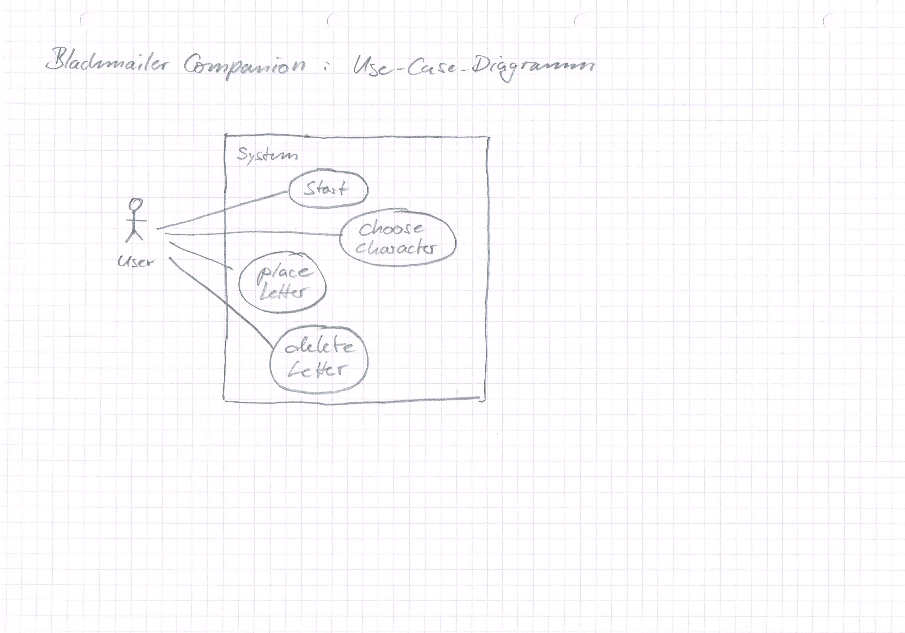
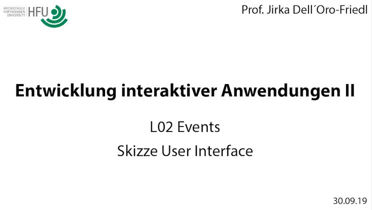
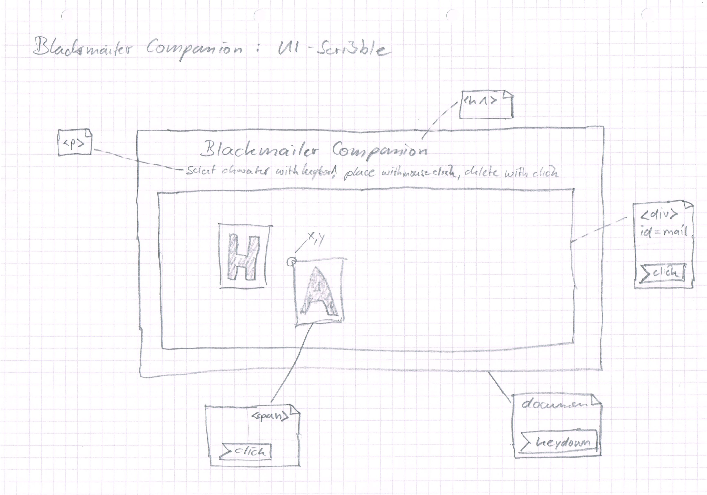
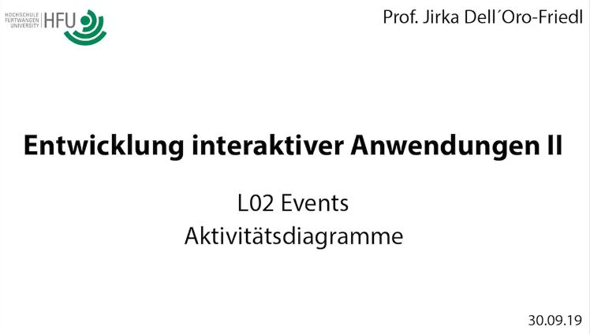
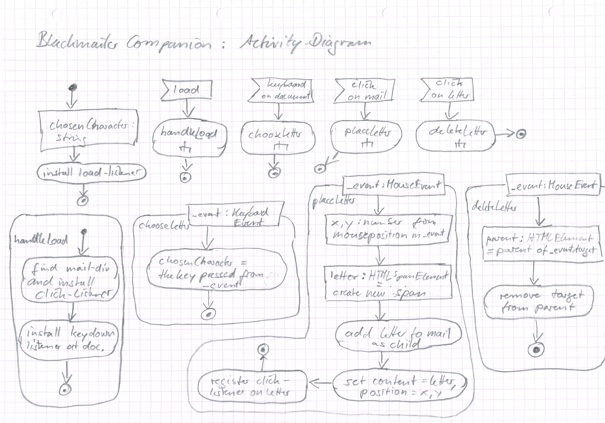
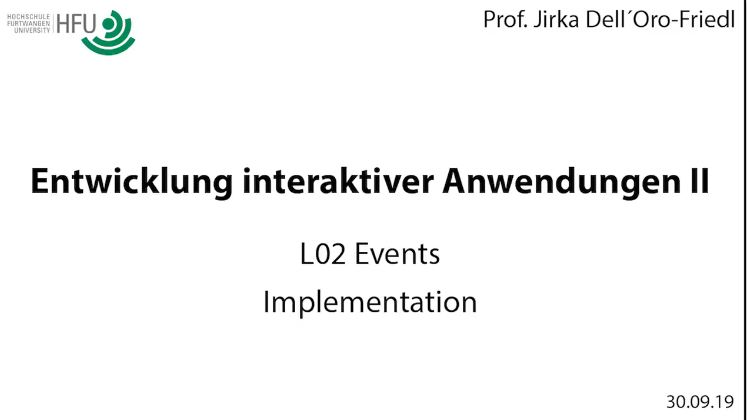
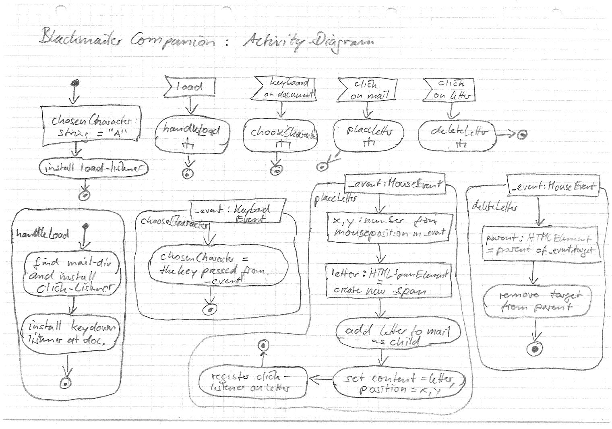
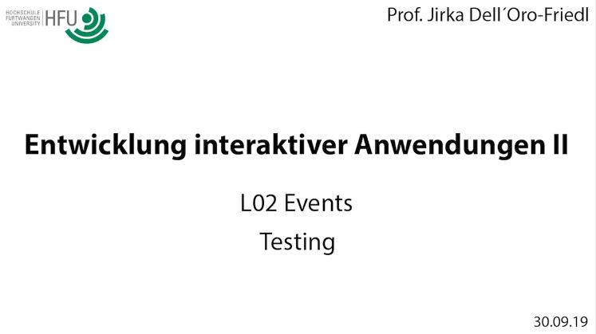

## L02 Events
# L02.1 Grundlagen
[](https://www.youtube.com/watch?v=IHbQdC5VHfw)
<small>Quelle: <a href="https://www.youtube.com/watch?v=IHbQdC5VHfw">https://www.youtube.com/watch?v=IHbQdC5VHfw</a></small>

## Rückblick DOM
Lädt der Browser eine Datei und versucht diese als HTML-Datei zu interpretieren, baut er anhand der Daten im Speicher ein Document-Object-Modell (DOM) auf. Was schließlich im Browserfenster angezeigt wird ist also nicht ein direktes Abbild der Datei, sondern ein Abbild dieses internen Speichermodells.
- [x] Erzeuge eine einfache Textdatei mit der Endung ".txt" im Dateinamen und schreibe einige Worte hinein, auch mit mehreren Leerzeichenfolgen, Umlauten und Tabulatoren. Lade diese Datei im Browser und schaue dir in den Entwicklertools die Seitenstruktur an (Tab links neben Console)   

Es wird deutlich, dass ein `html`-Element enstanden ist und darin ein `head`-Element sowie ein `body`-Element. In letzterem ist irgendwo, wahrscheinlich in einem `pre`-Element, unser eigentlicher Text vergraben.
- [x] Ändere die Endung in ".html" und lade die Datei erneut. Was hat sich verändert?

### DOM-Manipulation
Ein Skript kann das DOM manipulieren, darin Elemente verändern, hinzufügen oder löschen, der Browser kümmert sich automatisch um die Darstellung für den User. Das wurde im ersten Modul dieser Reihe bereits umfassend geübt und auch in der vorangegangenen Lektion wiederholt.
>**Achtung:** Die Begriffe Objekt, Element und Knoten können teilweise synonym verwendet werden, es ist aber Vorsicht geboten. 'Alles' in JavaScript/TypeScript ist Objekt, auch etwas vom Typ `number` oder `string`, trotz der scheinbaren Primitivität. Ein Knoten (Node) ist ein Objekt mit speziellen Eigenschaften und Fähigkeiten, mit dem sich ein Graph aufbauen lässt. Ein Element wiederum ist ein spezieller Knoten, der Eigenschaften eines HTML-Elementes aufweist. Mit Element werden aber auch allgemein Einträge in Arrays bezeichnet. Der Kontext ist also entscheidend.
- [x] Wiederhole hierzu die Inhalte des Schaubildes zur [DOM-Klassenhierarchie](https://jirkadelloro.github.io/EIA2-Inverted/X01_Appendix/DO-Hierarchy/DOM-Classhierachy.svg)

### Baumstruktur
Das DOM lässt sich, wie auch z.B. die Aktivitätsdiagramme, als Graph mit Knoten, die mit Kanten verbunden sind, darstellen.
- [x] Suche die Klasse `Node` im Schaubild zur DOM-Hierarchie. Welche verwandtschaftlichen Beziehungen werden innerhalb der Klasse genutzt?  

Diese Knoten enthalten die Kernfunktionalität zur Bildung des Graphen und damit des DOMs. Jeder Knoten kann auf einen anderen Knoten als `parentNode` verweisen und auf eine Liste von `childNodes`. Im DOM ist `document` der Wurzelknoten, der lediglich eine Referenz auf `html` in seiner Kinderliste hat. `html` referenziert über die Eigenschaft `parentNode` das `document` und hat in seiner Kinderliste Referenzen auf `head` und `body`. `body` wiederum referenziert `html` als Mama bzw Papa und hat wieder verschiedene Kindreferenzen, je nach Inhalt der darzustellenden Seite. Damit ergibt sich eine Baumstruktur, die sich in der Tiefe immer weiter verästeln kann und mit Hilfe der Entwicklertools, wie oben bereits getan, leicht einsehen lässt.
- [x] Wähle aus deinen eigenen vorangegangenen Arbeiten eine kleine Webseite aus und stelle deren DOM grafisch dar.

## Ereignisse
Das DOM bietet aber auch ein System für die Interaktion mit dem Nutzeri: das Eventsystem. Es stellt äußerst bequem Informationen zu Ereignissen innerhalb der Anwendung zur Verfügung, ohne dass Kenntnisse der Hardware erforderlich sind. Das Betriebssystem und der Browser werten diese Ereignisse bereits aus und bringen die Informationen darüber in eine allgemeine Form.

### Event-Objekt
Events sind spezielle Objekte, die Informationen über ein Ereignis
tragen. Ein solches Ereignis kann ein Mausklick sein, ein Tastendruck, eine Berührung des Bildschirms, das Laden einer Datei oder die Beendigung einer Datenübertragung und vieles mehr.
- [x] Im DOM-Klassendiagram sind einige Ereignisklassen aufgeführt. Finde sie und heraus, welche Informationen sie tragen.

### Target
In der Regel bezieht sich ein Ereignis auf ein bestimmtes Objekt. Zum Beispiel auf den Button, der angeklickt wurde, den Link, der berührt wurde, das Fenster, das den Ladevorgang abgeschlossen hat oder das Textfeld, das verändert wurde. Die Eigenschaft `target` des Event-Objektes stellt eine Referenz auf dieses Ziel-Objekt zur Verfügung.
- [x] Von welchem Typ ist `target`? Schau' im Klassendiagramm...
- [x] Objekte welcher Klassen können also `target`s sein? 

### Type
`type` ist eine simple Zeichenkette und gibt an, was für ein Ereignis beschrieben wird. Hier sind beispielsweise die Werte `click`, `load`, `change`, `dragstart` und viele weitere vordefiniert. Es ist aber auch möglich eigene, neue Ereignisse zu definieren.  
- [x] Recherchiere. Finde heraus, welche Arten von Events der Browser zur Verfügung stellt!

## Event-Handler
Handler sind Funktionen, die ein Ereignis auswerten. Der Umgang damit ist denkbar simpel.

### Handler-Implementation
Um ein Ereignis auszuwerten, implementierst Du einfach eine Funktion, deren Signatur diesem Muster entspricht:
```typescript
function handlerName(_event: Event): void {
    ...
}
```
Die Funktion nimmt also einen Parameter vom Typ `Event` entgegen, im Beispiel trägt dieser Parameter den Namen `_event`. Auch der Name der Funktion ist frei wählbar, es ist aber zu empfehlen den Prefix "handle" oder abgekürzt "hnd" zu verwenden, z.B. "handleClick", denn eine solche Funktion, die ein Event verarbeitet, nennt man Handler.

### Listener-Installation
Damit das System weiß, bei welchem Ereignis welcher Handler aufgerufen werden soll, muss der Handler registriert werden. Dies erfolgt mit der bekannten Anweisung `addEventListener(...)`, zum Beispiel so:
```typescript
document.addEventListener("click", handleClick);
```
Der erste Parameter ist lediglich die Zeichenkette, die den Typ des Ereignisses beschreibt, der zweite eine Referenz zum Handler. Erhält das document-Objekt nun ein Event-Objekt vom Typ "click", wird dieses an die Handler-Funktion `handleClick` weitergeschickt. Das `document`-Objekt horcht also jetzt in das System hinein, es wurde ihm hierfür ein "Ohr" installiert, ein sogenannter Listener.
>**Achtung:** Ein häufiger Fehler in JavaScript ist, statt der Referenz einen Funktionsaufruf zu implementieren, z.B. mit `addEventListener("click", handleClick())`. Die zusätzliche Klammer bewirkt, dass die Funktion bereits bei der Installation aufgerufen wird und deren zurückgeliefertes Ergebnis als Handler-Referenz installiert wird.

### Beispiel
Das Folgende dürfte das wohl primitivste Beispiel sein, dass wir mit dem Eventsystem darstellen können.
```typescript
namespace L02_Load {
    window.addEventListener("load", handleLoad);

    function handleLoad(_event: Event): void {
        console.log(_event);
    }
}
```
Hiermit wird das `window`-Objekt, welches dem Browsertab entspricht in dem die Applikation läuft, angewiesen, die Funktion handleLoad aufzurufen, wenn ein "load"-Event ankommt, und ihr das zugehörige `event`-Objekt zu übergeben. `handleLoad` sorgt dann lediglich für die Darstellung des Objektes in der Konsole.
- [x] Untersuche das ausgegebene `event`-Objekt
- [x] Recherchiere nach dem `load`-Event, wann genau wird es ausgelöst? Was ist der Unterschied zu `DOMContentLoaded`?
- [x] Installiere den Listener am `document`-Objekt, statt am `window`-Objekt. Was geschieht nun?
- [x] Experimentiere in der gleichen Form mit `DOMContentLoaded`, wie verhält sich das System nun?

> **Hinweis:** Um die Ausführung eines Scripts zu verzögern, steht mittlerweile auch das HTML-Attribut `defer` zur Verfügung. 

## Event-Phasen
Nicht alle Ereignisse werden allen Objekten im System mitgeteilt. Es ist also nur sinnvoll dort Listener zu installieren, wo sie auch wirken können. Besonders interessant wird das Ganze bei Interaktionen, die auf DOM-Objekten ausgeführt werden, wie beispielsweise der Klick auf einen Button. Solche Ereignisse werden nämlich in drei Phasen durch den DOM-Graphen durchgereicht.
 
 

### Phase 1: Capture
Das Event-Objekt wird zunächst an das `window` übergeben. Von dort wandert es zum `document`, zum `html`, zum `body` und weiter in den Baum in Richtung des `target`.
### Phase 2: Target
Wenn es vom Elternobjekt zum `target` gereicht wird, beispielsweise also zum angeklickten Button-Element, befindet sich das Event-Objekt in der Target-Phase.
### Phase 3: Bubble
Schließlich steigt das Event-Objekt im Baum wieder auf, bis es erneut das `window` erreicht. Es steigt also wie eine Luftblase unter Wasser an die Oberfläche.

### Listener-Options
Bei der Installation des Listeners können mit einem dritten Parameter noch Informationen zur Funktionsweise mitgegeben werden. Wird hier schlicht ein `true` mitgegeben, reagiert der Listener auf die Capture-Phase. Ansonsten, was üblicher ist, auf die Bubble-Phase. In jedem Fall reagiert er auf die Target-Phase.

### CurrentTarget
Neben dem `target` trägt das Event-Objekt auch noch eine Referenz auf das Objekt, dessen Listener das Ereignis als letztes gehört hat. Mit `currentTarget` kann also ausgewertet werden, wo sich das Ereignis gerade im DOM befindet und bearbeitet wird.

### Path
Den kompletten Pfad, den das Event durch das DOM nimmt, kann man im Attribut `path` einsehen oder per Skript durch die Methode `composedPath()` ermitteln.

### Beispiel
- [x] Untersuche die Seite [Phases](../X00_Code/L02_Events/Phases) und lasse den Code laufen.
- [x] Was geschieht bei Klick auf den Button, bei Klick rechts daneben und bei Klick darunter? Warum?

## CustomEvents
Neben den Ereignissen, die automatisch vom System erzeugt und verschickt werden, ist es auch möglich, explizit Ereignisse durch den eigenen Code erzeugen und verschicken zu lassen. Dabei können auch neue Ereignistypen definiert und beliebige Informationen als `detail` mitgegeben werden.
```typescript
// define a custom event that bubbles and carries some information
let event: CustomEvent = new CustomEvent("someSpecialType", {bubbles: true, detail: {someKey: someData}});
// send the event from some dispatcher
someEventTarget.dispatchEvent(event);
```
Alle Bezeichnungen, die im Beispiel mit "some" beginnen, können und sollten natürlich mit sinnvollen Bezeichnungen ersetzt werden.  

# L02.2 Ereignisgesteuerte Anwendung

<figcaption><small>Quelle: https://www.paketda.de/juniorpost/erpresserbrief-basteln.php</small></figcaption>

Erpresserbriefe zu basteln ist mühsam. So ist es doch eine interessante Geschäftsidee, eine Web-App zu entwickeln, mit der Erpresseris im Handumdrehen ihre Korrespondenz erledigen können. Wie geht man das an?

## Anwendungsfalldiagramm (Use-Case-Diagram)
Mit Hilfe des Anwendungsfalldiagramms machst Du dir zunächst einen groben Überblick über die Anforderungen an deine Anwendung. Das geht ganz schnell und hilft ungemein bei der Konzeption.  

<div align="center">
   <a href="http://hdl.handle.net/10900.3/OER_CXSBWOSW"></a>
  <a href="Material/BlackmailerCompanion_UseCaseDiagram.jpg"></a>
  <br/>
  <a href="http://hdl.handle.net/10900.3/OER_CXSBWOSW"> L02 Events: Anwendungsfalldiagram</a>
</div>

## Skizze: User Interface 
Als Nächstes machst Du dir eine Skizze des Erscheinungsbildes der Anwendung. Das wird schon einiges über die erforderliche darunterliegende Struktur verraten. Die Skizze versiehst Du schon mit den HTML-Auszeichnungen und Eigenschaften, die dir sinnvoll erscheinen. Unterscheide dabei zwischen statischen und dynamischen Elementen und Eigenschaften. Für die Dynamik trägst Du hier schon ein, an welchen Elementen Listener installiert werden soll und welche Ereignisse dabei mit welchen Aktivitäten verknüpft werden. Prüfe, ob alle Interaktionsmöglichkeiten zur Realisierung der Anwendungsfälle gegeben sind.

<div align="center">
  <a href="http://hdl.handle.net/10900.3/OER_BOIFLJAE"></a>  
  <a href="Material/BlackmailerCompanion_UI-Scribble.jpg"></a>
  <br/>
  <a href="http://hdl.handle.net/10900.3/OER_BOIFLJAE"> L02 Events: UI-Scribble</a>
</div>

## Aktivitätsdiagramme
Jetzt hast Du bereits aus der Sicht des Nutzeris die wesentlichen Aktivitäten, die beteiligten Elemente und die auszuwerteten Ereignisse festgehalten. Nun wechselst Du auf die Sicht aus dem System heraus und legst fest, wie es arbeiten soll. Dazu nutzt Du jetzt Aktivitätsdiagramme. Ein Event bildet dabei jeweils als Signalempfang einen Startknoten für eine Aktivität.  
Beginne dabei zunächst wieder mit einer Übersicht über die Aktivitäten. Nimm dir dann nacheinander die einzelnen Aktivitäten vor und verfeinere sie. Wiederhole diesen Prozess, bis Du zu den atomaren Aktionen gekommen bist die sich in Programmanweisungen umsetzen lassen. Am Anfang musst Du hierzu wahrscheinlich nach diesen Anweisungen noch etwas recherchieren.  
<div align="center">
  <a href="http://hdl.handle.net/10900.3/OER_HFILWFPA"></a>
  <a href="Material/BlackmailerCompanion_ActivityDiagram.jpg"></a>
  <br/>
  <a href="http://hdl.handle.net/10900.3/OER_HFILWFPA"> L02 Events: Aktivitätsdiagramm1</a>
</div>

## Implementation
Wenn Du den Eindruck hast, mit deiner Konzeption alles für eine erste Implementation der Anwendung berücksichtigt zu haben, kannst Du dich daran machen.  

<div align="center">
  <a href="http://hdl.handle.net/10900.3/OER_UTUDZVWF"></a>
  <a href="Material/BlackmailerCompanion_ActivityDiagram2.jpg"></a>
  <br/>
  <a href="http://hdl.handle.net/10900.3/OER_UTUDZVWF"> L02 Events: Aktivitätsdiagramm2</a>
</div>

## Testing
Während der Implementation wird das Programm immer wieder getestet. Es ist wichtig möglichst so zu implementieren, dass nicht erst ein abschließender Test Fehler zu Tage fördert, sondern dass immer lauffähige Zwischenstände existieren, die entsprechend in das Code-Repository aufgenommen werden.  

<div align="center">
  <a href="http://hdl.handle.net/10900.3/OER_GUVDTCKB"></a> 
  <br/>
  <a href="http://hdl.handle.net/10900.3/OER_GUVDTCKB"> L02 Events: Testing</a>
</div>

## Iterative Arbeitsweise
Bedenke, dass Du die Konzeption jederzeit verbessern kannst und solltest, wenn dir auffällt, dass etwas fehlt oder nicht funktioniert. Dasselbe gilt für alle vorangegangenen Schritte. So können Überlegungen beim Zeichnen der Skizze zurück auf das Use-Case-Diagramm reflektieren, oder Erkenntnisse bei der Implementation die Änderung der Skizze nach sich ziehen, was dann wiederum die Aktivitätsdiagramme beeinflusst. Es ist unwahrscheinlich, dass der erste konzeptionelle Ansatz sich unverändert durchführen lässt und zur perfekten Anwendung führt. 
> **Achtung:** Was Du auf keinen Fall machen darfst, ist auf der letzten Stufe, der Implementation, gravierende Änderungen vorzunehmen, ohne zuvor die Konzeption neu aufbereitet zu haben. Diese Vorgehensweise führt mit großer Sicherheit zum **Misserfolg!**

## Übungen
- [x] Löse zunächst das Problem mit dem erneuten Aufruf von placeLetter nach deleteLetter
  - experimentiere erst mit dem Lösungsoptionen 1 und 2. 
  - Plane dann Lösung 3 und implementiere sie.  
- [x] Erweitere die Erpresserbrief-App so dass sie auch auf Smartphone anwendbar ist
  - In einem weiteren Bereich sollen alle zulässigen Buchstaben zur Auswahl bereit stehen, so dass man sie per Touch aktivieren kann
  - Der aktuell ausgewählte Buchstabe soll in dieser Auswahl hervorgehoben erscheinen, so dass das Nutzeri weiß, was es gewählt hat, bevor es den Brief ändert
- Hinweis: recherchiere nach dem Pointer-Event
