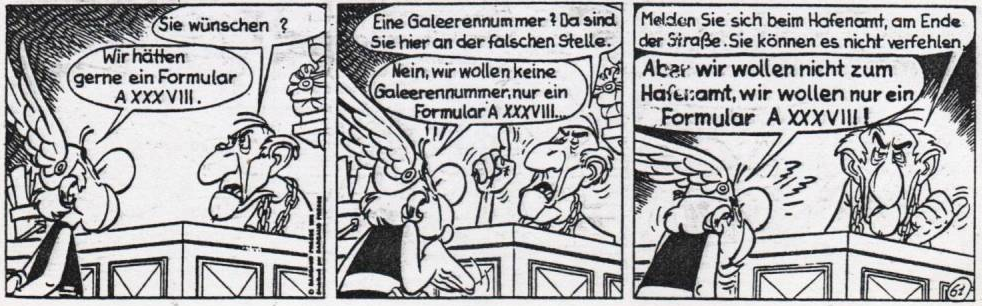
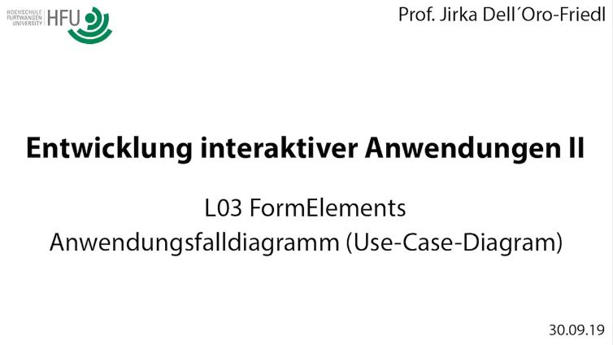
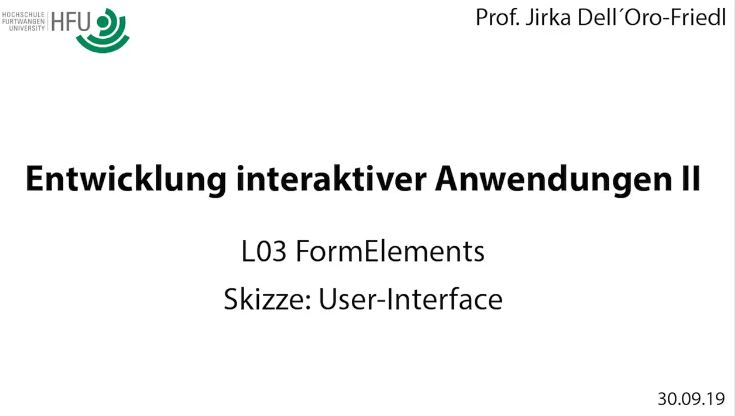
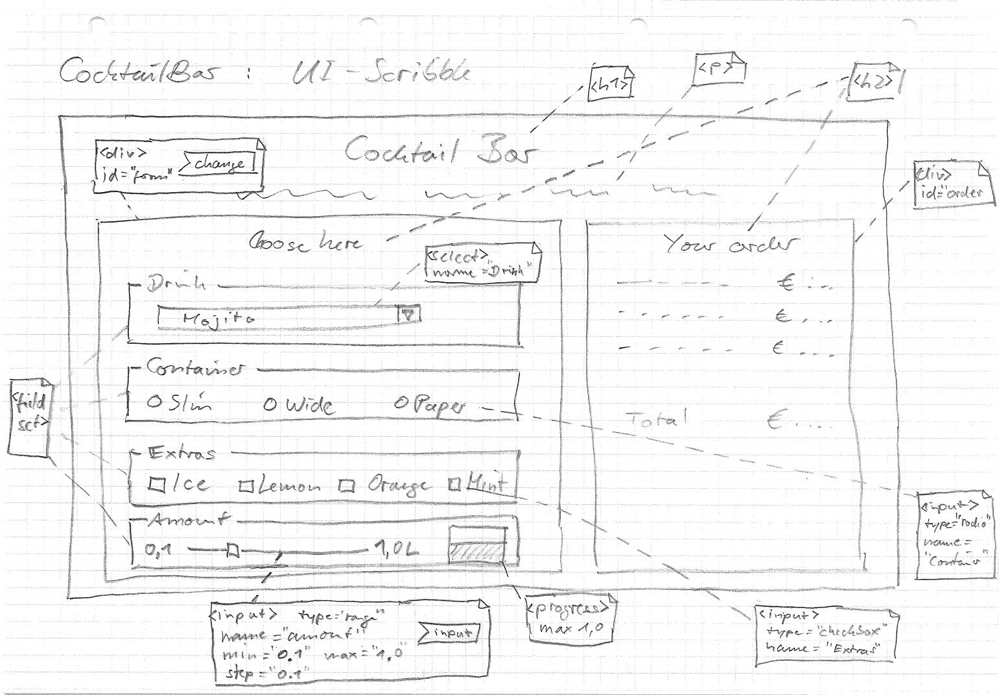
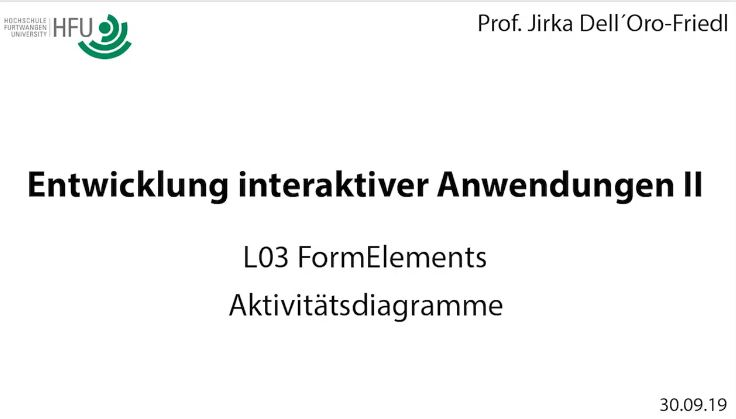
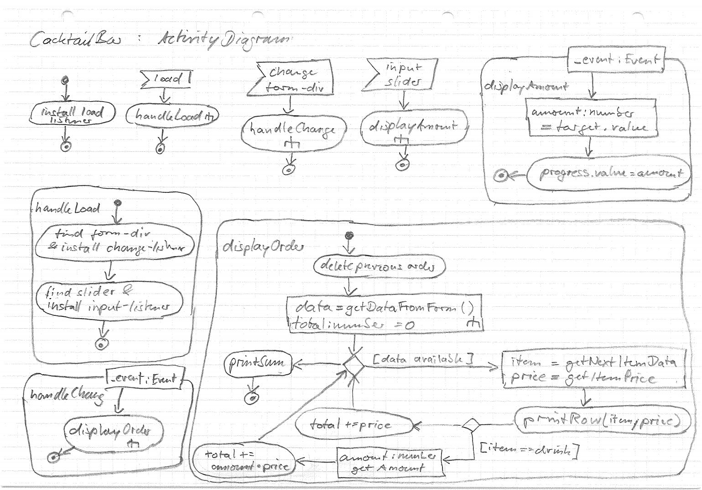
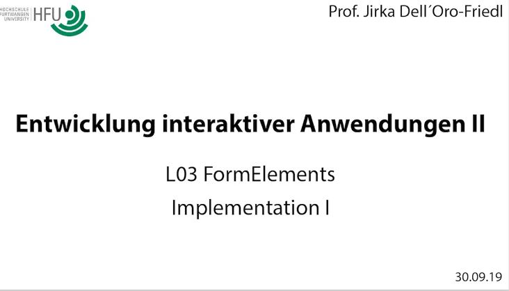
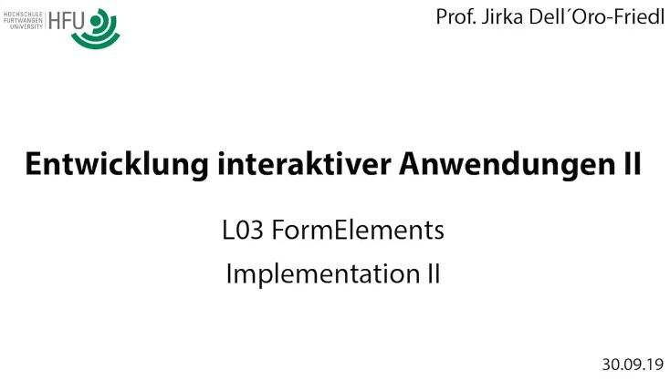
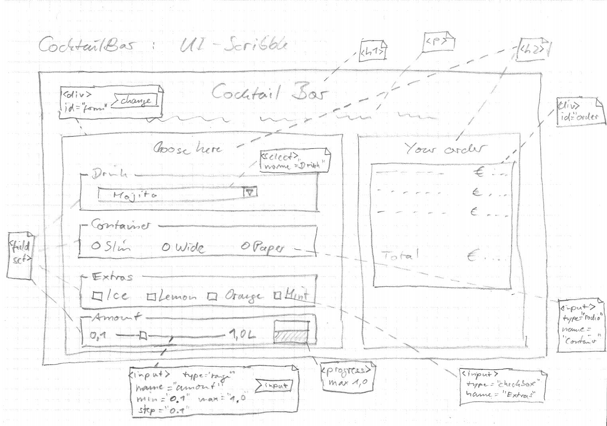

# L03 FormElements

<small>Quelle: <a href="https://mueli77.com/2016/12/11/asterix-review-special-45-12-pruefungen-fuer-asterix/">https://mueli77.com/2016/12/11/asterix-review-special-45-12-pruefungen-fuer-asterix/</a></small>

Interaktion war von Anfang an ein Kernpunkt von HTML. Das World-Wide-Web basiert auf der Idee, wissenschaftliche Dokumente durch interaktive Verweise, den Links, miteinander zu verknüpfen. Der Fokus wurde erst sehr viel später auf Katzenvideos gelegt.

> Fun-Fact: Tim Berners Lee ([Github-Profil](https://github.com/timbl)) entwickelte Anfang der 1990er Jahre HTML, HTTP, URL, den ersten Webserver und den ersten Browser. Einen Eindruck davon, wie sich das damals anfühlte, erhält man hier auf interaktive Weise: [WWW](http://line-mode.cern.ch/www/hypertext/WWW/TheProject.html)  

Sehr früh wurden aber auch schon HTML-Elemente unterschiedlichen Typs entwickelt, die es einem Nutzeri ermöglichen, Informationen einzugeben. Damit werden auch heute noch Formulare gestaltet. Die Elemente reagieren automatisch auf die Interaktion des Nutzeris und geben eine optische Rückmeldung, ohne dass eine weitergehende Programmierung erforderlich ist. Für die Grundfunktionalität genügt reines HTML.  
In diesem Kapitel lernst Du die wichtigsten Elemente kennen, erfährst, wie Du sie nutzen kannst und welche Informationen sie liefern. Ähnliche Elemente findet man auch in anderen Entwicklungsumgebungen zur Gestaltung von User-Interfaces.  

> - [x] Bringe den Code [L03_FormElements/Overview](https://github.com/JirkaDellOro/EIA2-Inverted/tree/master/X00_Code/L03_FormElements/Overview) aus dem Anhang bei dir lokal zum Laufen. In dieser Lektion wirst Du seine Funktionalität nach und nach freischalten und untersuchen. Zunächst erscheint nur die Überschrift "Form-Elements".

## Texteingabe
Die wichtigste Eingabemöglichkeit ist die von Text. Mit dem Keyboard-Event könnte man zwar beim Tippen jeden Buchstaben abfangen und damit eine Zeichenkette zusammen setzen, es geht aber sehr viel einfacher. Das generische `input`-Element bringt in seiner Urform als Textfeld schon diese Grundfunktionalität, kann aber noch viel mehr.  
> Beispiel: <input type="text" placeholder="Gib hier etwas ein" required/>
### Platzhalter
Dem Attribut `placeholder` kann ein Wert zugewiesen werden, der dem Nutzeri beispielsweise als Eingabeaufforderung dienen kann. Sobald das Nutzeri die Eingabe beginnt, verschwindet der Platzhalter automatisch und wird wieder angezeigt, wenn das Feld geleert wird.
### Passworteingabe
Der Wert "password" für das Attribut `type` bewirkt, dass die Eingabe nicht angezeigt wird und auch nicht kopiert werden kann. 
### Prüfung
Zum Beispiel wird durch die Angabe von "email" oder "url" als Wert für das Attribut `type` schon eine einfache Prüfung der eingegebenen Zeichenkette vorgenommen um gröbste Eingabefehler zu erkennen und die Ungültigkeit anzuzeigen. Wird das 'wertlose' Attribut `required` angegeben, wird zudem angezeigt, dass die Eingabe zwingend erforderlich ist. Die Darstellung kann per CSS und den Pseudo-Selektoren `:invalid`, `:valid` und `:required` angepasst werden.  
Eine deutlich komplexere Überprüfung kann mit Hilfe von regulären Ausdrücken erfolgen, was allerdings einige Expertise erfordert. Hierzu wird im Attribut `pattern` der zu verwendende reguläre Ausdruck festgelegt. Im Beispiel werden genau 3 Ziffern eingefordert.
### Textarea
Eine größere Variante des `input`-Elementes ist die `textarea`. Hier können längere Texte über mehrere Zeilen eingegeben werden, bei Überlauf erscheint eine Laufleiste und das Nutzeri kann das Feld ggf. in seiner Größe verändern.  
### Übungen
> - [x] Aktiviere jetzt in der HTML-Datei das Fieldset mit der `id` "fsText". Entferne hierzu die umschließenden Kommentar-Auszeichnungen `<!--` und `-->`. Am einfachsten geht das, indem Du den ganzen Absatz markierst und dann `Ctrl+#` drückst (Mac: ⌘+K ⌘+U). Speichere die Datei.
> - [x] Das Fieldset mit der Bezeichnung "Text-Input" sollte nun bei der aktualisierten Anzeige der Datei im Browser erscheinen. Prüfe das Verhalten der Elemente und vollziehe nach, wie es zustande kommt. Bedenke, dass noch kein Skript am Werk ist.  
> - [x] Aktiviere nun das Skript "FormElements.js" in der HTML-Datei. Bediene dann weiter die Elemente und beobachte die Ausgabe in der Konsole. Wann wird das `input`-Event verschickt, wann `change`?
> - [x] Untersuche den Code in der Datei FormElements.ts und kläre, wie er funktioniert.  

## Selektionen
Häufig soll das Nutzeri auch zwischen verschiedenen Möglichkeiten auswählen, ohne selbst Text einzugeben. Hierzu müssen ihm die Auswahlmöglichkeiten präsentiert und eine eindeutige Interaktionsmöglichkeit angeboten werden. HTML bietet hier verschiedene Elemente bzw. Elementtypen an.  

### Datalist
Hiermit kann einem Textfeld eine Liste von vordefinierten Einträgen zugewiesen werden. Das Nutzeri kann per Zeigerinteraktion einen solchen Eintrag auswählen oder durch Eintippen auf der Tastatur die Auswahl einschränken. Es kann aber immer noch auch Freitext eingeben und die Auswahl ignorieren. Die Kopplung von `input` und `datalist` geschieht durch die Attribute `list` und respektive `id`.  

### Radiobutton
Beispiel: <input type="radio" name="radio"><input type="radio" name="radio" checked><input type="radio" name="radio">  
Dieser Typ ist speziell für Single-Choice-Auswahlen gemacht. Alle `input`-Elemente des Typs `radio`, welche den gleichen Wert im Attribut `name` tragen, werden als Gruppe behandelt. Nur ein Element der Gruppe kann markiert sein.  

### Checkbox
Beispiel: <input type="checkbox"><input type="checkbox" checked><input type="checkbox" id="c3">  
Mit `input`-Elementen des Typs `checkbox` werden dagegen klassischerweise Multiple-Choice-Auswahlen dargestellt.  

> **Achtung:** Radiobuttons und Checkboxes beziehen sich in der Regel auf einen nebenstehenden Text. Für das Nutzeri ist es sehr ärgerlich, wenn diese Beziehung nicht auch zur Unterstützung der Interaktion genutzt wird, es also nicht auf den Text klicken kann um zu interagieren. Dabei ist es äußerst einfach dies zu berücksichtigen, der Text muss lediglich von einem `label`-Tag umschlossen sein. Die Kopplung von `label`- und `input`-Element geschieht dann einfach mit Hilfe der Attribute `for` und `id`. Dies sollte **immer** implementiert werden!  

### Select
Beispiel: <select name="Select" id="select">
<option value="option1">1.</option>
<option value="option2" selected>2.</option>
<option value="option2" selected>3.</option>
</select>  

Am mächtigsten ist das `select`-Element, auch 'Dropdown-Menü' oder 'ComboBox' genannt. Auf engem Raum kann eine vordefinierte Auswahl an Optionen als Single- oder auch Multiple-Choice Auswahl angeboten werden. Dabei können sogar noch Untergruppierungen vorgenommen werden.  

### Übungen
- [x] Aktiviere nun das zweite Fieldset, es trägt die `id` "fsSelection". Experimentiere im Browser mit den Selektions-Elementen.
- [x] Beobachte in der Konsole genau die Zuordnung von Elementname und Wert. Was fällt dir auf? Wo kommen die Werte her? Vergleiche mit den Texteingaben.
- [x] Aktiviere nun im Skript den Code zu "// Handling checkbox". Warum ist dieser Code hier, was ist dessen Sinn? Beobachte die Ausgabe in der Browserkonsole.
- [x] Ergänze das `select`-Tag um das 'wertlose' Attribut `multiple`. Wähle nun im Browser dort bei gedrückter Ctrl- oder Shift-Taste mehrere Optionen. Beobachte erneut die Ausgabe und halte deine Beobachtung fest.

## Weitere Eingabeelemente
Es gibt noch einige Eingabeelemente, die sich gänzlich anders verhalten. Ihre grundlegende Funktionsweise erschließt sich recht schnell und einfach.  

- [x] Aktiviere das Fieldset mit der `id` "fsSpecial". Experimentiere damit, verändere die Attributwerte und bediene die Elemente im Browser. Beobachte die Konsolenausgaben.
- [x] Beantworte die Frage nach der Wirkung des `value`-Attributs  

> **Hinweis**: es wird jetzt sehr deutlich, wie extrem das Input-Element standardmäßig seine Erscheinungsform ändert, abhängig von seinem Typ-Attribut. Das macht es zu einer "Allzweckwaffe". Neben den Attributen `name` und `value`, bringen Inputelemente zudem die Attribute `readonly` und `disabled` mit. Nutzeris können dann den Inhalt nicht mehr ändern, bei `disabled` das Element noch nicht einmal mehr fokussieren oder Inhalte herauskopieren.

## Ausgabeelemente
Es gibt zudem noch ein paar standardisierte Elemente, welche dem Nutzeri Rückmeldung geben. Sie dienen also der Interaktion des Systems mit dem Nutzeri.

- [x] Aktiviere das letzte Fieldset, es hat die `id` "fsOutput". 
- [x] Aktiviere auch die letzten Codefragmente. Erkläre, wie die Ausgabeelemente angesteuert werden.  

# Cocktailbar 


Wie oft sitzt man nicht abends zuhause und wünscht sich einen richtig leckeren Cocktail. Aber die Zutaten fehlen, es ist zu aufwendig damit anzufangen und raus will man auch nicht mehr? Da drängt sich doch die nächste geniale Geschäftsidee auf: die **Online-Cocktailbar!**  

Kundis können hier mit Hilfe eines Webformulars spontan einen Cocktail bestellen, der ihnen wenige Tage später per Post nach Hause geliefert wird. 

## Anwendungsfalldiagramm (Use-Case-Diagram)
Zeichne wieder ganz schnell ein kleines Anwendungsfalldiagramm. Versuche es selbst, bevor Du dir das Video anschaust.  

<div align="center">
  <a href="http://hdl.handle.net/10900.3/OER_ROTBOJQE"></a>
  <a href="Material/CocktailBar_UseCaseDiagram.jpg"></a>
  <br/>
  <a href="http://hdl.handle.net/10900.3/OER_ROTBOJQE"> L03 FormLements: Anwendungsfalldiagramm</a>
</div> 

## Skizze: User-Interface 
Das User-Interface wird nun schon ein wenig komplexer. Erstelle eine Skizze und überlege, welche Tags, Attribute und Listener Du brauchst. Investiere ein wenig Zeit um selbst einen ersten Entwurf zu gestalten, bevor Du das Video anschaust.

<div align="center">
  <a href="http://hdl.handle.net/10900.3/OER_ZVWFIXVL"></a>
  <a href="Material/CocktailBar_UI-Scribble.jpg"></a>
  <br/>
  <a href="http://hdl.handle.net/10900.3/OER_ZVWFIXVL"> L03 FormLements: UI-Scribble</a>
</div>

## Aktivitätsdiagramme
Nun ist schon grob konzipiert, was geschehen soll und wie sich das darstellt. Entwickle nun wieder ein Aktivitätsdiagramm mit dessen Hilfe Du festlegst, wie das Ganze funktioniert. Beginne wieder mit den Ereignissen und arbeite dich vom Groben ins Feine. Mach' dir am Anfang also noch nicht zu viele Gedanken über Details, sondern zerlege große Probleme in kleinere. Versuche es selbst, bevor Du das Video anschaust.

<div align="center">
  <a href="http://hdl.handle.net/10900.3/OER_VUTEAUWS"></a> 
  <a href="Material/CocktailBar_ActivityDiagram.jpg"></a>
  <br/>
  <a href="http://hdl.handle.net/10900.3/OER_VUTEAUWS"> L03 FormLements: Aktivitätsdiagramm</a>
</div>

## Implementation I
Versuche dich nun an der Implementation. Schaue dir das Video spätestens an, wenn Du dich an die Zusammenfassung der Bestellung machst. Hier gibt es noch einige Tipps.

<div align="center">
  <a href="http://hdl.handle.net/10900.3/OER_PSXQYBNK"></a>
  <br/>
  <a href="http://hdl.handle.net/10900.3/OER_PSXQYBNK"> L03 FormLements: Implementation I</a>
</div>

# FormData
JavaScript stellt einen einfachen Mechanismus zur Verfügung um Formularelemente automatisch auszuwerten und auf die Ergebnisse zuzugreifen. Hierzu müssen die Formularelemente in der DOM-Laufzeithierarchie einem `form`-Element untergeordnet sein. Wird bei der Erzeugung eines Objekts des Typs `FormData` nun ein Verweis auf auf dieses `form`-Element übergeben, so werden die Werte der `name`- und `value`-Attribute als Schlüssel-Werte-Paare zur Verfügung gestellt.
```typescript
let formData: FormData = new FormData(document.forms[0]);
```
Das `document`-Objekt stellt bereits bequem eine Liste aller untergeordneten `form`-Elemente zur Verfügung. In obigem Beispiel wird also das erste Formular des Dokuments ausgewertet.

## `name`-Attribut
Bislang hatte das `name`-Attribut nur für die Gruppierung von Radiobuttons eine Rolle gespielt. Tatsächlich stellt es aber für die automatische Auswertung von Formularen das maßgebliche Zuordnungskriterium dar. 
> **Achtung:** nicht das Attribut `id` ist für Formularelemente ausschlaggebend, sondern `name`  

Zu beachten ist auch, dass das `name`-Attribut, anders als `id` nicht eindeutig sein muss. Bei der Auswertung kann derselbe Name also mehrfach als Schlüssel auftauchen und jeweils unterschiedliche Werte tragen.  

## Auslesen
### `get(...)`
Bei eindeutigen und bekannten Namen lassen sich die Werte der `value`-Attribute mit Hilfe der Objektmethode `get(...)` wie bei einem assoziativen Array auslesen. Zum Beispiel so:
```typescript
console.log(formData.get("Drink"));
```
### `entries()`
Da aber die Namen nicht zwingend eindeutig sind und sie auch nicht unbedingt im Code reproduziert werden sollen, ist es häufig sinnvoll, über alle Einträge im FormData-Objekt zu iterieren.
Die Objektmethode `entries()` eines FormData-Objektes liefert alle gefundenen Schlüssel-Werte-Paare. Mit einer `for..of`-Schleife können diese bequem nacheinander behandelt werden:
```typescript
for (let entry of formData.entries()) {
    console.log(entry);
    console.log("name: " + entry[0]);
    console.log("value: " + entry[1]);
}
```
Jedes `entry`-Objekt ist also ein kleines Array mit zwei Einträgen, an Stelle 0 ein String mit dem der Wert des `name`-Attributs des ursprünglichen Form-Elements, und an Stelle 1 den entsprechenden Wert des `value`-Attributs. Letzterer ist hier vom Typ `FormDataEntryValue`, eine etwas besondere Zeichenkette, und muss gegebenenfalls konvertiert werden.  

## Implementation II

<div align="center">
  <a href="http://hdl.handle.net/10900.3/OER_UDZAJFTH"></a>
  <a href="Material/CocktailBar_UI-Scribble2.jpg"></a>
  <br/>
  <a href="http://hdl.handle.net/10900.3/OER_UDZAJFTH"> L03 FormLements: Implementation 2</a>
</div>   

> Achtung:   
> - im Video wird mehrfach von FormData-Element gesprochen. Besser ist FormData-Objekt, denn es ist kein HTML-Element.
> - zum im Video wird die auch zulässige Kurzschreibweise `for (let entry of formData)` genutzt. Ordentlicher aber ist die oben angegebene `for (let entry of formData.entries())`

- [x] Die Ausgabe der Bestellübersicht funktioniert noch nicht richtig. Finde den Fehler und korrigiere ihn.
- [x] Implementiere die Sonderbehandlung der Drinks.
- [x] Implementiere die Berechnung der Gesamtsumme
- [x] Überprüfe die Konzeption und korrigiere gegebenfalls die Diagramme entsprechend der gemachten Erfahrungen.  

Hinweis: Ungenauigkeiten bei der Berechnung von Fließkommazahlen können sehr schnell zu hässlichen Zahlendarstellungen führen. Der Typ `number` verfügt aber über mehrere Methoden zur Umwandlung in eine formatierte Zeichenkette. Recherchiere danach und nutze sie.
