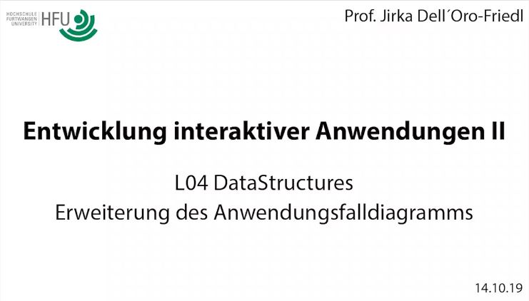
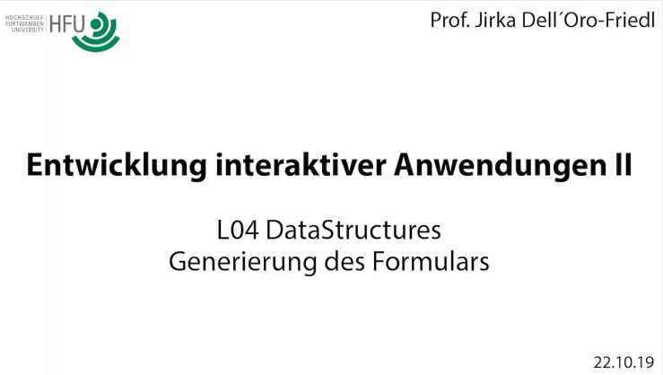
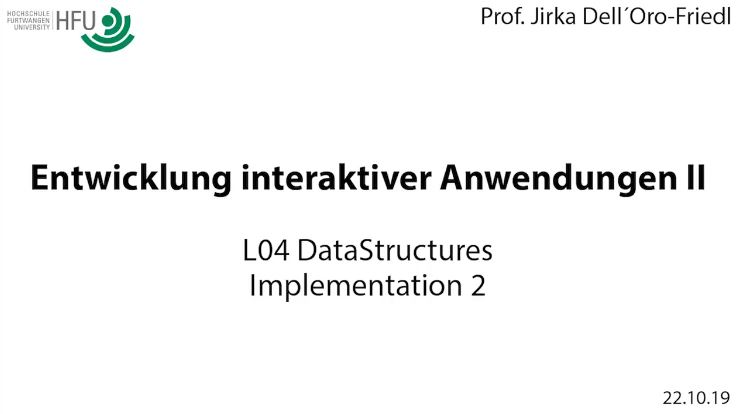
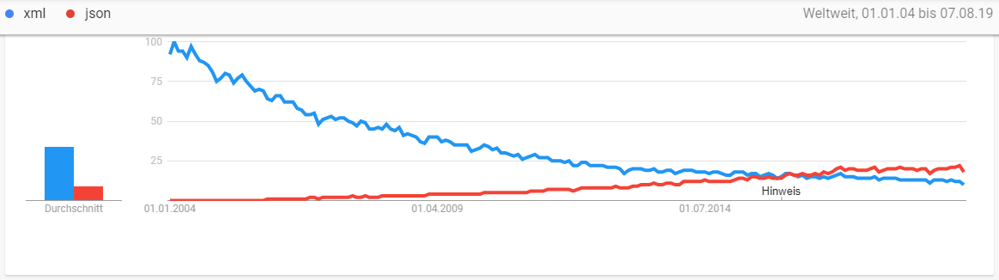

# L04_DataStructures

<small>Quelle: <a href="https://gutezitate.com/zitate-bilder/zitat-ordnung-ist-etwas-fur-primitive-das-genie-beherrscht-das-chaos-albert-einstein-181618.jpg">https://gutezitate.com/zitate-bilder/zitat-ordnung-ist-etwas-fur-primitive-das-genie-beherrscht-das-chaos-albert-einstein-181618.jpg</a></small>

Albert Einstein war wohl unbestritten eines der größten Genies, welche die Menschheit je hervorgebracht hat. Es ist unwahrscheinlich jemanden zu beleidigen, wenn in dieser Lektion davon ausgegangen wird, dass keine beteiligte Person einen ähnlichen Status genießt. Das gilt wohl für die meisten, die an der Konzeption interaktiver Anwendungen beteiligt sind und vielleicht mehr noch für die Nutzeris der Anwendungen. Wer also nicht Einsteins Genie für sich in Anspruch nimmt, könnte von Ordnung doch profitieren.   

- **FunFact**: Einstein wird noch ein weiteres Zitat zugesprochen, welches in diesem Zusammenhang nicht unerwähnt bleiben sollte: "Genie ist 1 % Talent und 99 % harte Arbeit ..."  

## Separation Of Concerns
Ebenso unstrittig wie Einsteins Genialität ist das Prinzip der Trennung der Zuständigkeiten (SoC) in der Softwareentwicklung. Hierbei geht es darum, dass jeder Teil der ganzen Software auch eine klare und von den anderen Teilen getrennte Zuständigkeit hat. Diese Zuständigkeit soll sich mit einem knappen Satz beschreiben lassen. Wenn in diesem Satz das Wort "und" vorkommt, ist möglicherweise etwas faul und dem Teil sind zu viele Zuständigkeiten übertragen.  
Bei der Cocktailbar haben wir schon vieles richtig gemacht, insbesondere, wenn wir das Ganze aus einer sehr übergeordneten Perspektive und die für die Entwicklung von Web-Applikationen grundlegende Separation betrachten.  
- [x] Arbeite diesen knappen [Artikel in SelfHTML.org](https://wiki.selfhtml.org/wiki/HTML/Tutorials/Trennung_von_Inhalt,_Pr%C3%A4sentation_und_Verhalten) durch. Vergleiche mit deiner eigenen Arbeit und prüfe, ob Du alles berücksichtigt hast.  

Der CSS-Teil der Cocktailbar beeinflusst nur die visuelle Gestaltung und fügt keine Inhalte oder Interaktionsmöglichkeiten hinzu. Das Skript kümmert sich ausschließlich um die Auswertung der Interaktion. Die HTML-Datei liefert die Struktur der Seite und die Interaktionselemente und stellt die Datenquelle dar... ups, da sind einige **UND**s drin. Und da knirscht es auch bald.

## Trennung von Struktur und Inhalt
In SelfHTML ist beschrieben, dass das HTML-Dokument Struktur und Inhalt bereit stellen soll. Das passt auch recht gut für statische Seiten, bei denen die Inhalte sich nie wesentlich ändern werden. Schon der Blackmailer Companion war aber ein gutes Gegenbeispiel. Der wesentliche Inhalt entsteht dort erst durch die Interaktion mit dem Nutzer und weder kann noch sollte er in der HTML-Datei statisch festgelegt sein. Diese legt nur die grobe Struktur fest. Richtig bleibt aber, dass das, was mit Hilfe der HTML-Datei entsteht, nämlich das DOM, weiterhin Struktur und Inhalt bereitstellt, selbst aber dynamisch ist und vom Skript manipuliert wird.  
Die Vereinigung von Struktur und Inhalt bei der Cocktailbar ist problematisch, denn das Angebot der Bar und die Preise können sich ändern. Und gehen wir davon aus, dass das Barkeeperi nicht selbst unter den Entwickleris der Online-Cocktailbar ist, stellt sich die Frage, wie das geänderte Angebot nun in die App findet. Soll das Betreiberi selbst im HTML-Code herumfuhrwerken? Und riskieren, dass die ganze App nicht mehr funktioniert, weil es einen Tippfehler bei einem Attribut hat? Diese Option darf ausgeschlossen werden.  
Das heißt, die bisherige Trennung der Zuständigkeiten muss um die Trennung des Inhaltes von Struktur, Verhalten und Gestaltung erweitert werden, sodass der Inhalt verändert werden kann, ohne Änderungen an den anderen Zuständigkeiten vornehmen zu müssen oder versehentlich zu vorzunehmen.  

## Erweiterung des Anwendungsfalldiagramms
Zwei Dinge sind aus Obigem zu folgern:
- es gibt einen weiteren Akteur, das Barkeeperi
- ihm muss eine Möglichkeit zur Verfügung gestellt werden das Angebot anzupassen ohne in die eigentliche Applikation einzugreifen  

  
 
<a href="http://hdl.handle.net/10900.3/OER_GFOXPPRS">L04 Use Case Diagram</a> 

## Algorithmen und Datenstrukturen
Neben dem Prinzip des "Divide et Impere", ist es bei der Konzeption von Anwendungen grundsätzlich eine sehr gute Vorgehensweise zwischen den Algorithmen und den Datenstrukturen zu unterscheiden. In Kombination stellen beide zusammen die Anwendung dar. Bestimme und untersuche einerseits die zu verarbeitenden Information, und überlege, wie diese Information strukturiert werden sollte, um sie gut verarbeiten zu können. Daraus ergeben sich die Datenstrukturen. Überlege andererseits, wie diese Information verarbeitet werden soll, somit konzipierst Du die Algorithmen.  

- **FunFact**: viele Quellen schreiben den ersten Algorithmus, der je für einen Computer konzipiert wurde, Lady Ada Lovelace (1815-1852) zu. Der zugehörige mechanische Computer, die "Analytical Engine", konnte zu dieser Zeit noch nicht funktionsfähig hergestellt werden. Adas Algorithmus aber funktionierte! Ihr zu Ehren wurde über ein Jahrhundert später eine populäre Programmiersprache "Ada" genannt.

Die Konzeption der Algorithmen und Datenstrukturen stellt also die Grundlage für eine nachfolgende Programmierung dar. Ohne diese Grundlage die Programmierung zu beginnen ist eine erratische Vorgehensweise und führt bei komplexeren Anwendungen in der Regel zu erhöhtem Aufwand und minderwertigen Lösungen.  

Die getrennte Betrachtung führt zu guten Datenstrukturen, die auch von noch nicht geplanten Algorithmen für andere Zwecke verarbeitet werden können, und zu Algorithmen, die wiederum noch nicht bekannte Daten verarbeiten können.  

# Cocktailbar: Datenstruktur
Die Cocktailbar funktioniert ja recht gut, sie ist aber völlig unflexibel und lässt das Barkeeperi außen vor. Es ist also wünschenswert, dass die Seite im Prinzip so bleibt, aber nicht von einer statischen HTML-Datei abgeleitet wird sondern dynamisch auf der Grundlage von Daten erzeugt wird, die das Barkeeperi selbst pflegen kann. Eine einfache Möglichkeit ist, ihm eine spezielle und simpel strukturierte Textdatei an die Hand zu geben, in welche es nach einem übersichtlichen Muster seine Daten eintragen kann. Es soll also nicht mit einem Chaos konfrontiert werden, das Genialität fordert, sondern mit Ordnung.

  

   
<a href="http://hdl.handle.net/10900.3/OER_MRBDUWIR">L04 Datenstruktur</a>

## Generierung des Formulars
Nun ist die Datenstruktur definiert und wie das fertige Formular aussehen und funktionieren soll ist auch bekannt und bereits getestet. Jetzt muss also noch ein Algorithmus entwickelt werden, welcher mit Hilfe der Daten das Formular generiert. Dazu muss zunächst entschieden werden, welche Teile des DOM automatisch beim Laden der Seite durch die Interpretation der HTML-Datei erzeugt werden sollen, und welche dann dynamisch durch das Skript dazu kommen. Theoretisch ist es natürlich möglich, komplett auf eine Beschreibung der Seitenstruktur in der HTML-Datei zu verzichten, lediglich einen Verweis auf das Skript zu implementieren und die DOM-Erzeugung komplett dem dadurch aufgerufenen Skript zu überlassen. Einerseits würde dies aber auch dem SoC-Prinzip zuwider laufen, weil unnötig viel Verantwortlichkeit auf das Skript übertragen wird, andererseits liegt bereits eine HTML-Datei vor, welche die Struktur beschreibt. Es erscheint also eher sinnvoll, lediglich die Beschreibungen der dynamischen Strukturen aus der bestehenden HTML-Datei zu entfernen und sie auf die statischen zu reduzieren. Das ist eine klassische Design-Entscheidung und wird für dieses Beispiel in obigem Sinne getroffen.  

<a href="http://hdl.handle.net/10900.3/OER_RMJGXPFC"> L04 Generierung des Formulars</a>   

> - [x] Konzipiere auch die beiden anderen Aktivitäten zur Erstellung der Interaktionsgruppen.  

## Implementation I

 
   
<a href="http://hdl.handle.net/10900.3/OER_DOUCTCEZ">L04 Implementation 1</a>  

## Implementation II

   
<a href="http://hdl.handle.net/10900.3/OER_TPHTKHOI">L05 Implementation 2</a>  

## Refactoring
### Erfahrungen einfließen lassen  
> - [x] Reflektiere die Korrekturen, die sich bei der ersten Implementation ergeben haben, im Konzept. Konzipiere auch Fehlerhinweise, so dass das Barkeeperi einen Tipp bekommt, wenn aufgrund einer Fehleingabe etwas nicht funktioniert.

### Vervollständigen  
> - [x] Überarbeite und vervollständige die Implementierung entsprechend der verbesserten Konzeption. Passe auch die zu verwendenden Elementtypen und ggf. das Stylesheet an.
> - [x] Lagere die Interfaces in eine eigene Datei aus, so dass das Barkeeperi nicht versehentlich daran manipuliert.  

### Separation of Concerns
Betrachtet man nun den Code in der HTML-Datei, dem Skript und der Datendatei fällt auf, dass die Kategorien des Angebots der Cocktailbar überall auftauchen und nicht nur für die Bezeichnung, sondern auch für die Steuerung des Programms verwendet werden. Das widerspricht dem SoC-Prinzip!
> - [x] Überarbeite die Konzeption der Cocktailbar derart, dass nicht in der HTML-Datei, im Skript und in der Datendatei alle Bezeichnungen für die Angebotskategorien auftauchen. Sie sollten nur in der Datendatei stecken. Hier muss dann auch die Information über die gewünschte Form der Interaktion für die jeweilige Kategorie untergebracht sein. Hierzu wird es sinnvoll sein, eine eigene Datenstruktur für die Kategorien zu erschaffen, in denen mehr Information steckt.  

## JSON (JavaScript Object Notation)
Natürlich ist diese Lösung noch nicht unbedingt der Weisheit letzter Schluss um das Angebot für das Barkeeperi wartbar zu machen. Aufgrund der Angabe des `namespace`s und der Deklaration sowie dem Zuweisungsoperator `let data: Data = ` handelt es sich bei der Datei "Data.*" immer noch um eine Skript-Datei und das Barkeeperi kann bei falscher Handhabung leicht das Programm unbrauchbar machen. Ohne diese Angaben würde es sich aber bereits um eine valide JSON-Datei handeln und in den nächsten Lektionen wird erklärt, wie man damit umgeht und wie man reines JSON tatsächlich als Daten- und Datentransferformat nutzt.  
JSON wird heute interessanterweise auch intensiv außerhalb der JavaScript-Welt in gänzlich andersartigen Anwendungen eingesetzt. Es konnte sich mittlerweile als Konkurrent zu **XML (Extensible Markup Language)**, dessen Struktur auch HTML folgt, etablieren und bezüglich des öffentlichen Interesses, sofern man das auf Google Trends ermitteln kann, XML seit dem Frühjahr 2016 hinter sich lassen.  

  

Weiterhin ist aber auch XML ein verbreiteter Standard und in manchen Anwendungen effizienter einzusetzen.
