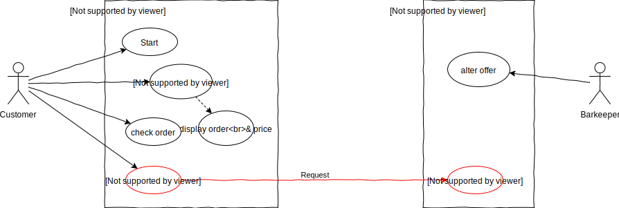
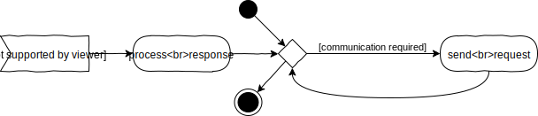
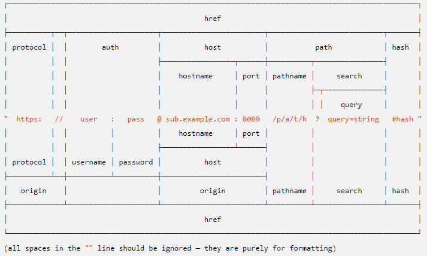
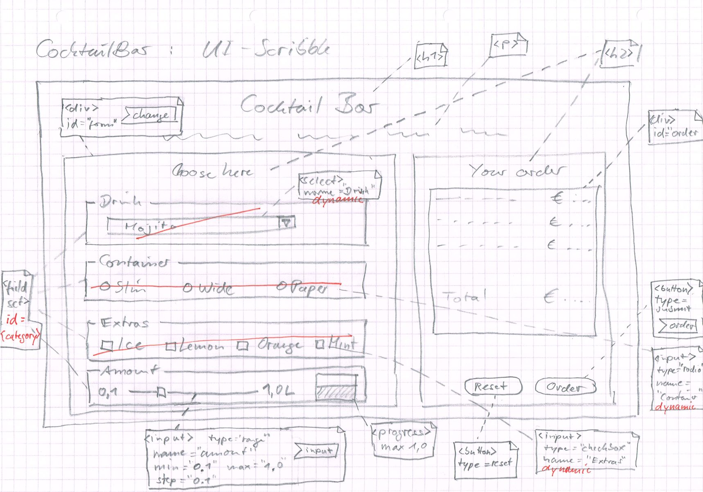
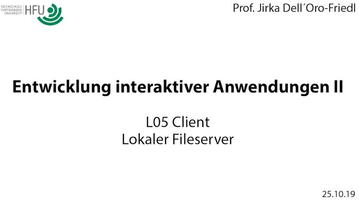
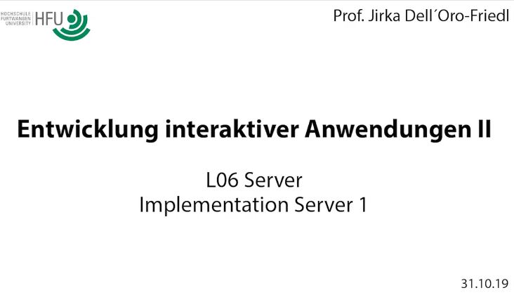
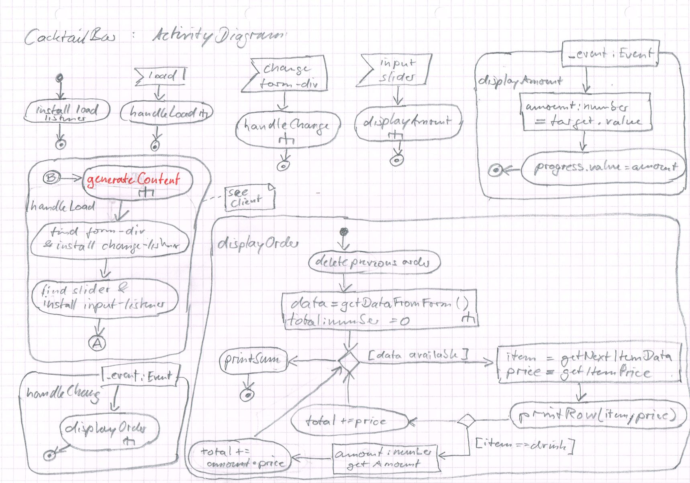
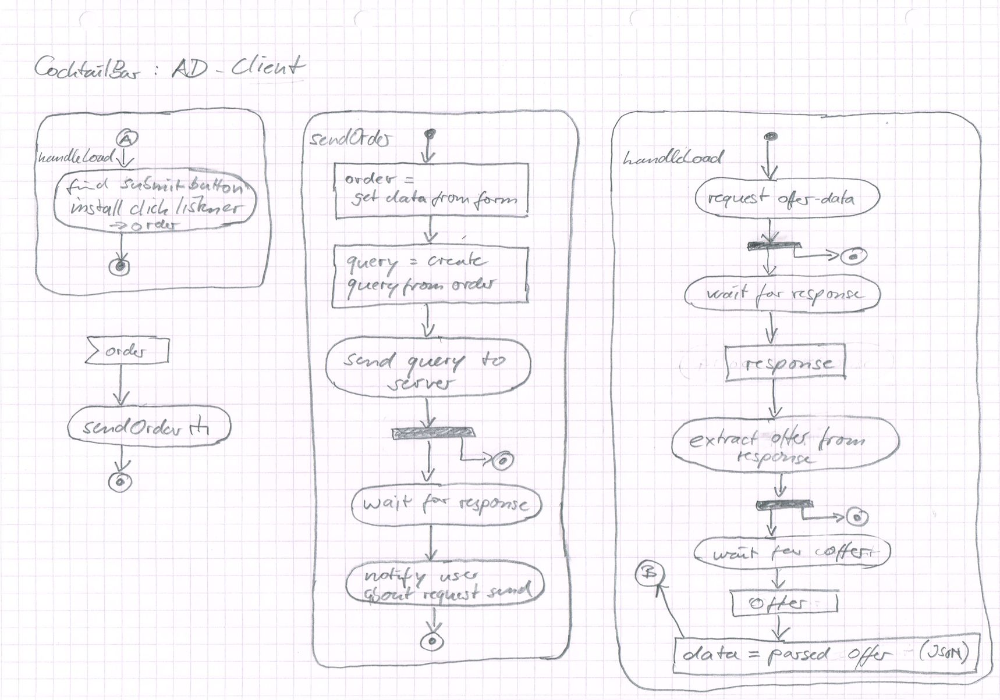

# L05_Client
  
<small>Quelle: <a href="https://arnoldzwicky.org/category/these-modern-times/page/3/">https://arnoldzwicky.org/category/these-modern-times/page/3/</a></small>

Die Cocktailbar funktioniert so schon ganz gut, allerdings gibt es noch einen großen Nachteil: die Bestellung wird noch nicht verschickt. Solange also das Barkeeperi nicht daneben sitzt, wenn das Kundi seinen Cocktail zusammenstellt, wird ihm das Geschäft entgehen. Diese Konstellation entspricht aber nicht unseren betrachteten Anwendungsfällen und macht das System ohnehin obsolet.  
Es muss also die Webseite, die vom Browser des Kundis auf dessen Rechner angezeigt wird, mit einem anderen Rechner kommunizieren, der die Bestellung empfängt, verarbeitet und schließlich dem Barkeeperi mitteilt. Gegebenenfalls sollte er auch eine Rückmeldung über die Bearbeitung geben, die wiederum vom Browser des Kundis empfangen und letzterem angezeigt wird.

- [x] Lies dir diesen kurzen [Wikipedia-Artikel](https://de.wikipedia.org/wiki/Client-Server-Modell) durch um einige Grundbegriffe des Client-Server-Modells zu klären. 

## Anwendungsfalldiagramm
Tatsächlich nutzt die Cocktailbar selbst bereits ein Client-Server-System sobald sie auf Github-Pages veröffentlicht wurde. Pages fungiert nun als File-Server und liefert die HTML-, CSS- und JS-Dateien aus, die ein Browser interpretieren kann. Der Browser stellt den Client dar und es ist irrelevant, auf welchem Rechner er läuft, solange er über eine Internetverbindung mit dem Server kommunizieren kann.  
- [x] Vergleiche hierzu die [EIA2-Landschaft](../X01_Appendix/Landscape/EIA2Landscape2022.svg). Welche Systeme und Prozesse sind dir mittlerweile aus EIA1 und EIA2 bekannt? Zeichne einen geschlossenen Linienzug ein, der all dies ein- und alle unbekannten Prozesse und Systeme ausschließt.  

Teilt man also das Anwendungsfalldiagramm auf, so dass es zwei Systeme, Client und Server, darstellt, so wird klar, dass
- das Kundi mit einem anderen System interagiert als das Barkeeperi
- die Bestellung von dem einen System, dem Client, an das andere System, dem Server, übertragen werden muss.  

  
> Das oben angesprochene File-Serving ist hier nicht dargestellt, da dies Browser und Server bereits automatisch erledigen.

## Kommunikation
Kommunikation ist der Prozess des Austauschs oder der Übertragung von Information. Dabei werden zwei grundsätzliche Formen derselben unterschieden. 
### Synchron
  

Synchron bedeutet "zeitlich gemeinsam". Bei der Kommunikation heißt das allerdings nicht gleichzeitig, sondern "aufeinander abgestimmt". Das bedeutet, dass die Kommunikationspartner aufeinander warten, bis der jeweils andere seine Information übertragen hat und dann ihrerseits mit einer Übertragung beginnen. Somit verbringen die beteiligten Systeme die Hälfte der zur Verfügung stehenden Zeit zwangsläufig mit Warten. Im Diagram, welches den Kommunikationsalgorithmus eines der Partner darstellt, wird dies mit der kleinen Schleife angedeutet.  

- [x] Sammle Beispiele für synchrone Kommunikation in deinem eigenen Alltag.  

So klein diese Schleife auch erscheint, sie kann ein großes Problem darstellen. Die Systeme könnten die Wartezeit sinnvoll nutzen, anstatt nur in ihr zu verharren. Besonders problematisch wird es, wenn ein System für die Antwort lange braucht. Wenn beispielsweise eine Webseite nicht mehr reagiert, weil der Browser auf eine Antwort des Servers wartet, wird das Nutzeri den Prozess bald abbrechen.


### Asynchron
  
Daher hat sich die asynchrone Kommunikation durchgesetzt. Die Kommunikationspartner setzen eine oder mehrere Anfragen ab, damit ist ihr Teil zunächst erledigt und sie können sich um andere Aufgaben kümmern. Wenn eine Antwort auf eine der Anfragen vorliegt, erhält das anfragende System ein Signal. Dieses dient als Startpunkt für einen neuen Prozess, bei dem zunächst die Antwort verarbeitet wird und gegebenenfalls weitere Anfragen verschickt werden.  

- [x] Sammle Beispiele für asynchrone Kommunikation in deinem eigenen Alltag.
- [x] Was sind die besonderen Herausforderungen bei der asynchronen Kommunikation?

Damit ist es Webseiten beispielsweise möglich, die Darstellung aufzubauen und Interaktion zur Verfügung zu stellen, während weitere Daten geladen werden. Oder während der Interaktion mit dem Nutzeri Daten zu versenden.  

## Forms
HTML-Forms bieten bereits gänzlich ohne zusätzliche Programmierung die Möglichkeit, Daten synchron zu verschicken. Hierzu ist es lediglich erforderlich, dem Form-Tag ein `action`- und ein `method`-Attribut anzufügen, sowie im Formular einen Submit-Button zu integrieren. Der `action`-Wert gibt den URL an, an welchen die Daten gehen soll. Die Daten selbst, also die Werte der Formularelemente, werden bei Betätigung des Submit-Buttons automatisch aufbereitet und verschickt. Wie sie verschickt werden, hängt von der gewählten `method` ab.
### Get
Bei `method="get"` werden die Daten als Zeichenketten einfach im Klartext an den URL angehängt, abgetrennt mit einem `?`. Die Schlüssel- und Wertepaare sind mit `&` (Et, kaufmännisches Und, Ampersand) voneinander getrennt, die Schlüssel und Werte mit einem `=` verbunden. Der Browser ruft dann diesen URL mitsamt Anhang auf, die komplette Zeichenkette erscheint in der Adresszeile.
- [x] Surfe im Netz und suche nach Beispielen für die Datenübertragung in dieser Form, in dem Du die Adressezeile beobachtest.
- [x] Ergänze das Formularelement deiner aktuellen Cocktailbar-Implementation mit den Attributen `method="get"` und `action=""`. Der leere Wert bei `action` bedeutet, dass der aktuelle URL erneut genutzt werden soll. Füge zudem mit
```html
<button type="submit">Abschicken</button>
```
einen Submit-Button im Formular ein. Untersuche was geschieht, wenn Du nun die Seite aufrufst und den Button betätigst.
> Der typ `"submit"` ist die Voreinstellung für Buttons und muss nicht explizit angegeben werden. Jeder Button innerhalb eines Formulars, bei dem nicht explizit ein anderer Typ angegeben ist, führt also zum Datenversand. Und häufig zu Verwirrung bei den Entwickleris...

### Post
Bei `method="post"` werden die Daten als eigene Datenpakete versand und sind nicht für das Nutzeri sichtbar. Post wird aber vor allem auch dann verwendet, wenn größere Datenmengen verschickt werden, da die zulässige Länge des URL begrenzt ist. Auf der Serverseite müssen die Datenpakete zunächst erst wieder zu einer zusammenhängenden Request zusammengefügt werden.
- [x] Verwende nun die Methode `"post"` im Formular und betätige den Submit-Button. Versuche nun mit Hilfe der Entwicklertools die Daten zu finden. Klicke dazu auf den Reiter "Netzwerk" oder "Netzwerkanalyse" und dann auf den Post-Request bei den gelisteten Anfragen.  

## Implementation asynchroner Kommunikation
#### XmlHttpRequest-Events
Bei der asynchronen Kommunikation lässt sich wieder sehr gut die nun wohlbekannte Ereignissteuerung einsetzen. JavaScript bietet hierzu das Standardobjekt `XMLHttpRequest` an. Ein solches Objekt kann mit dem Schlüsselwort `new` erzeugt werden. Das Objekt bietet einige Kommandos, mit denen recht einfach eine Verbindung zum Server aufgebaut und eine Request verschickt werden kann. Während das Objekt die Verbindung verwaltet, erzeugt es bei Statusänderungen entsprechende Events, die wiederum mit dem üblichen Schema von Listeners abgefangen und an die zugehörigen Handlerfunktionen weitergeleitet werden. Auch die vollständige Übertragung der Serverantwort ist eine solche Statusänderung, womit das oben dargestellte Schema der asynchronen Kommunikation clientseitig implementiert werden kann.  
> Das XML im Namen des Objektes verrät, dass es sich dabei um eine etwas betagte Technologie handelt, die 1999, während der Standardisierung von HTML4, von Microsoft veröffentlicht wurde. Sie ist aber verbreitet und kommt noch häufig zum Einsatz. [Mehr Infos gibt es hier.](https://wiki.selfhtml.org/wiki/JavaScript/XMLHttpRequest)

#### Fetch & Promises
2017 wurde die globale JavaScript-Funktion `fetch` als Schnittstelle für asynchrone Kommunikation eingeführt. So kann mit einer einzigen Anweisung nach dem Muster `fetch(url [, data])` eine Request verschickt und eine Response erhalten werden. Aufgrund der Asynchronität liefert fetch aber nicht sofort die Antwort des Servers, sondern ein Objekt vom Typ `Promise`. Dies kann metaphorisch betrachtet werden: Das Versprechen, das fetch abgibt, verpflichtet dazu, die eigentliche Funktion auszuführen, in diesem Falle also zu kommunizieren, und im Erfolgsfall, sowie im Falle des Misserfolgs, bestimmte weitere Funktionen aufzurufen. Es handelt sich also wieder um eine Ereignissteuerung, die aber in einem etwas anderen Gewand daherkommt.  

Im einfachsten Fall sieht das ganze Konstrukt dann so aus:
```typescript
    function communicate(_url: RequestInfo): void {
        // try to communicate
        let promise: Promise<Response> = fetch(_url);
        // establish the functions to call when communication 1. succeeds, 2. fails
        promise.then(handleSuccess, handleFailure);
    }

    function handleFailure(_response: Response): void {
        console.log("Failure", _response);
    }

    function handleSuccess(_response: Response): void {
        console.log("Success", _response);
    }
```
Auch hier ist die Funktionalität über mehrere Funktionen verteilt und daher insgesamt unübersichtlich. Das wird noch verstärkt dadurch, dass die Response, die den Handlern von der Promise als Parameter übergeben wird, noch nicht die Rohdaten der Antwort des Kommunikationspartners darstellt. Um die Response zu verarbeiten sind weitere Funktionen erforderlich, die wiederum Promises erzeugen, die weitere Handler aufrufen und so weiter. 
> **FunFact:** Dadurch entsteht ein Gewirr an Funktionen, das von Entwickleris als "Callback Hell" bezeichnet wird.

#### Async/Await
Deswegen wurden 2017 auch die neuen Schlüsselworte `async` und `await` in JavaScript implementiert. Damit wird nun etwas ganz Erstaunliches möglich. Anstatt mit der synchronen Programmierweise (eine Anweisung im Code erfolgt strikt nach Beendigung der vorangegangenen) und Events asynchrone Prozesse abzubilden und damit "Callback Hell" zu erzeugen, wird mit Hilfe der beiden Schlüsselworte die Programmierung selbst asynchron. Damit wird das fetch-Beispiel plötzlich extrem übersichtlich:

```typescript
    async function communicate(_url: RequestInfo): Promise<void> {
        let response: Response = await fetch(_url);
        console.log("Response", response);
    }
```
Mit dem Schlüsselwort `async` wird eine Funktion als asynchron deklariert, das bedeutet, dass ihre Ausführung unterbrochen und zu einem späteren Zeitpunkt fortgesetzt werden kann. Genau dies bewirkt das Schlüsselwort `await`, welches daher nur innerhalb von asynchronen Funktionen Sinn ergibt. Sobald `fetch` gestartet wird, wird die Funktion `communicate` zunächst beendet und die Ausführung des Programms bei der nächsten Anweisung nach deren Aufruf fortgesetzt. Sobald aber `fetch` beendet wurde, wird die Funktion `communicate` bei der Anweisung nach dem fetch fortgesetzt. Das heißt also, dass das Hauptprogramm, sofern es noch nicht komplett abgelaufen ist, unterbrochen wird um die Ausgabe der Response in der Konsole zu bewerkstelligen. Danach ist `communicate` tatsächlich am Ende und das Hauptprogramm wird fortgesetzt. Es könnten aber in der Funktion noch weitere `await`s folgen, die wieder entsprechendes Verhalten bewirken. So bläht die weitere Verarbeitung der Response den Code nicht doch wieder durch Callbacks auf.  
- [x] Kopiere obenstehenden asynchronen Code und bette ihn in ein neues Programm ein. Lasse vom Hauptprogramm aus die Funktion `communicate` mit dem Parameter "https://jirkadelloro.github.io/EIA2-Inverted/L05_Client/Material/Test.txt" aufrufen. Lasse vor und nach dem Aufruf von `communicate` in der Konsole die Zeichenketten "Start" und "End" ausgeben.
- [x] Starte nun das Programm, nachdem Du es lauffähig implementiert hast. Beschreibe deine Beobachtung. In welcher Reihenfolge kommen die Ausgabe in der Konsole?
- [x] Das ausgegebene Response-Objekt ist komplex und der eigentliche Inhalt der Serverantwort ist noch nicht zu sehen. Erweitere die Funktion `communicate` um eine Zeile, in der Du die Methode text() des Response-Objektes aufrufst. Achtung: text() gibt wieder eine Promise zurück. Nutzt Du aber auch hier `await` erhältst Du als Ergebnis des Ganzen eine Zeichenkette, die Du einer Variablen vom Typ string zuweist. Lasse so den Inhalt der Serverantwort ausgeben.  

## Uniform Resource Locator (URL)
Jetzt hast Du einige Werkzeuge an der Hand um synchrone oder asynchrone Kommunikation von der Clientseite aus zu starten, also eine Request zu verschicken und eine Response vom Server zu erhalten. Derzeit wird nur die Get-Methode betrachtet, bei der die Nutzdaten in den URL-String eingebettet werden. Bei der asynchronen Kommunikation muss dies nun noch getan werden. Dazu sollte zunächst der Aufbau des URL näher untersucht werden.
- [x] Studiere den Aufbau des URL anhand der folgenden Grafik.  
  
<small>Quelle: <a href="https://nodejs.org/dist/latest-v12.x/docs/api/url.html#url_url_strings_and_url_objects">https://nodejs.org/dist/latest-v12.x/docs/api/url.html#url_url_strings_and_url_objects</a></small>  

### Teil 1
Protocol, Authentifizierung und Host werden benötigt, um eine Verbindung zu einem Server aufzubauen. Häufig genügt allerdings bereits die Angabe des Hostnamen, z.B. www.hs-furtwangen.de, um Browser und Server zur Kommunikation zu bewegen.  
> So ausgeschrieben ist die Darstellung der Hostnamen eine Hilfestellung für Menschen. Tatsächlich baut der Browser zunächst eine Verbindung zu einem Name-Server auf und fragt dort nach der unter diesem Namen hinterlegten Adresse.  
- [x] Gib in der Adresszeile des Browsers eine "echte" Adresse ein: 141.28.2.12

### Teil 2
Der zweite Teil des URL wird dann von dem erreichten Server beliebig interpretiert. Ein reiner File-Server versucht im Pfadnamen eine Ordnerstruktur zu erkennen um in seinem Speichersystem eine Datei zu finden, deren Inhalt er als Antwort zurückliefert. github.io ist so ein reiner Fileserver, er hat in obigen Beispiel einfach den Inhalt der Datei Test.txt zurückgeliefert.

#### Query-String
Der Query-String stellt nun die eigentlichen Nutzdaten dar, die bei der synchronen Übertragung mit der Get-Methode des Formulars bereits automatisch aufbereitet und mitgeschickt wurden. Ein Application-Server, der bezüglich Funktionalität über die Möglichkeiten eines reinen Fileservers hinausgeht, kann diesen String interpretieren und mit den gewonnenen Daten Berechnungen anstellen oder weitere Prozesse steuern.

## Daten asynchron senden
Um also Daten per Get mit Fetch zu senden, muss lediglich der URL um den Query-String erweitert werden. Wie dieser String zustande kommt ist irrelevant, hier kann man beliebig kreativ werden. Sofern die Daten aus einem Formular aber bereits vorliegen, ist es einfach möglich, ihn aus einem FormData-Objekt zu generieren. Hierbei hilft ein weiteres Standard-JavaScript-Objekt: URLSearchParams
```typescript
let url: string = "https://whatever.server/path/file";
let query: URLSearchParams = new URLSearchParams(<any>formData);
url += url + "?" + query.toString();
await fetch(url);
```
> Zur Zeit (2019) wird leider noch ein kleiner Hack verwendet, da TypeScript noch nicht ein Objekt vom Typ FormData als Parameter akzeptiert und daher mit `<any>` ausgetrickst werden muss.

### Custom Data
Ein Objekt vom Typ `URLSearchParams` lässt sich fast genauso verwenden wie eines vom Typ `FormData`. Insbesondere können an beide Objekte per `append` noch weitere Schlüssel-Werte-Paare angefügt werden. So ist es sehr leicht auch Informationen, die nicht aus einem Formular kommen, mit auf den Weg zu schicken.  

> **Zusatzinfo**: `fetch` akzeptiert neben dem URL noch einen zweiten Parameter, ein `RequestInit`-Objekt. Damit lassen sich noch viele weitere zusätzliche Steuerinformationen für die Kommunikation angeben und auch sehr einfach die Post-Methode für die Datenübertragung verwenden. Auch kann dabei das FormData-Objekt direkt genutzt werden. 

# Cocktailbar: Bestellung versenden

<div align="center">
<a href="http://hdl.handle.net/10900.3/OER_DLGSHALR"></a>
<a href="Material/CocktailBar_UI-Scribble.jpg"></a>
  <br/>
<a href="http://hdl.handle.net/10900.3/OER_DLGSHALR"> L05 Client: Aktivitätsdiagramm</a>
</div>


## Implementation I
<div align="center">
<a href="http://hdl.handle.net/10900.3/OER_ZMJSQDTS"></a>
  <br/>
<a href="http://hdl.handle.net/10900.3/OER_ZMJSQDTS"> L05 Client: Implementation I</a>
</div>

- [x] Ergänze die Implementation so, dass beim Reset die Bestellübersicht gelöscht wird!

## Weitere Infos

<details>
<summary>Lokaler Fileserver</summary>
Das VSCode-Plugin LiveServer kennst Du bereits und nutzt es wahrscheinlich. Damit ist das CORS-Problem bereits umgangen. Es gibt noch weitere Möglichkeiten, einen lokalen Server zu betreiben.  
Beim Testen auf der lokalen Maschine tritt nun ein Fehler auf. Der URL wird als ungültig erkannt, da nicht das HyperText-Transfer-Protocol genutzt wird. Es greifen Sicherheitsmechanismen des Browsers, die verhindern, dass Skripte von Websiten auf die lokalen Speichermedien des Clientrechners zugreifen. Sie gehören zur Cross-Origin-Resource-Sharing-Policy (CORS) die regelt, welche Ressourcen von welcher Quelle auf welche Ressourcen von welcher anderen Quelle zugreifen dürfen.  
Sobald die Cocktailbar von Github-Pages aus aufgerufen wird, tritt das Problem nicht auf. Alle Resourcen befinden sich in derselben Domäne im Netz, wo mit dem http-Protocol gearbeitet wird, und der Zugriff mit `fetch` ist erlaubt.  
Es wäre natürlich sehr lästig, während der Entwicklung für jeden Test zunächst das aktuelle Projekt auf einen entfernten Fileserver kopieren zu müssen. Stattdessen ist es einfach möglich, die lokale Entwicklungsmaschine zu einem Fileserver zu machen und das Projekt dann unter "Internetbedingungen" zu testen. Im folgenden Beispiel wird hierzu ein winziger Fileserver genutzt, der unter <https://www.npmjs.com/package/serve> zu finden ist.

<div align="center">
<a href="http://hdl.handle.net/10900.3/OER_ECPNTLWE"></a>
  <br/>
<a href="http://hdl.handle.net/10900.3/OER_ECPNTLWE"> L05 Client: Lokaler Fileserver</a>
</div>
</details>

<details>
<summary>Submit-Button</summary>  

Es gibt verschiedene Möglichkeiten, das Problem des Submitbuttons zu lösen.  
<ul>
  <li>im Skript mit `_event.preventDefault()` das Standardverhalten unterbinden</li>
  <li>als Typ des Buttons in der HTML-Datei `"button"` definieren</li>
  <li>den Button außerhalb des Formulars platzieren</li>  
</ul>
</details>

## Daten nachladen
`fetch` und die Erkenntnisse aus diesem Kapitel können auch genutzt werden, um das Problem zu lösen, das im vorangegangenen Kapitel noch übrig blieb: die Daten zum Angebot des Barkeeperis vollständig aus dem Programmcode herauszulösen. Ein Fileserver kann, so wie es zuvor mit der Datei Test.txt geschehen ist, den Inhalt einer Datei als Zeichenkette liefern, der Client kann diese Antwort weiterverarbeiten.  
Im letzten Kapitel wurde die Variable `data` direkt im Code definiert, die Daten waren im Code literal gegeben. Dadurch war es leicht möglich, mit der Punkt-Syntax oder der Klammer-Syntax auf die Daten zuzugreifen und deren hierarchische Ordnung zu nutzen. Liegt nun die Information lediglich als Zeichenkette in der Response vor, ist es wünschenswert, diese ebenso in ein assoziatives Array umzuwandeln.

### JSON-Objekt
Hierfür stellt JavaScript das JSON-Objekt zur Verfügung, mit dem die Erzeugung eines assoziativen Arrays auf Basis der in einer Zeichenkette enthaltenen Information leicht möglich ist. Ebenso kann damit umgekehrt die Repräsentation eines solchen Arrays in Form einer Zeichenkette erzeugt werden. Das JSON-Objekt stellt hierfür zwei Methoden zur Verfügung: `parse` und `stringify`.

<div align="center">
<a href="http://hdl.handle.net/10900.3/OER_CRBMCJPT"></a>
<a href="Material/CocktailBar_ActivityDiagram.jpg"></a>
<a href="Material/CocktailBar_ActivityDiagram_Client.jpg"></a>
  <br/>
<a href="http://hdl.handle.net/10900.3/OER_CRBMCJPT"> L05 Client: Diagramme</a>
</div>

> **Hinweis:** Im Video wird der Begriff "Marker" verwendet, die korrekte Bezeichnung laut UML-Standard ist "Konnektor"

## Implementation II

<div align="center">
<a href="http://hdl.handle.net/10900.3/OER_IBOVUHND"></a>
<br/>
<a href="http://hdl.handle.net/10900.3/OER_IBOVUHND"> L05 Client: Implementation II</a>
</div>

> **Hinweis:** Es existiert bereits eine Fülle von kostenlosen JSON-Editoren, die man dem Barkeeper an die Hand geben könnte, um möglichst fehlerfrei das Angebot zu editieren.
