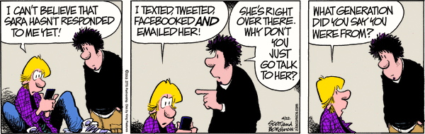
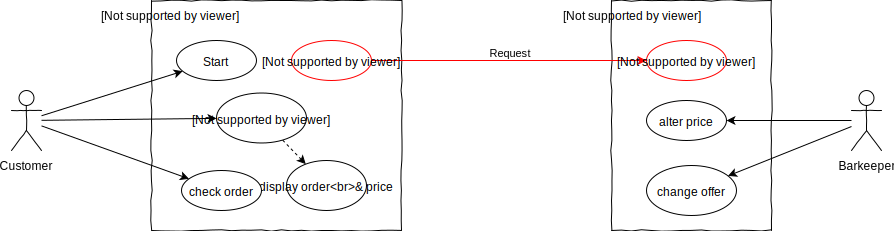
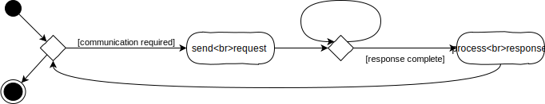
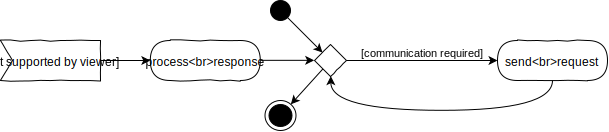

# L05_DataTransferClient
  
<small>Quelle: <a href="https://arnoldzwicky.org/category/these-modern-times/page/3/">https://arnoldzwicky.org/category/these-modern-times/page/3/</a></small>

Die Cocktailbar funktioniert so schon ganz gut, allerdings gibt es noch einen großen Nachteil: die Bestellung wird noch nicht verschickt. Solange also der Barkeeper nicht daneben sitzt, wenn der Kunde seinen Cocktail zusammenstellt, wird ihm das Geschäft entgehen. Diese Konstellation entspricht aber nicht unseren betrachteten Anwendungsfällen und macht das System ohnehin obsolet.  
Es muss also die Webseite, die vom Browser des Kunden auf dessen Rechner angezeigt wird, mit einem anderen Rechner kommunizieren, der die Bestellung empfängt, verarbeitet und schließlich dem Barkeeper mitteilt. Gegebenenfalls sollte er auch eine Rückmeldung über die Bearbeitung geben, die wiederum vom Browser des Kunden empfangen und letzterem angezeigt wird.

- [x] Lies dir diesen kurzen [Wikipedia-Artikel](https://de.wikipedia.org/wiki/Client-Server-Modell) durch um einige Grundbegriffe des Client-Server-Modells zu klären. 

## Anwendungsfalldiagramm
Tatsächlich nutzt die Cocktailbar selbst bereits ein Client-Server-System sobald sie auf Github-Pages veröffentlicht wurde. Pages fungiert nun als File-Server und liefert die HTML-, CSS- und JS-Dateien aus, die ein Browser interpretieren kann. Der Browser stellt den Client dar und es ist irrelevant, auf welchem Rechner er läuft, solange er über eine Internetverbindung mit dem Server kommunizieren kann.  
- [x] Vergleiche hierzu die [EIA2-Landschaft](../X01_Appendix/Landscape/EIA2Landscape2019.svg). Welche Systeme und Prozesse sind dir mittlerweile aus EIA1 und EIA2 bekannt? Zeichne einen geschlossenen Linienzug ein, der all dies ein- und alle unbekannten Prozesse und Systeme ausschließt.  

Teilt man also das Anwendungsfalldiagramm auf, so dass es zwei Systeme, Client und Server, darstellt, so wird klar, dass
- der Kunde mit einem anderen System interagiert als der Barkeeper
- die Bestellung von dem einen System, dem Client, an das andere System, dem Server, übertragen werden muss.  

  
> Das oben angesprochene File-Serving ist hier nicht dargestellt, da dies Browser und Server bereits automatisch erledigen.

## Kommunikation
Kommunikation ist der Prozess des Austauschs oder der Übertragung von Information. Dabei werden zwei grundsätzliche Formen derselben unterschieden. 
### Synchron
  

Synchron bedeutet "zeitlich gemeinsam". Bei der Kommunikation heißt das allerdings nicht gleichzeitig, sondern "aufeinander abgestimmt". Das bedeutet, dass die Kommunikationspartner aufeinander warten, bis der jeweils andere seine Information übertragen hat und dann ihrerseits mit einer Übertragung beginnen. Das bedeutet zwangsläufig, dass die beteiligten Systeme die Hälfte der zur Verfügung stehenden Zeit mit Warten verbringen. Im Diagram, welches den Kommunikationsalgorithmus eines der Partner darstellt, wird dies mit der kleinen Schleife angedeutet.  

- [x] Sammle Beispiele für synchrone Kommunikation in deinem eigenen Alltag.  

So klein diese Schleife auch erscheint, sie kann ein großes Problem darstellen. Die Systeme könnten die Wartezeiten sinnvoll nutzen, anstatt nur in Ihnen zu verharren. Besonders problematisch wird es, wenn ein System für die Antwort lange braucht. Wenn beispielsweise eine Webseite nicht mehr reagiert, weil der Browser auf eine Antwort des Servers wartet, wird der Nutzer den Prozess bald abbrechen.


### Asynchron
  
Daher hat sich die asynchrone Kommunikation durchgesetzt. Die Kommunikationspartner setzen eine oder mehrere Anfragen ab, damit ist ihr Teil zunächst erledigt und sie können sich um andere Aufgaben kümmern. Irgendwann kommt ein Signal, dass eine Antwort auf eine der Anfragen vorliegt. Dieses dient als Startpunkt für einen neuen Prozess, bei dem zunächst die Antwort verarbeitet wird und gegebenenfalls weitere Anfragen verschickt werden.  

- [x] Sammle Beispiele für asynchrone Kommunikation in deinem eigenen Alltag.
- [x] Was sind die besonderen Herausforderungen bei der asynchronen Kommunikation?

Damit ist es Webseiten beispielsweise möglich, die Darstellung aufzubauen und Interaktion zur Verfügung zu stellen, während weitere Daten geladen werden. Oder während der Interaktion mit dem Nutzer Daten zu versenden.  

## Forms
HTML-Forms bieten bereits gänzlich ohne zusätzliche Programmierung die Möglichkeit, Daten synchron zu verschicken. Hierzu ist es lediglich erforderlich, dem Form-Tag ein `action`- und ein `method`-Attribut anzufügen, sowie im Formular einen Submit-Button zu integrieren. Der `action`-Wert gibt den URL an, an welchen die Daten gehen soll. Die Daten selbst, also die Werte der Formularelemente, werden bei Betätigung des Submit-Buttons automatisch aufbereitet und verschickt. Wie sie verschickt werden, hängt von der gewählten `method` ab.
### Get
Bei `method="get"` werden die Daten als Zeichenketten einfach im Klartext an den URL angehängt, abgetrennt mit einem `?`. Die Schlüssel- und Wertepaare sind mit `&` (Et, kaufmännisches Und, Ampersand) voneinander getrennt, die Schlüssel und Werte mit einem `=` verbunden. Der Browser ruft dann diese URL mitsamt Anhang auf, die komplette Zeichenkette erscheint in der Adresszeile.
- [x] Surfe im Netz und suche nach Beispielen für die Datenübertragung in dieser Form, in dem Du die Adressezeile beobachtest.
- [x] Ergänze das Formularelement deiner aktuellen Cocktailbar-Implementation mit den Attributen `method="get"` und `action=""`. Der leere Wert bei `action` bedeutet, dass die aktuelle URL erneut genutzt werden soll. Füge zudem mit
```html
<button type="submit">Abschicken</button>
```
einen Submit-Button im Formular ein. Untersuche was geschieht, wenn Du nun die Seite aufrufst und den Button betätigst.
> Der typ `"submit"` ist die Voreinstellung für Buttons und muss nicht explizit angegeben werden. Jeder Button innerhalb eines Formulars, bei dem nicht explizit ein anderer Typ angegeben ist, führt also zum Datenversand. Und häufig zu Verwirrung bei den Entwicklern...

### Post
Bei `method="post"` werden die Daten als eigene Datenpaket versand und sind nicht für den Nutzer sichtbar. Post wird aber vor allem auch dann verwendet, wenn größere Datenmengen verschickt werden, da die zulässige Länge des URL begrenzt ist. Auf der Serverseite müssen die Datenpakete zunächst erst wieder zu einer zusammenhängenden Request zusammengefügt werden.
- [x] Verwende nun die Methode `"post"` im Formular und betätige den Submit-Button. Versuche nun mit Hilfe der Entwicklertools die Daten zu finden. Klicke dazu auf den Reiter "Netzwerk" oder "Netzwerkanalyse" und dann auf den Post-Request bei den gelisteten Anfragen.  


#### XmlHttpRequest-Events
Bei der asynchronen Kommunikation lässt sich wieder sehr gut die nun wohlbekannte Ereignissteuerung einsetzen. Javascript bietet hierzu das Standardobjekt `XMLHttpRequest` an. Ein solches Objekt kann mit dem Schlüsselwort `new` erzeugt werden. Das Objekt bietet einige Kommandos, mit denen recht einfach eine Verbindung zum Server aufgebaut und eine Request verschickt werden kann. Während das Objekt die Verbindung verwaltet, erzeugt es bei Statusänderungen entsprechende Events, die wiederum mit dem üblichen Schema von Listeners abgefangen und an die zugehörigen Handlerfunktionen weitergeleitet werden. Auch die vollständige Übertragung der Serverantwort ist eine solche Statusänderung, womit das oben dargestellte Schema der asynchronen Kommunikation clientseitig implementiert werden kann.  
> Das XML im Namen des Objektes verrät, dass es sich dabei um eine etwas betagte Technologie handelt, die 1999, während der Standardisierung von HTML4, von Microsoft veröffentlicht wurde. Sie ist aber verbreitet und kommt noch häufig zum Einsatz. [Mehr Infos gibt es hier.](https://wiki.selfhtml.org/wiki/JavaScript/XMLHttpRequest)

#### Fetch & Promises
2017 wurde die globale Javascript-Funktion `fetch` als Schnittstelle für asynchrone Kommunikation eingeführt. 

```typescript
    function sendRequest(): void {
        let promise: Promise<Response> = fetch("Test.txt?y=10", );
        promise.then(handleSuccess, handleFailure);
    }

    function handleFailure(_response: Response): void {
        console.log("Failure", _response);
    }

    function handleSuccess(_response: Response): void {
        console.log("Promise", _response);
        console.log(_response.text().then((_text: string) => {
            console.log("Content", _text);
        }));
    }
```

#### Async/Await

## Requests
## URL
## Query
## Custom Data
## Fetch
## JSON-Object


- [x] Vergleiche hierzu die [EIA2-Landschaft](../X01_Appendix/Landscape/EIA2Landscape2019.svg)