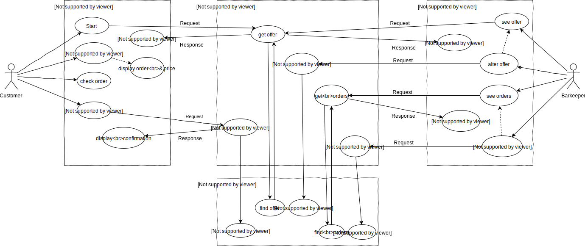
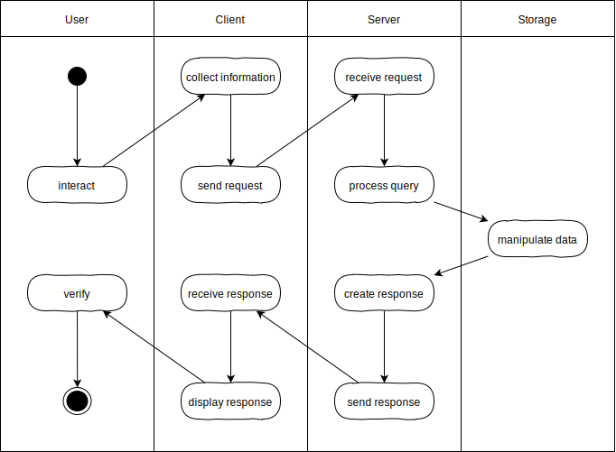

# L06_DatabaseServer

<small>Quelle: <a href="https://xkcd.com/910/">https://xkcd.com/910/</a></small>  

Ein reiner Fileserver wird natürlich den Ansprüchen nicht gerecht, welche die Cocktailbar an die Gegenseite der Kommunikation stellt. Die Bestellung kommt zwar an, aber die Serversoftware ist nicht darauf programmiert, damit etwas anzufangen. Der Query-String wird schlicht ignoriert. Was genau damit geschehen soll, wurde allerdings auch noch gar nicht definiert. Im vorangegangenen Kapitel wurde lediglich festgehalten, dass der Server die Bestellung entgegen nehmen soll.  

Nun müssen wir davon ausgehen, dass das Barkeeperi nicht im Keller eines Rechenzentrums sitzt und wartet, bis auf irgendeinem Monitor ein Fenster aufgeht und eine Bestellung anzeigt. Anders als an einer nicht-virtuellen Bar, kommunizieren Barkeeperi und Kundi nun asynchron. Die Bestellungen müssen also gespeichert werden und zwar so, dass das Barkeeperi darauf jederzeit von anderen Clients aus Zugriff hat. Damit brauchen wir als weiteres System einen Datenspeicher.

## Use-Case-Diagramm



Neben dem Datenspeicher wurde im Diagramm auch ein Client für das Barkeeperi berücksichtigt. Spätestens jetzt wird klar, wie hilfreich Anwendungsfalldiagramme in frühen Stadien der Softwareentwicklung sind. 

> - [x] Studiere intensiv das dargestellte Diagramm und erkläre was es darstellt.

## Swimlane-Activity Diagram
Im Use-Case-Diagramm ist ein Muster zu erkennen. Häufig löst eine Interaktion des Nutzeris eine Aktivität im Client aus, wodurch eine Request an den Server geschickt wird, welcher dann auf den Datenspeicher zugreift, eine Response formuliert und an den Client zurückschickt, der diese aufbereitet und dem Nutzeri eine Rückmeldung gibt. Diese Standard-Aktivität über Systemgrenzen hinweg kann auch in einem Aktivitätsdiagramm dargestellt werden.

  

Jedes beteiligte System, gegebenenfalls auch das Nutzeri, wird dabei in einem eigenen Bereich, einer sogenannten Swimlane, also Schwimmbahn, dargestellt.

## Datenbank
Was oben zunächst unspezifisch als Datenspeicher angeführt wurde, ist in der Regel eine Datenbanksoftware, die große Datenmengen schnell und effizient verwalten kann. Diese Systeme sind meist standardisiert, so dass eine Serversoftware sich nicht mit der internen Funktionsweise auseinandersetzen, sondern lediglich die richtigen Befehle und Datenformate bedienen muss, um die Datenbank zu nutzen.

### Relationale Datenbanken
Seit den 1970er Jahren dominieren relationale Datenbanken, bei denen die Daten in Tabellenstrukturen untergebracht werden und durch Querverweise ein Netz von Tabellen aufgespannt wird. Mit der Structured-Query-Language (SQL) wurde eine Abfragesprache entwickelt, mit der komplexe Anweisungen formuliert werden können, welche die Datenbanksoftware dann selbständig ausführt um Daten aus dem Bestand zu liefern oder zu manipulieren. Heute ist insbesondere die Open-Source-Datenbanksoftware MySQL sehr weit im Internet verbreitet.
> **FunFact:** Dem Namen MySQL wird meist intuitiv die Bedeutung "MeinSQL" zugesprochen. Tatsächlich aber hat der finnische Entwickler Michael Widenius sein 1994 gestartetes Open-Source-Projekt nach seiner Tochter My benannt.

### NoSQL-Datenbanken
Mit dem durch das Internet stetig wachsenden Datenaufkommen wurde der Bedarf an Skalierungsmöglichkeiten immer größer. Die Leistung und Kapazität einer Datenbank sollte also während des Betriebs durch Einsatz von mehr Hardware einfach vergrößert werden können. Relationale Datenbanksysteme sind aber ursprünglich nicht dafür ausgelegt, die Daten zu verteilen. 
NoSQL bzw. dokumentenorientierte Datenbanken adressieren dieses Problem. Die zu verwaltenden Daten müssen dabei nicht in starr definierte Tabellenform gebracht werden, sondern jeder Datensatz kann als beliebig strukturiertes Dokument abgelegt werden.  
Das No in NoSQL bedeutet "Not only", es gibt also auch Systeme, die mit SQL arbeiten können. Dokumentenorientierte Datenbanken sind eine Variante der NoSQL-Datenbanken, es gibt noch andere.

### MongoDB
2009 wurde mit MongoDB eine NoSQL-Datenbanksoftware veröffentlicht, die JavaScript als interne Verkehrssprache nutzt. Die Daten liegen im JSON-Format vor, Abfragen und Aggregationsfunktionen können direkt als JavaScript-Anweisungen formuliert werden, außerdem können ganze Anweisungsfolgen zum Datenbanksystem geschickt und dort ausgeführt werden.  

> **FunFact:** Der Name MongoDB leitet sich von *humongous* ab, womit die groteske Größe der Datenmengen gemeint ist, die mit dieser Software verwaltet werden können.

Zusammen mit node.js, was es ermöglicht, JavaScript außerhalb des Browsers zu nutzen, kann also die ganze Serverseite heute mit JavaScript/TypeScript umgesetzt werden. Das Nachfolgeprojekt von node.js, deno, verarbeitet direkt TypeScript. Wenn auch die aktuellen Installationen im Internet noch von JavaScript, PHP und MySQL dominiert sind, bist Du mit Node.js, TypeScript und MongoDB sehr zukunftsträchtig aufgestellt.

Für die Konzeption ist es allerdings zunächst unerheblich, welche Systeme letztlich zum Einsatz kommen.

## MingiDB
Die Installation und Einrichtung einer Datenbank im Netz und die Entwicklung der serverseitigen Steuersoftware würde den Rahmen dieses Kurses sprengen. So wurde speziell hierfür eine winzige Serversoftware entwickelt, die sich an MongoDB orientiert aber äußerst leicht installieren lässt, direkten Einblick in die verwalteten Daten erlaubt und über keinerlei Sicherheitsmechanismen und Optimierungen verfügt.

> **Achtung:** MingiDB wurde ausschließlich zu Lehrzwecken und für Prototypen entwickelt und darf nicht darüber hinaus zum Einsatz kommen.

### Datenbank
Eine MingiDB-Datenbank ist lediglich ein Ordner auf einem über das Internet erreichbaren Computer, der PHP verarbeiten kann, in dem die Datei `index.php` von MingiDB abgelegt ist. Das darin enthaltene PHP-Skript legt innerhalb des Ordner selbständig JSON-Dateien an, die als `collection` bezeichnet werden. Die einzelnen Einträge in einer `collection` werden `document` genannt und sind einfach unsere bekannten assoziativen Arrays im JSON-Format. Jeder Eintrag wird dabei von MingiDB automatisch mit einer eindeutigen Identifikation versehen, auch wenn die Inhalte ansonsten identisch sind.

```plaintext
Database
├ Collection_0
├ Collection_1
│ ├ Document_0
│ ├ Document_1
│ ├ Document_2
│ └ ...
├ Collection_2
└ ...  
```  

### Server
Das Skript dient gleichzeitig als Server, mit dem der Client kommuniziert. Normalerweise kann ein solcher Server frei programmiert werden und selbstständig Daten auch erzeugen, verändern und prüfen. Für diesen Kurs genügt es, dass er die Queries, die er vom Client erhält, nach einem festgelegten Schema interpretiert und damit die Daten verwaltet.

### Installation
Github-Pages ist ein reiner Fileserver und Du hast keine Möglichkeit, mehr Funktionalität auf der Serverseite zu implementieren. Deine Datenbank muss von einem Service betrieben werden, der dir diese Möglichkeit bietet. Und Du brauchst einen freien Zugang dazu. Nutze jetzt deinen eigenen HFU-Webspace, hier können selbstgeschriebene Programme serverseitig ausgeführt werden. Diese und weitere Daten kannst Du dort mit Hilfe des File-Transfer-Protocol (ftp bzw. sftp) selbst verwalten, fast so wie mit deinem lokalen Dateisystem.
- [x] Mache dich zunächst mit dem Webspace vertraut, den dir die Hochschule zur Verfügung gestellt hat, und mit einem der empfohlenen FTP-Clients. Siehe <https://howto.hs-furtwangen.de/webdata/>
- [x] Hole dir nun MingiDB von <https://github.com/JirkaDellOro/MingiDB> und folge den Anweisung zur Installation und dem Tutorial. 
- [x] experimentiere mit dem MingiDB-Client und deiner Datenbank.

# Cocktailbar: Datenbankanbindung
MingiDB kann also GET-Requests vom Client entgegen nehmen, den Query interpretieren und den Datenspeicher verwalten, darin Datensätze erzeugen (Create), lesen (Read), verändern (Update) und löschen (Delete). Diese vier Aktivitäten sind fundamental und werden kurz durch das Akronym `CRUD` zusammengefasst.  

Wie MongoDB erwartet auch MingiDB die Daten im JSON-Format. Zudem wird im Query ein Kommando und die Angabe der Collection erwartet. Das bedeutet, dass er bearbeitet werden muss, bevor er abgeschickt wird.

## Umwandlung
Leider bieten weder FormData noch URLSearchParams Methoden zur Umwandlung der Formulardaten in das erforderliche JSON-Format. Der Algorithmus hierfür ist aber nicht sonderlich komplex.
```typescript 
interface FormDataJSON {
  [key: string]: FormDataEntryValue | FormDataEntryValue[];
}

let formData: FormData = new FormData(form);
let json: FormDataJSON = {};

for (let key of formData.keys())
  if (!json[key]) {
    let values: FormDataEntryValue[] = formData.getAll(key);
    json[key] = values.length > 1 ? values : values[0];
  }
```
- [x] Ergründe, was hier geschieht. Recherchiere nach den Typen und Anweisungen im Internet.

## Query
Es geht zunächst nur um die Bestellung, also ist nur das Kommando "insert" erforderlich. Die Collection heißt "Orders" und es wird davon ausgegangen, dass sie in der Datenbank bereits existiert. Mit Hilfe eines leeren URLSearchParams-Objekt kann der Query nun leicht erzeugt werden.
```typescript
let query: URLSearchParams = new URLSearchParams();
query.set("command", "insert");
query.set("collection", "Orders");
query.set("data", JSON.stringify(json));
```
Ein so erzeugter Query sieht in der Zeichenkettendarstellung nun beispielsweise so aus:  
`?command=insert&collection=Orders&data={"Drink":"Sex on the beach","Container":"Papercup","Extras":["Lemon","Orange"],"Amount":"0.4"}`

- [x] Übertrage den Code in die `sendOrder`-Funktion deiner Cocktailbar (oder hole dir den Code aus dem Anhang) und bringe ihn mit deiner eigenen Datenbank zum Laufen. Dazu musst Du dort die Collection "Orders" zuvor angelegt haben und im Code den URL auf deine Datenbank angeben.

## Angebot
Das Angebot des Barkeeperis liegt derzeit noch als statische Datei bei der Applikation. Entsprechend des Use-Case-Diagramms sollte es in einer Collection `offer` liegen. Dabei wäre es möglich, das komplette Angebot als ein einziges Dokument abzulegen, so wie es derzeit auch vorliegt. Allerdings wäre die Funktionalität einer Datenbank vielleicht besser genutzt, wenn man das Angebot auf mehrere Dokumente aufteilt. Diese könnten so aussehen:
```typescript
{ Drink: [ { name: "Mojito", price: 25.00 }, { name: "Caipirinha", price: 30.00 }, ... ] }
{ Extras: [ { name: "Ice", price: 0.50 }, { name: "Lemon", price: 0.20}, ... ]}
...
```
Auch ist es möglich und vielleicht sinnvoll, eigene Collections für Drinks, Extras, Container etc. anzulegen und darin für jedes Item ein eigenes Dokument.
```typescript
Collection Drink
{ name: "Mojito", price: 25.00 }
{ name: "Caipirinha", price: 30.00 }
...
Collection Extras
{ name: "Ice", price: 0.50 }
{ name: "Lemon", price: 0.20}
...
```
Diese Collections könnte man auch in einer eigenen Datenbank, bei MingiDB also einem eigenen Ordner, für das Barkeeperi-Angebot anlegen und damit strenger von den Bestellungen trennen.  

> **Achtung:** Wie also Informationen in Datenbanken strukturiert sein sollen, ist eine Designentscheidung, die Du treffen musst!

