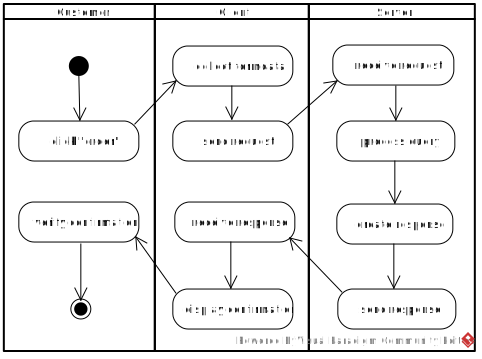

# L06_Server

<small>Quelle: <a href="https://xkcd.com/910/">https://xkcd.com/910/</a></small>  

Ein reiner Fileserver wird natürlich den Ansprüchen nicht gerecht, welche die Cocktailbar an die Gegenseite der Kommunikation stellt. Die Bestellung kommt zwar an, aber die Serversoftware ist nicht darauf programmiert, damit etwas anzufangen. Was genau damit geschehen soll, wurde allerdings noch gar nicht definiert. Im vorangegangenen Kapitel wurde lediglich festgehalten, dass der Server die Bestellung entgegen nehmen soll.  

  

In diesem Kapitel soll daher zunächst die Grundlage für die Weiterverarbeitung geschaffen werden. Der Server soll eine asynchrone Kommunikation mit dem Client führen, Daten von diesem entgegen nehmen und eine Antwort erzeugen können, die über das einfache Ausliefern von statischen Dateiinhalten hinausgeht. Kurzum: ein Applikation-Server wird erstellt.

  
Der Anwendungsfall kann in obenstehendem, domänenübergreifenden Aktivitätsdiagramm dargestellt werden. Jedes beteiligte System, gegebenenfalls auch der Nutzer, wird dabei in einem eigenen Bereich, einer sogenannten Swimlane, also Schwimmbahn, dargestellt.

## Node.js
Der Server wird voraussichtlich nicht in einem Browser laufen. Üblicherweise sind Server auf Maschinen installiert, die in einem Rechenzentrum in lebensfeindlicher Umgebung stehen und nicht mit der Interaktion mit Usern beschäftigt sind. Ein Browser, der doch vordringlich für die Mensch-Maschine-Kommunikation verantwortlich ist, wäre da nur hinderlich. Daher sind Server meist in niederen Sprachen wie C++, Java usw. programmiert und werden ggf. in ihrere Funktionalität mit Hilfe von Skriptsprachen wie Pearl, CGI oder PHP erweitert.  

2009 kam der damals 28jährige Student Ryan Dahl auf die Idee, Googles V8-Javascript-Interpreter außerhalb des Browsers zu nutzen, um verschiedene Module zu erweitern und damit einen Server zu programmieren. Der Einsatz von Javascript war vor allem motiviert durch Unterstützung der Ereignissteuerung, womit Server nicht durch wartende Prozesse blockiert werden. Ryan schuf damit Node.js, eine Programmierumgebung, mit der es möglich ist, Javascript und damit auch kompiliertes TypeScript außerhalb von Browsern zu nutzen und damit Anwendungen zu entwickeln. VSCode selbst ist eine solche Anwendung! Ryan erklärt Node.js selbst in diesem [Google Talk](https://www.youtube.com/watch?v=F6k8lTrAE2g) (danger, very techy)

> **FunFact:** 2018 kündigte Ryan Dahl die Entwicklung von Deno an, womit er Node.js Konkurrenz macht. Unter anderem soll Deno direkt TypeScript-Programme interpretieren, ohne dass daraus zuvor Javascript-Dateien erzeugt werden müssen. Hier ist Ryans [Github-Profil](https://github.com/ry)

Für dich ist der riesige Vorteil von Node.js, dass Du keine weitere Programmiersprache lernen musst, um einen Server zu entwickeln. Ebenso kannst Du damit Desktop-Programme für Windows, Mac oder Linux bauen (siehe VSCode). Mit TypeScript und Node.js bist Du sehr gut aufgestellt.  

- [x] Wie kannst Du ermitteln, welche Node-Version auf deinem Rechner installiert ist?
- [x] Stelle sicher, dass Du eine aktuelle Version hast und führe gegebenenfalls ein Update durch.

## Entwickeln mit Node.js
### Types
Damit TypeScript bei der Entwicklung einer Node.js-Applikation richtig helfen kann, muss es die neuen Datentypen kennen, die Node mitbringt. Diese installierst Du wieder einfach per npm auf deiner Entwicklungsmaschine, am besten auf der obersten Ebene deines EIA2-Projektes:
```
npm install @types/node
```
Dabei entsteht ein Ordner `node_modules` und eine Datei `package.lock.json`. Letztere kannst Du in dein Repository übernehmen oder löschen. Im Ordner `node_modules` allerdings befinden sich die Definitionsdateien für TypeScript und später kommen noch weitere Module dazu, die richtig Platz brauchen. Daher solltest Du diese nicht auf dein Github-Repository pushen. Wähle stattdessen im SourceControl-View von VSCode für diesen Ordner die Option "Add File to .gitignore" (z.B. per Rechtsklick). Dann wird sich Git nicht mehr um diesen Ordner kümmern.

### Run
Ein Skript mit Node laufen zu lassen ist denkbar einfach. Da auf deiner Maschine bereits Node installiert ist (sonst würden VSCode und der TypeScript-Compiler nicht funktionieren) musst Du lediglich in der Konsole
```
node NameDesSkripts.js
```
eingeben, wobei NameDesSkripts natürlich mit dem Namen der Skript-Datei zu ersetzen ist, die Du tatsächlich laufen lassen möchtest.

### Debug
In VSCode kann das Skript, in welchem sich gerade der Cursor befindet, auch ganz einfach mit Ctrl+F5 gestartet werden. Dann nämlich läuft der VSCode-Debugger an und verarbeitet das Skript, greift aber nicht ein. Die Skriptausgaben sind in der DEBUG CONSOLE zu finden.  

Mit Tastendruck auf F5 alleine startest Du den Debugger mit der vollen Funktionalität und kannst nun wie mit dem Browserdebugger durch das laufende Programm navigieren, Breakpoints setzen und Variablen beobachten.

### API
Node kommt mit einigen neuen Standardobjekten und Modulen, für EIA2 brauchst Du aber nur sehr wenige davon. Die Dokumentation findest Du im Netz auf https://nodejs.org/de/docs/.  
Das Objekt `process` beispielsweise liefert Informationen zur Umgebung, in der ein Node-Programm gerade ausgeführt wird. 

|Hier erscheint jetzt ein Video|
|-
|Zweigeteilt 
|1. VSCode 
|2. Jirkas sprechender Kopf  

>Inhalt: eine erste Node-Anwendung  
> - namespace (erst prüfen, wie es damit weiter geht)
> - Variablen
> - Starten (Commandline, Ctrl+F5, F5)
> - Debuggen
> - Events, Unterschiede zu bisher
> - Timeout
> - process

- [x] Eine kleine Aufgabe mit einer Node-App lösen! Hierzu CLI-Parameter entgegen nehmen. Farben-Konverter? Bin-Dez-Hex? Eliza?

## Erweiterungen
Zusätzlich zu den schon fest eingebauten Modulen, werden auch Standard-Erweiterungen mitgeliefert. Um einen Server zu bauen, brauchen wir dabei das Module `http`. Das Module `url` ist hilfreich um den query-String zu extrahieren und zu interpretieren. Beide Module können mit dem Schlüsselwort `import` geladen und einer Variablen zugewiesen werden, über welche in der Folge auf die Funktionen und Objekte der Module zugegriffen werden kann. Der Asterisk `*` gibt an, dass sämtliche Funktionalität importiert werden soll, hier könnte auch eine Auswahl getroffen werden.
```typescript
import * as Http from "http";
import * as Url from "url";

export namespace ... {
    Http.createServer(...);
}
```
**Achtung:** Wird `input` verwendet, geht TypeScript davon aus, dass ein eigenes, neues Modul erzeugt werden soll und fordert das Schlüsselwort `export` vor `namespace`, auch wenn es hier bedeutungslos ist.

Auch die Standardmodule, die wahlweise importiert werden wie `http` und `url`, sind in der [Node-Dokumentation](https://nodejs.org/de/docs/) beschrieben.

## Design
|Hier erscheint jetzt ein Video|
|-
|Zweigeteilt 
|1. Diagrammerstellung auf Papier 
|2. Jirkas sprechender Kopf  

>Inhalt: 
> - Einen Port auf dem System für Anfragen öffnen
> - Listener installieren, der auf eine Anfrage reagiert
> - Handlerfunktion, welche die Anfrage verarbeitet und eine Antwort formuliert

## Implementation 1
|Hier erscheint jetzt ein Video|
|-
|Dreigeteilt 
|1. groß das Programm, das gerade getippt wird
|2. klein die Diagramme im Wechsel
|3. klein Jirkas sprechender Kopf  

> Inhalt:
> - Implementation bis Reaktion auf Request

## handleRequest
Die Events, die in diesem System verwendet werden, sind keine DOM-Events, schließlich ist HTML nicht die Grundlage auf der Serverseite. Deswegen folgen sie auch nicht der Konvention, dass immer ein Event-Objekt an den Handler übergeben wird. 
Der Handler zum Request-Event erwartet zwei Parameter, den ersten vom Typ `IncomingMessage` und den zweitem vom Typ `ServerResponse` aus dem `http`-Modul.  

`IncomingMessage` liefert Informationen zur eingegangenen Request, zum Beispiel den URL als String. Um daraus bequem den Query-Teil zu extrahieren, bietet das `url`-Modul hilfreiche Methoden. `parse` interpretiert den URL und erzeugt daraus ein neues Objekt, dessen Eigenschaft `query` nun wieder ein assoziatives Array darstellt.

`ServerResponse` ist ein Objekt, welches die Informationen für die Antwort sammelt. Dabei wird, wie bei Kommunikationsprotokollen üblich, diese Information in zwei grundlegende Kategorien aufgeteilt
- Header: Information zur eigentlichen Nachricht
- Body: die Nachricht selbst.

Header-Informationen integrierst Du mit der Methode `setHeader(...)` des ServerResponse-Objektes, mit `write(...)` kannst Du ganz einfach Zeichenketten dem Nachrichten-Body anfügen und mit `end()` die Antwort verschicken lassen. Eine simple Antwort kann man also derart zusammenbauen:
```typescript
function handleRequest(_request: Http.IncomingMessage, _response: Http.ServerResponse): void {
    _response.setHeader("content-type", "text/html; charset=utf-8");
    _response.setHeader("Access-Control-Allow-Origin", "*");
    _response.write("Was geht?");
    _response.end();
}
```
Im Beispiel verschickt der Server lediglich die Antwort mit dem Inhalt "Was geht?". Der Header gibt an, dass die Antwort ein mit utf-8 kodierter Text ist, also z.b. kein Bild, und dass sie von jedem geöffnet werden darf. Auch hier bedeutet der Asterisk wieder "alles".

## Implementation 2
|Hier erscheint jetzt ein Video|
|-
|Dreigeteilt 
|1. groß das Programm, das gerade getippt wird
|2. klein die Diagramme im Wechsel
|3. klein Jirkas sprechender Kopf  

> Inhalt:
> - Parameter verarbeiten
> - Probleme umschiffen, Header einbauen
> - Verschiedene Ausgaben auf Konsole und in Antwort
> - JSON erzeugen

## Heroku
Der Server auf dem Entwicklungsrechner funktioniert, nun gilt es, ihn in einem Rechenzentrum unterzubringen, damit der Cocktailbar-Client auch von anderen Rechnern aus damit kommunizieren kann. Eine Möglichkeit ist es, einen realen oder virtuellen Rechner anzumieten, ihn selbst zu konfigurieren und die erforderliche Software darauf zu installieren etc. Das erfordert einiges an Spezialwissen und teilweise obliegt auch die Wartung, Erweiterung und Aktualisierung in der Verantwortung des Mieters.
Mittlerweile gibt es aber auch einen großen Markt für "Platform As A Service" (PaaS), bei dem sich der Nutzer nicht um die Infrastruktur kümmern muss, sondern diese einfach nutzen kann. Der Anbieter kümmert sich um deren Bereitstellung, Wartung, Skalierung und so weiter. Heroku ist eine solche PaaS, sie findet in diesem Modul Anwendung.  

- [x] Schau' dir das [NewsWatch-Video](https://newswatchtv.com/2018/06/15/heroku-newswatch-review/) zu Heroku an.
- [x] Versuche in der [EIA2-Landschaft](../X01_Appendix/Landscape/EIA2Landscape2019.svg) die Laufzeitumgebung für deinen Server auf deiner Entwicklungsmaschine und in der Cloud zu verorten.

### Installation
- [x] Öffne die Seite www.heroku.com
- [x] Lege dir ein kostenloses Nutzerkonto an
    - [x] Primary language: Node.js
- [x] Klicke rechts oben auf "New" und dann auf "create new app"
    - [x] Der Name deiner App muss einzigartig sein und darf nur kleine Buchstaben nutzen
    - [x] Wähle Region Europe
    - [x] Dann "create app"
- [x] In deinem persönliches Dashboard (Steuerpult) interessiert zunächst nur die Seite"Deploy"
  - [x] Um nun deinen Code auf Heroku zu laden, wähle dort "Connect to Github"
  - [x] Klicke darunter erneut auf "Connect to Github"
  - [x] Im Popup mit Github verbinden
  - [x] Wähle dein Repository aus
  - [x] ** ggf. muss in Github noch der Zugriff gewährt werden. @Praktikanten: bitte Vorgang beschreiben **

Heroku sollte nun vorbereitet sein deinen Code von deinem Repository zu pullen und als Web-App laufen zu lassen. 

### Deployment
- [x] Klicke im Dashboard oben rechts auf "More" und öffne "View logs" in einem neuen Browserfenster.
- [x] Ordne das Deploy- und das Logs-Browserfenster nebeneinander auf deinem Bildschirm an um die Ausgaben beobachten zu können.
- [x] Klicke auf "Deploy Master Branch"
  - [x] Beobachte die Ausgaben in beiden Fenstern beobachten
  - [x] Wenn Du alles richtig gemacht hast, erhältst Du im Deploy-Fenster Fehlermeldungen und deine Web-App crasht!

### package.json
Das Problem ist nämlich, dass Heroku keine Ahnung davon hat, was es eigentlich tun soll. Auf deiner Entwicklungsmaschine hattest Du von Hand die Kommandos gegeben. So wurde Node installiert, der Code kompiliert und der Server unter Node.js gestartet etc. Um solches auf Heroku zu machen fehlt dir der direkte Zugang. Es ist aber auch nicht sinnvoll, denn schließlich soll deine Server-App auch automatisch starten, und nicht immer von deiner Präsenz abhängig sein. Das Build-Log gibt schon darüber Auskunft wie vorzugehen ist.
```plaintext
 !     The 'heroku/nodejs' buildpack is set on this application, but was
 !     unable to detect a Node.js codebase.
 !         
 !     A Node.js app on Heroku requires a 'package.json' at the root of
 !     the directory structure.
 !     
 !     If you are trying to deploy a Node.js application, ensure that this
 !     file is present at the top level directory. This directory has the
 !     following files:
 ```
 Wenn Du darunter deine Dateien und Ordner siehst, ist alles sehr gut. Du musst also nur eine json-Datei mit dem Namen package auf der obersten Ebene deiner Dateistruktur unterbringen, mit der Du Heroku die notwendigen Informationen mitgeben kannst. Zum Glück hilft dir Node bei der Erstellung dieser Datei.

 - [x] Öffne eine Konsole auf der obersten Ebene deines Projektes
 - [x] Gib `npm init` ein
 - [x] Bei den meisten Einträgen kannst Du einfach die Vorschläge akzeptieren. Einen Namen, der wie der Name deiner Heroku-App nur aus Kleinbuchstaben bestehen darf, und deinen Namen als Autor solltest Du wenigstens eingeben.
 - [x] Wenn Du damit durch bist, öffne die entstandene Datei `package.json`
   - [x] ersetze darin den mit "test" bezeichneten Eintrag in "scripts" durch
   ```
   "node Relativer/Pfad/Zu/Datei.js"
   ```
   wobei Du den rechten Teil natürlich mit Sinnvollem ersetzt.
- [x] Teste `package.json` indem Du nun in der Konsole `npm start` eingibst. Der NodePackageManager (npm) sucht jetzt selbst in der Datei nach dem Eintrag "start" unter "scripts" und führt aus was darin steht.
- [x] Wenn's klappt: Commit und Push!
- [x] Wenn nicht: Issue posten...

### Server-App starten
- [x] Öffne wieder die beiden Heroku-Fenster
- [x] Starte wieder einen Build im Deploy-Fenster
- [x] Beobachte die Logs in beiden Fenstern in beiden sollte die Zeile "Build succeeded" zwischen den anderen auftauchen.

Dein Server wird auch gleich gestartet. Heroku gibt dir auch die Möglichkeit, die Antworten deines Server direkt im Browser anzeigen zu lassen.
- [x] Klicke dazu auf "View" bzw. "Open app"
- [x] Ein neuer Browsertab öffnet sich und zeigt dir die Serverantwort. Der URL ist die Adresse deiner App.
- [x] Erweitere den URL um einen Search- bzw. Query-Teil und beobachte die Serverantworten.

## Client
Jetzt musst Du lediglich noch die url-Variable in deiner Clientsoftware anpassen, damit diese sich mit dem Heroku-Server unterhält.
- [x] Teste deinen Heroku-Server vom Client aus, sowohl 

