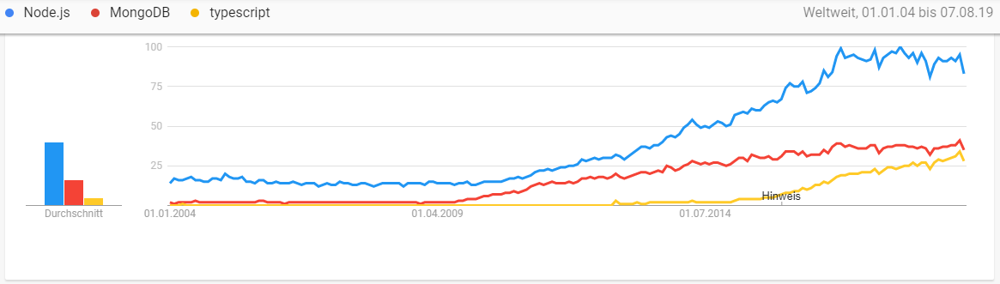
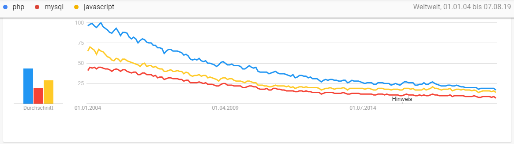

# L07_Database

<small>Quelle:<a href="https://dilbert.com/strip/1995-11-17">https://dilbert.com/strip/1995-11-17</a></small>  

Mit dem Cocktailbar-Client kann der Kunde einen Cocktail zusammenstellen, seine Bestellung überprüfen und abschicken. Der Server nimmt die Bestellung entgegen und formuliert eine Bestätigung, die der Client anzeigt. Dumm nur: der Barkeeper bekommt davon immer noch nichts mit. Denn anders als an einer nicht-virtuellen Bar, kommunizieren Barkeeper und Kunde nun asynchron. Der Barkeeper ist also höchstwahrscheinlich nicht zugegen, wenn die Bestellung hereinkommt und arbeitet sie stattdessen zu irgendeiner anderen Zeit ab. Die Bestellungen müssen also irgendwie gespeichert werden und zwar so, dass der Barkeeper darauf jederzeit Zugriff hat.  

Es wäre möglich, dass der Server für jede Bestellung eine Datei anlegt und diese in seinem Massenspeicher ablegt, oder alle Bestellungen in einer Datei sammelt. Allerdings sollten auch alte Bestellungen gelöscht, oder vielleicht alle Bestellungen des gleichen Kunden herausgesucht, oder zur Optimierung des Angebots die Häufigkeit der Bestellung einer bestimmten Drink-Extra-Kombination ermittelt werden können. Für all dies müssten wieder entsprechende Algorithmen und Datenstrukturen konzipiert und implementiert werden. Da solche Anforderungen bei der Entwicklung interaktiver Anwendungen aber sehr häufig auftreten und oft ähnlich sind, gibt es bereits Standardsoftware, welche Daten speichert, verwaltet und auswertet: Datenbanksysteme!  

## Relationale Datenbanken
Seit den 1970er Jahren dominieren relationale Datenbanken, bei denen die Daten in Tabellenstrukturen untergebracht werden und durch Querverweise ein Netz von Tabellen aufgespannt wird. Mit der Structured-Query-Language (SQL) wurde eine Abfragesprache entwickelt, mit der komplexe Anweisungen formuliert werden können, welche die Datenbanksoftware dann selbständig ausführt um Daten aus dem Bestand zu liefern oder zu manipulieren. Heute ist insbesondere die Open-Source-Datenbanksoftware MySQL sehr weit im Internet verbreitet.
> **FunFact:** Dem Namen MySQL wird meist intuitiv die Bedeutung "MeinSQL" zugesprochen. Tatsächlich aber hat der finnische Entwickler Michael Widenius sein 1994 gestartetes Open-Source-Projekt nach seiner Tochter My benannt.

## NoSQL-Datenbanken
Mit dem durch das Internet stetig wachsenden Datenaufkommen wurde der Bedarf an Skalierungsmöglichkeiten immer größer. Die Leistung und Kapazität einer Datenbank sollte also während des Betriebs durch Einsatz von mehr Hardware einfach vergrößert werden können. Relationale Datenbanksysteme sind aber ursprünglich nicht dafür ausgelegt, die Daten zu verteilen. 
NoSQL bzw. dokumentenorientierte Datenbanken adressieren dieses Problem. Die zu verwaltenden Daten müssen dabei nicht in starr definierte Tabellenform gebracht werden, sondern jeder Datensatz kann als beliebig strukturiertes Dokument abgelegt werden.  
Das No in NoSQL bedeutet "Not only", es gibt also auch Systeme, die mit SQL arbeiten können. Dokumentenorientierte Datenbanken sind eine Variante der NoSQL-Datenbanken, es gibt noch andere.

## MongoDB
2009 wurde mit MongoDB eine NoSQL-Datenbanksoftware veröffentlicht, die Javascript als interne Verkehrssprache nutzt. Abfragen und Aggregationsfunktionen können direkt als Javascript-Anweisungen formuliert werden, außerdem können ganze Anweisungsfolgen zum Datenbanksystem geschickt und dort ausgeführt werden.  

> **FunFact:** Der Name MongoDB leitet sich von *humongous* ab, womit die groteske Größe der Datenmengen gemeint ist, die mit dieser Software verwaltet werden können.

Für dich ist der riesige Vorteil der Nutzung dieser Datenbanksoftware, dass Du keine weitere Abfrage- oder Programmiersprache lernen musst. Die Anweisungen, die MongoDB für Node.js bereit stellt, sind auch in TypeScript definiert, so dass Du sie mit der gewohnten Unterstützung einsetzen kannst, genauso wie die modernen Konzept der ansynchronen Kommunikation mit dem Datenbanksystem wie `Promise` und `async/await`.  
Wenn auch die aktuellen Installationen im Internet noch von JavaScript, PHP und MySQL dominiert sind, bist Du mit Node.js, TypeScript und MongoDB zudem sehr zukunftsträchtig aufgestellt, wie die Grafiken von Google-Trend nahelegen.




Für die Konzeption ist es allerdings zunächst unerheblich, welche Systeme letztlich zum Einsatz kommen.

## Use-Case-Diagramm
Durch den Einsatz einer Datenbanksoftware ist es nicht mehr erforderlich, eine Datenverwaltung selbst zu entwickeln. Komplexität entsteht nun aber durch die Kommunikation zwischen den Systemen Client, Server und Datenbanksystem. Das wird schon im erweiterten Use-Case-Diagram deutlich.


Neben der Datenbank wurde nun auch ein Client für den Barkeeper berücksichtigt, denn schließlich sitzt er wahrscheinlich nicht im Rechenzentrum und kann direkt die Maschinen manipulieren, auf denen der Server läuft.  
Spätestens jetzt sollte klar werden, wie hilfreich Anwendungsfalldiagramme in frühen Stadien der Softwareentwicklung sind. 

> - [x] Studiere intensiv das dargestellte Diagramm und erkläre was es darstellt.

Das Diagramm stellt lediglich die Grundfunktionalitäten dar, tatsächlich kann es schnell noch deutlich komplexer werden, wenn die Anforderungen steigen. Beispielsweise wäre es sicher wünschenswert, wenn der Barkeeper nach dem Ändern des Angebotes oder dem Löschen einer Bestellung eine Rückmeldung bekommt und sein Interface auf den aktuellen Stand gebracht wird.  
Auch ist hier nur das Verhalten dargestellt, welches im fehlerfreien Lauf erwartet wird. Wenn unterschiedliche Systeme aber miteinander kommunizieren sind Fehler wie Verbindungsabbrüche oder falsche Nutzereingaben an der Tagesordnung. Die Fehlerbehandlung macht oft den größten Teil der letztlich entwickelten Software aus, und würde an dieser Stelle den Rahmen weit sprengen.

## Allgemeine Datenbankstruktur
```plaintext
MongoDB-Instanz
├   admin
├   config
├   local
├ Database_1
├ Database_2
│ ├ Collection_1
│ ├ Collection_2
│ │ ├ {key: value, key: value, ...}
│ │ ├ {key: value, key: value, ...}
│ │ ├ {key: value, key: value, ...}
│ │ └ ...
│ ├ Collection_3
│ └ ...
├ Database_3
└ ...
``` 
- Eine MongoDB-Instanz kann mehrere Datenbanken verwalten.
- Die Datenbanken admin, config und local werden dabei standardmäßig angelegt und sind für die interne Funktionalität erforderlich
- Die kannst beliebig viele eigene Datenbanken anlegen
- In jeder Datenbank können beliebig viele Collections untergebracht sein
- Jede Collection enthält eine beliebige Anzahl an Dokumenten
- Ein Dokument ist im Wesentlichen lediglich ein JSON-String

## Datenbankstruktur für die Cocktailbar
Da jede Bestellung vom Server leicht in einen JSON-String umgewandelt wird, bietet es sich an, diese beispielsweise in einer Collection namens `orders` abzulegen. Das Angebot des Barkeepers sollte in einer Collection `offer` liegen. Dabei wäre es möglich, das komplette Angebot als ein einziges Dokument abzulegen, so wie es derzeit auch vorliegt. Allerdings wäre die Funktionalität einer Datenbank besser genutzt, wenn man das Angebot auf mehrere Dokumente aufteilt. Diese könnten so aussehen:
```typescript
{ Drink: [ { name: "Mojito", price: 25.00 }, { name: "Caipirinha", price: 30.00 }, ... ] }
{ Extras: [ { name: "Ice", price: 0.50 }, { name: "Lemon", price: 0.20}, ... ]}
...
```
Auch ist es möglich und vielleicht sinnvoll, eigene Collections für Drinks, Extras, Container etc. anzulegen und darin für jede Sorte ein eigenes Dokument.
```typescript
Collection Drink
{ name: "Mojito", price: 25.00 }
{ name: "Caipirinha", price: 30.00 }
...
Collection Extras
{ name: "Ice", price: 0.50 }
{ name: "Lemon", price: 0.20}
...
```
Diese Collections könnte man auch in einer eigenen Datenbank für das Barkeeper-Angebot anlegen und damit strenger von den Bestellungen trennen.  

> **Achtung:** Wie also die Informationen in Datenbanken strukturiert sein sollen, ist eine Designentscheidung, die Du treffen musst!

## Installation
Wie der Server kann auch die Datenbanksoftware als Service im Netz genutzt werden. Ebenso ist es aber sinnvoll, während der Entwicklung lokal testen zu können.
- [x] Installiere MongoDB auf deiner Maschine. Besuche hierzu das [MongoDB Manual](https://docs.mongodb.com/manual/administration/install-community/) (MongoDB **nicht** als Service und auch **nicht** MongoCompass installieren)
- [x] Finde den Ordner, in den Du MongoDB installiert hast. Darin solltest Du die ausführbaren Programme `mongod` und `mongo` sehen.

Im unteren Beispiel wurde MongoDB in einem Ordner Test installiert, die Datenbanken sollen im Ordner Database angelegt werden.  

```plaintext
Test
├ MongoDB
│ └ bin
│   ├ mongod (ggf .exe)
├   └ ...
└ Database
```  

- [x] Um eine Datenbank anzulegen, rufe in einem Terminal die Datenbanksoftware `mongod` auf und gib als Parameter "--dbpath" den Pfad zu dem Ordner an, in dem Du die Datenbanken haben möchtest. Den Ordner musst zuvor kreiert haben.   

Arbeitet das Terminal gerade im Ordner Test, dann lautet der Aufruf

```
MongoDB/bin/mongod --dbpath Database
``` 

**Hinweis:** Nutze hier besser das Terminal  (aka Kommandozeileninterpreter, Shell, Command, Konsole) deines Betriebssystems. So kannst Du besser mehrere Fenster kontrollieren als innerhalb von VSCode.

Wenn alles funktioniert, gibt MongoDB einige Meldungen im Terminal aus und unter den letzten befinden sich "Listening on ..." und "waiting for connections on port ...". Das Programm läuft jetzt offensichtich als Server auf deinem Localhost und wartet am angegebenen Port auf Kommunikationspartner.

- [x] Schaue nun den Inhalt des Datenbankordners an. MongoDB hat hier einige Informationen zur Verwaltung deiner Daten abgelegt.

## Mongo Shell
Die eigentlichen Daten kann man so nicht einsehen, sie werden in einem effizienten Format gespeichert, das von Menschen nicht gut interpretiert werden kann. Um schnell und einfach von Hand die Datenbank einzusehen und zu manipulieren, bietet MongoDB einen eigenen Kommandozeileninterpreter an: die MongoShell. Dieser Client kann Javascript interpretieren, sich mit dem laufenden Datenbankserver verbinden, Anweisungen an diesen schicken und dessen Antworten ausgeben.  

> **Hinweis:** Wenn bei den nächsten Übungen etwas nicht funktionieren sollte, poste sofort einen Issue. Bis eine Antwort kommt, kannst Du mit dem folgenden Video weiter machen...  

- [x] Öffne in einem zweiten Terminalfenster mit `mongo` die MongoShell. Beobachte im ersten Fenster, dass MongoDB einen Verbindungsversuch registriert und diesen akzeptiert.
- [x] Gib `show dbs` in der Shell ein, es sollten dir Infos zu den drei internen Datenbanken angezeigt werden.
- [x] Lege mit `use Test` eine neue Datenbank mit Namen "Test" an. Die Shell bestätigt "switched to db Test". Test ist nun für die folgenden Befehle die Datenbank, mit der gearbeitet wird.
- [x] Gib `show collections` ein. Da noch keine Collections in Test angelegt sind, sollte nichts ausgegeben werden. Tatsächlich wird auch `show dbs` noch nicht die Datenbank Test ausgeben, da diese noch leer ist.
- [x] Gib ein `doc = {name: "...", firstname: "...", registration: "..."}` wobei Du `...` jeweils mit deinem Nachnamen, Vornamen und deiner Matrikelnummer ersetzt. Damit erzeugst Du eine Javascript-Variable namens `doc` und ein Objekt mit Informationen zu dir, auf welches die Variable verweist.
- [x] Mit `db.Students.insert(doc)` fügst Du nun den mit `doc` referenzierten Datensatz in eine Collection namens "Students" in die aktuelle genutzte Datenbank, also in Test, ein.
- [x] Lasse dir wieder den Überblick über die Datenbanken und über die Collections in der Datenbank Test ausgeben. Test und darin Students sollten nun angezeigt werden. 
- [x] Den Inhalt der Collection lässt Du dir jetzt mit `db.Students.find()` anzeigen. Dein Datensatz sollte auftauchen, wobei dieser um einen Schlüssel "_id" mit einem zugehörigen Wert erweitert wurde. Jedes Dokument erhält nämlich automatisch eine eindeutige Identifikation. 
- [x] Trage mit `insert` erneut die Information von `doc` ein und vergleiche, dass nun zwei identische Datensätze vorhanden sind, die sich nur aufgrund ihrer _id unterscheiden.
- [x] Trage noch weitere Datensätze mit Informationen zu deinen Kommilitonen oder zu Fantasiestudis ein. Dabei sollte es Datensätze mit teilweise identischen Informationen geben, so wie man sie bei Geschwistern oder Studis mit gleichen Vornamen vorfindet. Du kannst dabei weiter die Variable `doc` verwenden und vor jedem Eintrag die Information darin verändern, oder auch Datensätze direkt als Parameter der `insert`-Anweisung angeben, also `db.Students.insert({...})`
- [x] Suche nun mit `db.Students.find({key:value})` nach allen Datensätzen bei denen ein bestimmter Schlüssel `key` einen bestimmten Wert `value` hat.

Nachdem Du diese Übungen erfolgreich abgeschlossen hast, kannst Du nicht nur mit der MongoShell umgehen, sondern hast auch schon die grundlegendsten Anweisungen gelernt, die genauso auch im Code Verwendung finden. Sehr viel weitergehend ist die [Dokumentation](https://docs.mongodb.com/manual/reference/method/). Wenn es nicht richtig geklappt hat, kannst Du dir untenstehendes Video anschauen, indem diese Übungen demonstriert werden.

<div align="center"><a><video controls width="30%"> 
  <source src="http://games.hs-furtwangen.de/EIA2_Video/L07_V1_MongoShell.mp4" type="video/mp4"> 
<a href="http://games.hs-furtwangen.de/EIA2_Video/L07_V1_MongoShell.mp4"></a>
</video></a>  
</div>

## MongoDB in Node
Wenn der Kunde der Cocktailbar eine Bestellung aufgibt, soll der Server diese Bestellung an die Datenbanksoftware schicken, damit sie dort gespeichert wird. Was eben von Hand mit der MongoShell erledigt wurde, soll also das Node.js-Programm bewerkstelligen. Hierzu muss Node zunächst um die entsprechenden Module für die Arbeit mit MongoDB erweitert werden. Führe also die Kommandos `npm install @types/mongodb` sowie `npm install mongodb` auf der obersten Ebene deines EIA2-Projektes aus. 

Die Datei `package.json` sollte nun neue Einträge unter `dependencies` aufweisen, welche auf die Module und Versionen von MongoDB verweisen. Damit weiß dann auch z.B. Heroku, mit welchen Modulen das Projekt arbeitet, ohne dass diese Module im Github-Repository mitgeliefert werden. Überprüfe zudem noch einmal die Datei `.gitignore` damit nicht versehentlich diese Module in deine Versionskontrolle geraten.

Das Node-Modul `mongodb` stellt verschiedene Standardobjekte zur Verfügung, mit denen die Datenbankoperationen innerhalb der Node-Umgebung ausgeführt werden können. Wie zuvor die Module `http` und `url` wird auch `mongodb` importiert, in diesem Fall als `Mongo`
```typescript
import * as Mongo from "mongodb";
```

### MongoClient
Stellt, wie zuvor die MongoShell, innerhalb der Node-Umgebung eine Verbindung mit dem Datenbanksystem her. Ein neues MongoClient-Objekt erwartet für seine Erzeugung als Parameter einen URL und gegebenenfalls noch Zusatzoptionen. Seine Methode `connect` liefert eine Promise, auf deren Erfüllung gewartet werden kann.
```typescript
let mongoClient: Mongo.MongoClient = new Mongo.MongoClient(_url, options);
await mongoClient.connect();
```

### Collection
Eine Variable von diesem Typ referenziert direkt eine Collection der Datenbank. Darauf können dann die aus der MongoShell bekannten Operationen ausgeführt werden. 
```typescript
let orders: Mongo.Collection = mongoClient.db("Cocktailbar").collection("Orders");
orders.insert({...});
```

## Aktivitätsdiagram
Mit diesen Informationen kann nun die Steuerung der Datenbank durch den Server aufgrund der ankommenden Requests und die Formulierung der Antworten konzipiert werden.

<div align="center"><a><video controls width="30%"> 
  <source src="http://games.hs-furtwangen.de/EIA2_Video/L07_V2_ActivityDiagram.mp4" type="video/mp4"> 
<a href="http://games.hs-furtwangen.de/EIA2_Video/L07_V2_ActivityDiagram.mp4"></a></video></a>  
<a href="Material\CocktailBar_ActivityDiagram-Server.jpg"></a>
</div>

## Implementation

<div align="center"><a><video controls width="30%"> 
  <source src="http://games.hs-furtwangen.de/EIA2_Video/L07_V3_Implementation.mp4" type="video/mp4"> 
<a href="http://games.hs-furtwangen.de/EIA2_Video/L07_V3_Implementation.mp4"></a></video></a>    
</div>

## Test
- [x] Starte den Server in einem dritten Terminalfenster. MongoDB sollte den Verbindungsversuch erkennen und eine zweite Connection anzeigen.
- [x] Starte den Client in einem kleinen neuen Browserfenster. Am besten ordnest Du die Fenster so an, so dass dein Bildschirm nun horizontal und vertikal halbiert erscheint. 
- [x] Setze mit dem Client mehrere unterschiedliche Bestellungen ab und beobachte die Ausgaben im Serverfenster. 
- [x] Frage mit der MongoShell die Collection "Orders" der Datenbank "Cocktail" ab um zu schauen, ob die Bestellungen eingetragen wurden.

<div align="center"><a><video controls width="30%"> 
  <source src="http://games.hs-furtwangen.de/EIA2_Video/L07_V4_Test.mp4" type="video/mp4"> 
<a href="http://games.hs-furtwangen.de/EIA2_Video/L07_V4_Test.mp4"></a>
</video></a>    
</div>

## Online Service
Die Datenbank auf dem Entwicklungsrechner ist natürlich nur zum Testen da, von Außen sollte niemand Zugriff darauf haben. Die Bestellungen sollen aber in einer Datenbank gespeichert werden, die ständig erreichbar ist. MongoDB bietet mit Atlas ein eigenes Serviceangebot hierfür.

- [x] Betrachte die EIA2-Landschaft. Die letzte Wolke wird jetzt in Angriff genommen.
  - [x] Rufe https://www.mongodb.com/ auf
  - [x] Klicke auf "Start Free"
  - [x] Melde dich mit Namen und Mailadresse an
  - [x] Wähle "Create a cluster" unter Starter Clusters
  - [x] Wähle AWS und einen Free Cluster in Europa
  - [x] Wähle einen Clusternamen, vielleicht deinen eigenen oder "EIA2"?
  - [x] Klicke auf "Create Cluster"

- [x] Folge jetzt dem "Get Started"-Guide! https://docs.atlas.mongodb.com/getting-started/
  - [x] Erlaube deinem Testuser Read/Write-Zugriff
  - [x] Erlaube in der Whitelist Zugriff von überall mit der IP-Adresse 0.0.0.0/0
  - [x] Lege KEINE Beispieldaten an
  - [x] Wähle "Connect Your Application" und kopiere den Connection-String, lege ihn zunächst als Kommentar in deinem Servercode ab.
- [x] Wähle dann Collections->Add my own data
  - [x] Lege eine Datenbank "Cocktailbar" und die Collection "Orders" an
  - [x] Klicke auf "Insert Document" und füge in "Orders" ein Dokument ein
  - [x] Experimentiere mit den Icons an dem Dokument

- [x] Ersetze nun im Servercode den URL zum Datenbankserver mit dem kopierten Connection-String. Du kannst ihn dir auch unter Clusters->Connect noch einmal anzeigen lassen.
- [x] Starte deinen lokalen Server neu. Setze mit dem Client weitere Bestellungen ab und prüfe in Atlas ob die Bestellungen in der Online-Datenbank ankommen.

## Ausbau
- [x] Erweitere deinen Server derart, dass beim Start ein Argument entgegen genommen (z.B. eine der beiden Zeichenketten "local" und "remote") und anhand dessen entschieden wird, ob deine lokale oder die Online-Datenbank genutzt wird.
- [x] Lasse nun Heroku deinen Server bauen. Passe dazu die Steuerdatei `package.json` so an, dass der Pfad zum neuen Server eingetragen ist und bei der Startanweisung das Argument mitgegeben wird z.B. 
  ```typescript
  "scripts": {
    "start": "node PfadZumServer/Server.js remote"
  },
  ```
- [x] Passe den Client so an, dass er mit dem Heroku-Server kommuniziert.
- [x] Setze mit dem Client Bestellungen ab und prüfe 
  - in der Client-Konsole
  - im Heroku-Log
  - in Atlas
  dass und wie die Daten fließen.
- [x] Plane eine Funktion retrieveOrders, welche mit `orders.find()` alle Bestellungen ausliest und ein Array von `Orders` zurückliefert. Nutze dazu die asynchrone Funktion `toArray()` des Cursor-Objektes. Dieses Array soll in der Folge dem Barkeeper dargestellt werden, sodass er die Bestellungen abarbeiten kann.
- [x] Plane eine Erweiterung der Funktion `handleRequest`, so dass retrieveOrders aufgerufen und das Ergebnis als Zeichenkette in die Serverantwort eingefügt wird, wenn der Server mit dem Query-String `command=retrieve` aufgerufen wird. Eine Clientsoftware für den Barkeeper kann damit die Bestellungen abrufen.
- [x] Implementiere diese Erweiterungen und teste sie.
