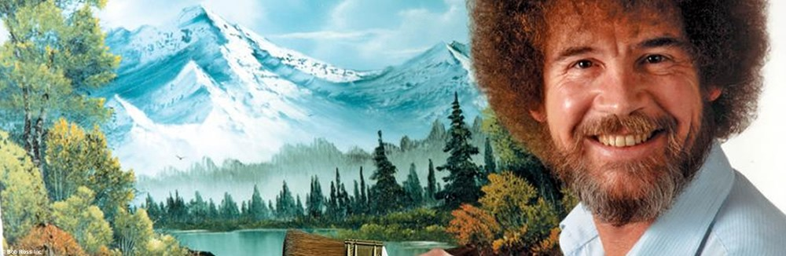
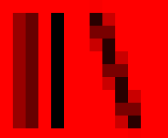
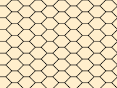
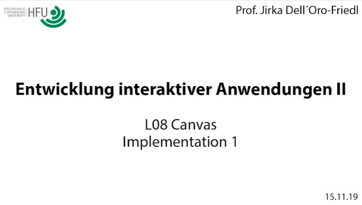
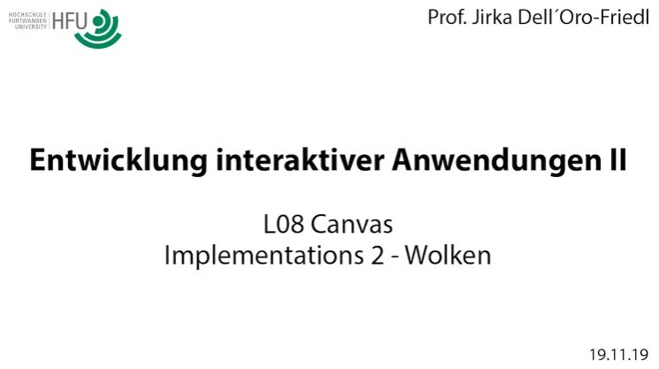

## L08 Canvas
# L08.1 Grundlagen

<small>Quelle: <a href="http://pix4.qmde.de/www.quotenmeter.de/pics/sonstiges/2019/medien/bobross_ox__W1000xh0.jpg">http://pix4.qmde.de/www.quotenmeter.de/pics/sonstiges/2019/medien/bobross_ox__W1000xh0.jpg</a></small>  

Die standardisierten HTML-Elemente vereinfachen die Gestaltung einer Web-Applikation enorm, und Formular-Elemente unterstützen sogar komplexe Interaktion in einer den meisten Nutzeris bereits geläufigen Form. Allerdings sind die Gestaltungsmöglichkeiten dadurch recht eingeschränkt. Ebenso übliche Formen der Informationsvermittlung, wie beispielsweise Diagramme, lassen sich damit nicht zur Laufzeit erzeugen. Hierfür nutzt man das `HTMLCanvasElement`!  
> **FunFact:** Canvas heißt so viel wie Plane, Segel, Markise... aber auch Leinwand.

Das `HTMLCanvasElement`stellt eine rechteckige Fläche auf einer Browserseite zur Verfügung, deren einzelne Bildpunkte (Pixel) mit Hilfe von Zeichenbefehlen beliebig eingefärbt werden können. Innerhalb dieser Fläche lassen sich frei Formen und Farben dynamisch generieren. 
> **FunFact:** Pixel ist ein Kunstwort, dass sich aus **Pic**ture und **El**ement oder **Cell** zusammensetzt. Eine Rastergrafik, wie sie unsere modernen Monitore darstellen, unsere Kameras liefern oder unsere Webseiten aufbauen, sind aus einer Vielzahl solcher farbiger Pixel zusammengesetzt.

## CanvasRenderingContext
Die Befehle für diese Bildmanipulation stellt das `HTMLCanvasElement` aber nicht direkt zur Verfügung, sondern es bietet hierfür spezielle Programmierschnittstellen (Application Programming Interfaces, API) an, die in diesem Zusammenhang CanvasRenderingContext genannt werden. Sie können sehr umfangreich sein und es gibt sie sowohl für 2D- als auch für 3D-Grafikdarstellung z.B. mit WebGL. Mit dem folgenden Code wird ein solcher CanvasRenderingContext für die Bildmanipulation mit zweidimensionalen Zeichenkommandos von einem im DOM vorhandenen Canvas angefordert und eine Referenz darauf gespeichert.  
```typescript
let canvas: HTMLCanvasElement = document.querySelector("canvas");
let crc2: CanvasRenderingContext2D = canvas.getContext("2d");
```
- [x] Erstelle eine HTML-Datei und lege dort mit `<canvas>` ein Canvas-Element an.
- [x] Erstelle ein TypeScript-Programm, welches den RenderingContext des Canvas-Elementes anfordert und eine Referenz in einer Variable namens `crc2` speichert, wie oben angegeben.
- [x] Gib in einer weiteren Zeile `crc2.` ein und verschaffe dir einen Eindruck von der Menge der Zeichenbefehle, die dir nun zur Verfügung stehen.  

Die Pixel des Canvas-Elements werden beim Aufbau des DOMs zunächst mit der Farbe `#FFFFFF`, also weiß, besetzt. Daher fällt der Canvas auf weißem Hintergrund nicht ins Auge. Der einfachste Befehl, den Du nutzen kannst um das zu ändern, ist `fillRect()`, wobei zunächst die Füllfarbe als Eigenschaft `fillStyle` des RenderingContexts definiert werden muss.
```typescript
crc2.fillStyle = "#FF0000";
crc2.fillRect(0, 0, crc2.canvas.width, crc2.canvas.height);
```
- [x] Finde heraus, welche Bedeutung die Parameter der Methode `fillRect` haben. Experimentiere damit.

## Pfade
`fillRect(...)`, `clearRect(...)` und `strokeRect(...)` sind die einzigen Zeichenbefehle, die sofort ein sichtbares Ergebnis liefern. Komplexere Formen definierst Du zunächst mit Hilfe eines Pfad-Objektes.

### Vektorgrafik
Wenn auch das entstehende Bild am Ende als Rastergrafik vorliegt, die Definition der Pfade erfolgt nach den Regeln der Vektorgrafik. Das bedeutet, dass Du nicht einzelne Pixel manipulierst, sondern mathematische Beschreibungen der zu zeichnenden Formen und ihrer Koordinaten formulierst. Die Rasterung übernimmt dann der RenderingContext wenn die Zeichenmethoden `stroke()` und `fill()` aufgerufen werden. Daraufhin erst werden die Pixel, die innerhalb oder am Rande des Pfades liegen nach der zuvor definierten Füll- oder Linienvorschrift mit Farbe versehen.  
Es gibt allerdings auch Methoden zur direkten Manipulation von Pixeln, die in dieser Lektion aber keine Rolle spielen sollen.

### Arc  

```typescript
crc2.beginPath();
crc2.arc(100, 100, 20, 0, 1.5 * Math.PI);
crc2.closePath();
crc2.stroke();
```  

- [x] Erkunde, was `arc` bewerkstelligt und was die Parameter bedeuten.
- [x] Finde heraus, wie Du die Linienfarbe ändern kannst.
- [x] Was geschieht, wenn die Anweisung `closePath()` nicht ausgeführt wird. Warum?


### Ellipse
Lange Zeit war es erforderlich, Ellipsen als verzerrte Kreise darzustellen oder mit Kurven anzunähern. Mittlerweile gibt es aber auch eine `ellipse`-Anweisung.

- [x] Finde heraus, wie die Ellipse funktioniert...

### Linienzüge
Mit den Anweisungen `moveTo(...)` und `lineTo(...)` kannst Du einen Pfad um Linienzüge erweitern. Eine Linie wird dabei nur durch die Endposition definiert, die Startposition ist die Endposition der vorangegangenen Anweisung.  

- [x] Lasse ein Dreieck zeichnen.

### Kurven
Mit `moveTo(...)` und `lineTo(...)` kannst Du beliebige eckige Formen darstellen. Wenn es geschmeidiger werden soll, nutzt Du quadratische oder Bezier-Kurven.  

- [x] Experimentiere mit [dieser Anwendung](https://jirkadelloro.github.io/EIA2-Inverted/X01_Appendix/Canvas/Curves/Curves/start.html). Beachte, dass für quadratische Kurven außer dem vorangegangenen Endpunkt des aktuellen Pfades zwei weitere, für Bezierkurven drei weitere Punkte angegeben werden müssen.  

### Text
Alternativ zu einer Textüberlagerung durch ein weiteres HTML-Element, kann Text auch durch den RenderingContext auf den Canvas gebracht werden. Hierzu dienen die Methoden `fillText(...)` und `strokeText(...)` und weitere Methoden zur Steuerung der Textausgabe.

### Weiteres
Der CanvasRenderingContext bietet noch einige Zeichen- und Stilmittel mehr, studiere hierzu dieses [CheatSheet](../X01_Appendix/Canvas/HTML5_Canvas_Cheat_Sheet.pdf). Damit erhältst Du schnell einen Überblick und kannst die Syntax nachschlagen. Aber auch das ist nicht vollständig. Im Internet findest Du bei Bedarf noch zahlreiche weitere Quellen.

### Pfadobjekte
Bei Verwendung der Pfad-Methoden direkt auf dem RenderingContext, wird ein globales Pfadobjekt manipuliert. Mit `beginPath()` wird der darin enthaltene alte Pfad gelöscht und ein neuer angelegt.  
Es ist aber auch möglich, mit `new Path2D()` individuelle Pfadobjekt zu erzeugen und die Pfadanweisungen darauf auszuführen. So kann der Pfad gespeichert und im Laufe des Programms wiederverwenden werden, ohne dass der Algorithmus zur Pfaderstellung wieder durchlaufen werden muss. Zum Zeichnen eines solchen Pfadobjektes wird es schließlich als Parameter der Zeichenmethode einfach mitgegeben.  

```typescript
let path: Path2D = new Path2D();
path.arc(60, 60, 50, 0, 2 * Math.PI);
crc2.stroke(path);
```

## Rendering
"Render" ist ein relativ unspezifisches Wort und bedeutet lediglich so viel wie "ausführen, machen, tun". Im Zusammenhang mit digitalen Medien ist meist die Erzeugung eines Bildes anhand gegebener Daten gemeint. Es gibt unterschiedliche Ansätze hierfür.   

> **FunFact:** Render als Substantiv heißt auch "Putz". Die in der 3D-Grafik häufig genannte "Renderpipe" könnte man also falsch als "Putzpfeife" übersetzen.  

### Retained Mode
Es wird zunächst ein Modell der gesamten darzustellenden Szene erzeugt, was fortwährend manipuliert werden kann. Das Rendering-API kümmert sich dann darum, die Szene als Ganzes zu rendern. Ein dir wohlbekanntes Beispiel für ein solches Modell ist das DOM. Es wird automatisch gerendert und so die visuelle Darstellung erzeugt, die das Nutzeri sieht.

### Immediate Mode
CanvasRenderingContext aber arbeitet im Immediate Mode. Es gibt keinerlei Verwaltung für darzustellende Bildteile. Wann, wo und wie jeder Pfad gerendert wird, obliegt vollständig dem Programm, welches den Context nutzt. Sobald ein Zeichenkommando abgearbeitet wird, verändern betroffene Pixel im Zielbild ihre Farbe. 

> **Achtung:** Da der Canvas wiederum ein DOM-Element ist, muss der Browser Gelegenheit bekommen, das fertige Bild auf der Seite darzustellen. Eine Endlosschleife beispielsweise wird ihn daran hindern.

### Maleralgorithmus
Das bedeutet, das nachfolgende Zeichenkommandos die Wirkung der vorangegangenen überschreiben können. Das Bild muss also "von hinten nach vorne" aufgebaut werden. Bildteile, die im Hintergrund liegen sollen, werden zuerst gezeichnet, danach die Bildteile im Vordergrund. Das ist der sogenannte Maleralgorithmus, denn ein Maler arbeitet am effizientesten ebenfalls so.  
- [x] Schaue dir Malvideos im Internet an, vielleicht von oben dargestelltem Bob Ross. Beachte, in welcher Folge er die Bildbestandteile malt.

## Koordinatensystem
Das Standard-Koordinatensystem hat seinen Ursprung in der linken oberen Ecke des Canvas, positive Koordinatenwerte steigen horizontal nach rechts an, vertikal nach unten. Angaben sind direkt bezogen auf Pixel, wobei die Koordinate (0.5,0.5) den ersten sichtbaren Pixel ganz links oben referenziert, die Koordinate (canvas.width-0.5, canvas.height-0.5) den letzten sichtbaren Pixel rechts unten.  

> **Achtung:** Wie immer bei den digitalen Medien beginnen wir die Zählung mit der 0, daher liegt bei einem Canvas mit der Größe 300x200 der Pixel mit der Koordinate (300, 200) nicht mehr im sichtbaren Bereich.  

Als Koordinatenwerte sind nicht nur Ganzzahlen zulässig, sondern auch Fließkommazahlen. Je nach Einstellung des Canvas wird dann beim Rendern der nächste Pixel gefüllt, oder die Farbe halbtransparent auf die umgegebenden Pixel verteilt. Um einen Pixel tatsächlich genau mittig zu treffen, kann es erforderlich sein, Nachkommastellen zu nutzen. Der untenstehende Code erzeugt das nebenstehende Bild (stark vergrößert).  

  

```typescript
crc2.beginPath();
crc2.moveTo(2.1, 1);
crc2.lineTo(2.1, 10);
crc2.moveTo(4.5, 1);
crc2.lineTo(4.5, 10);
crc2.moveTo(7.5, 1);
crc2.lineTo(10.5, 10);
crc2.stroke();
```

Eine schräge Linie verläuft immer durch viele Zwischenpositionen. Würden nur die dabei am stärksten berührten Pixel gezeichnet, entsteht ein Treppen-Effekt (Aliasing). Bei der Farbverteilung (Anti-Aliasing) wird dies kaschiert, es entstehen durch die Transparenzen aber neue Farben im Bild und die Linie wird unscharf gezeichnet.

## Transformation
Sollen ähnliche Bildbestandteile, z.B. Bäume, Häuser, Schneeflocken etc., mehrfach in einem Bild auftauchen, ergibt sich ein Problem. Da die Pfade, mit deren Hilfe diese Bestandteile gezeichnet werden, mit absoluten Koordinaten bezogen auf das Standard-Koordinatensystem konstruiert werden, sind diese Informationen fest im Pfad definiert. Selbst wenn keine literalen Werte als Parameter übergeben sondern Variablen genutzt werden, so dass der Code zur Konstruktion wiederverwendet werden kann, muss der komplette Pfad erneut konstruiert werden, wenn der gleiche Bildbestandteil an einer anderen Stelle auftauchen soll.  
Hier schaffen Transformationen Abhilfe. Anstatt die Koordinaten und Dimensionen neu anzugeben, kann mit Transformationen das Koordinatensystem verändert werden, auf das sich die Angaben beziehen. 

<!--
- [x] Lade dir den Standalone [FlashPlayer-Projector von Adobe](https://www.adobe.com/support/flashplayer/debug_downloads.html) herunter. Eine Installation ist nicht erforderlich.
- [x] Öffne damit diese URL: <https://webuser.hs-furtwangen.de/~del/Apps/Transformation/Transformation.swf>
- [x] Experimentiere mit der Transformator-App. Erzeuge drei unterschiedliche und aktive Transformationen und beobachte die Auswirkungen.
- [x] Vertausche sie durch Klick auf das Doppelpfeil-Symbol. Erkläre, warum das Haus des Nikolaus seine Position oder Erscheinung dabei ändert.
-->

Die Transformationen werden nacheinander ausgeführt und jede weitere Transformation verändert das Ergebnis der vorangegangenen. Tatsächlich existiert nur eine Transformationsmatrix, welche die komplette Transformationskette darstellt. Jedesmal, wenn `translate(...)`, `rotate()` oder `scale()` aufgerufen wird, wird diese Matrix verändert. Bei der Erstellung oder beim Zeichnen eines Pfades wird die Gesamtmatrix mit einer einfachen Matrixmultiplikation auf die Koordinaten angewendet.  
Das bedeutet, dass immer wiederkehrende Transformatsaufrufe in der Matrix kumulieren, was in der Regel nicht gewünscht ist. Für dieses Problem gibt es mehrere Lösungsansätze:
- mit `resetTransform()` die Gesamtmatrix wieder auf den Urzustand bringen
- mit `save()` den aktuellen Zustand der Gesamtmatrix speichern, und diesen Zustand später mit `restore()` wieder herstellen. Dabei kann auch mehrfach `save()` aufgerufen werden, die dabei gespeicherten Zustände werden per `restore()` in umgekehrter Reihenfolge wieder restauriert.
- mit `getTransform()` den aktuellen Zustand der Gesamtmatrix speichern und einer Variable vom Typ `DOMMatrix`zuweisen. Mit `setTransform(...)` und der Variable als Parameter wird dieser Zustand wieder hergestellt  

## Stil
### Farbe
Der CanvasRenderingContext kann Farbangaben als Zeichenketten verarbeiten, wie sie ebenso in CSS3 verwendet werden. Hier hat man also die Auswahl der Farbkodierung und kann die heranziehen, die sich für die Aufgabe am besten eignet. Für eine Serie von Bildelementen, die mit gleicher Farbe aber unterschiedlicher Helligkeit dargestellt werden sollen, ist die Angabe im HSL-Format deutlich leichter zu bewerkstelligen als in den anderen Formaten. Folgende Zeichenketten produzieren alle das gleiche  <span style="background-color: salmon; width:130px; display:inline-block; text-align:center">Lachsrot</span>

| Format       | Zeichenkette                                   |
|--------------|------------------------------------------------|
| Hexadezimal  | #FA8072                                        |
| RGB          | RGB( 250, 128, 114 ) oder RGB( 98%, 50%, 45% ) |
| HSL          | HSL( 6, 93%, 71% )                             |
| Predefiniert | salmon                                         |

RGB und HSL erlauben (dann auch als RGBA und HSLA bezeichnet) noch einen vierten Parameter, nämlich die Opazität (Alpha) die als Fließkommazahl zwischen 0 und 1 angegeben wird. Zudem ist auch die weniger präzise Angabe mit nur drei hexadezimalen Ziffern möglich.

### Farbverlauf
Zwei Arten von Farbverläufen (Gradients) sind möglich, der lineare und der radiale. Beim linearen werden zwei Punkte auf dem Canvas angegeben, die Farbe verläuft dann vom ersten zum zweiten. Der radiale Farbverlauf wird ebenso mit Hilfe von zwei Punkten aber auch zwei Radien definiert. Damit ergeben sich zwei Kreise zwischen deren Perimetern die Farbe verläuft.  
Welche Farbwerte der Verlauf an welchen Stellen erreichen soll, wird mit Hilfe von Haltepunkten auf der Verlaufsstrecke angegeben. Die Lage der Haltepunkte wird dabei nur mit einem einzigen Wert relativ zur Gesamtstrecke bzw. -fläche des Verlaufs definiert. Dabei entspricht der Wert 0 der Position des Beginns und 1 der des Endes des Verlaufs. Der Haltepunkt mit dem kleinsten Wert bestimmt die Farbe bis zum Beginn und darüber hinaus, der mit dem größten die Farbe bis zum Ende und darüber hinaus. Dazwischen laufen die Farben ineinander.

```typescript       
let gradient: CanvasGradient = crc2.createLinearGradient(0, 0, 0, 100);

gradient.addColorStop(0, "black");
gradient.addColorStop(.5, "red");
gradient.addColorStop(1, "gold");

crc2.fillStyle = gradient;
crc2.fillRect(0, 0, 200, 100);
```
- [x] Welches Bild liefert der oben angegebene Code?
- [x] Füge weitere Haltepunkte ein um schärfere Kanten zwischen den Farben zu erhalten.

### Pattern
Es ist auch möglich, Füllmuster einzusetzen. Dabei werden verschiedene Quellen für das Muster unterstützt wie Bitmaps, SVG-Bilder oder auch Grafiken, die auf einem Canvas erzeugt werden. Folgender Code liefert nebenstehendes Bild.

  

```typescript
let pattern: CanvasRenderingContext = document.createElement('canvas').getContext('2d');
pattern.canvas.width = 40;
pattern.canvas.height = 20;

pattern.fillStyle = '#fec';
pattern.fillRect(0, 0, pattern.canvas.width, pattern.canvas.height);
pattern.moveTo(0, 10);
pattern.lineTo(10, 10);
pattern.lineTo(20, 0);
pattern.lineTo(30, 0);
pattern.lineTo(40, 10);
pattern.lineTo(30, 20);
pattern.lineTo(20, 20);
pattern.lineTo(10, 10);
pattern.stroke();

crc2.fillStyle = crc2.createPattern(pattern.canvas, 'repeat');
crc2.fillRect(0, 0, canvas.width, canvas.height);
```

## Linien
Natürlich lässt sich auch die Gestaltung der Linien, die mit der Anweisung `stroke()` gezeichnet werden, detailliert kontrollieren. Linien können durchgehend oder unterschiedlich gestrichelt werden, Farben, Gradienten und auch Muster erhalten, sowie die Linienenden und die Ausführung von Knicken in den Linien spezifisch gestalten sein.

- [x] Recherchiere im Internet nach den Möglichkeiten für die Liniengestaltung.

## Save/Restore
Die Anweisungen `save()` und `restore()` speichern nicht nur die aktuelle Transformationsmatrix zwischen, sondern auch die Stilangaben für die Füllungen und Linien und weitere Informationen, die insgesamt den Zustand (`state`) des RenderingContexts beschreiben. Somit ist es möglich, beispielsweise wieder zum vorangegangenen Stil zurück zu kehren, wenn zwischenzeitlich ein anderer benötigt wurde. `save()` speichert die Informationen auf einem Ablagestapel (stack), weitere Aufrufe von `save()` legen weitere solcher Informationen oben auf. Mit `restore()` wird der Stapel von oben nach unten Stück für Stück geleert und die Zustände des CanvasRenderingContexts in umgekehrter Reihenfolge der Speicherung wiederhergestellt.

# L08.2 Landschaftsbild

## Scribble
<div align="center">
<a href="http://hdl.handle.net/10900.3/OER_SHBUHNLQ"></a>
<a href="Material\Alley_Scribble.jpg"></a>
<br/>
<a href="http://hdl.handle.net/10900.3/OER_SHBUHNLQ">L08 Canvas-Scribble</a>
</div>


## Aktivitätsdiagramm
<div align="center">
<a href="http://hdl.handle.net/10900.3/OER_BKILGHVL"></a>
<a href="Material\Alley_ActivityDiagram.jpg"></a>
<br/>
<a href="http://hdl.handle.net/10900.3/OER_BKILGHVL">L08 Canvas: Aktivitätsdiagramm</a>
</div>


## Implementation des Hintergrund
<div align="center">
<a href="http://hdl.handle.net/10900.3/OER_XQZRKOBR"></a>
<br/>
<a href="http://hdl.handle.net/10900.3/OER_XQZRKOBR">L08 Canvas: Implementation I</a>
</div>


## Implementation der Wolke
<div align="center">
<a href="http://hdl.handle.net/10900.3/OER_YFYTDWCV"></a>
<br/>
<a href="http://hdl.handle.net/10900.3/OER_YFYTDWCV">L08 Canvas: Implementation II</a>
</div>


## Aktivitätsdiagramm zu den Bergen
<div align="center">
<a href="http://hdl.handle.net/10900.3/OER_CMDSHKDM"></a>
<a href="Material\Alley_ActivityDiagram-Mountains.jpg"></a>
<br/>
<a href="http://hdl.handle.net/10900.3/OER_CMDSHKDM">L08 Canvas: Aktivitätsdiagramm Berge</a>
</div>


## Implementation der Berge
<div align="center">
<a href="http://hdl.handle.net/10900.3/OER_BARAOYLQ"></a>
<br/>
<a href="http://hdl.handle.net/10900.3/OER_BARAOYLQ">L08 Canvas: Implementation Berge</a>
</div>


## Übungen
- [x] Isoliere die Funktionalität eine Zufallszahl zwischen einem minimalen und maximalen Wert zu liefern. Konzipiere sie als Aktivität und implementiere sie als Funktion, welche die beiden Grenzwerte entgegenen nimmt und eine entsprechende Zufallszahl zurück gibt. Ersetze die Stellen im Programm, an denen diese Funktion genutzt werden kann und sollte durch entsprechende Aufrufe derselben.
- [x] Studiere das [Scribble](Material/draw.io/Alley_Scribble.svg) und das [Aktivitätsdiagramm](Material/draw.io/Trees_ActivityDiagram.svg) zum Aufbau der Baumreihe sowie die Implementation. Hier findest Du vielleicht noch einige wertvolle Hinweise für deine weitere Arbeit.
- [x] Studiere den Code der Allee und ergründe, warum noch weitere Variablen vor den Aufrufen der draw-Functionen dazu gekommen sind.
- [x] Experimentiere mit den Parametern der verschiedenen Funktionen und auch mit den hardkodierten Werten innerhalb dieser. Modifiziere so das Bild nach deinem ästhetischen Empfinden.
- [x] Lasse die Position der Straße am Horizont um einen zufälligen Betrag zwischen -200 und 200 Pixeln horizontal verschieben, so dass der Fluchtpunkt bei jedem Aufruf des Programms ein anderer ist. Warum werden die Baumreihen mitbewegt?

- [x] Der CanvasRenderingContext bietet noch weitere Möglichkeiten wie z.B. Schatten. Verschaffe dir einen Überblick über diese.
