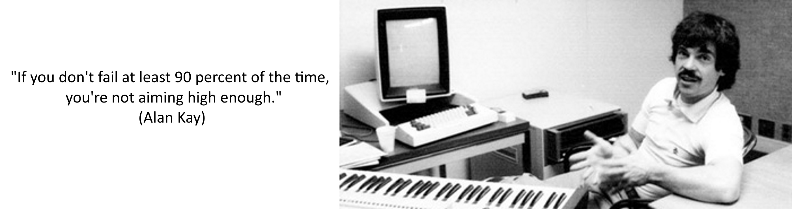
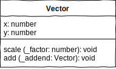
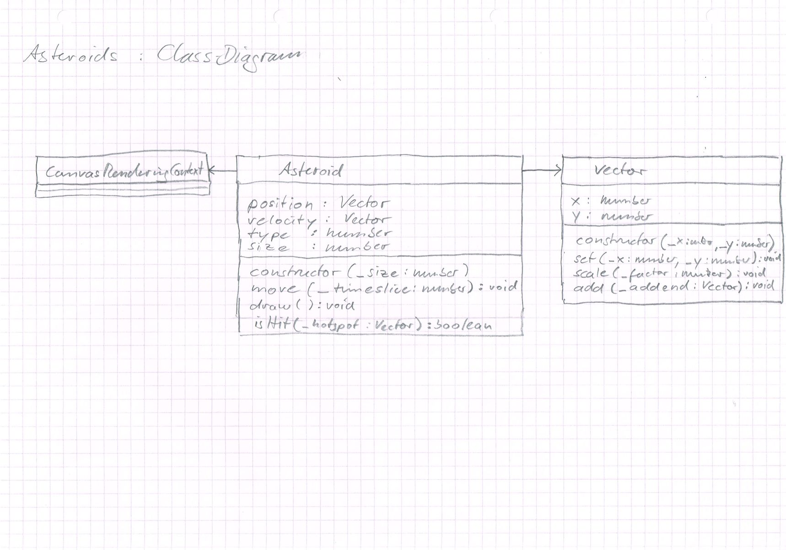
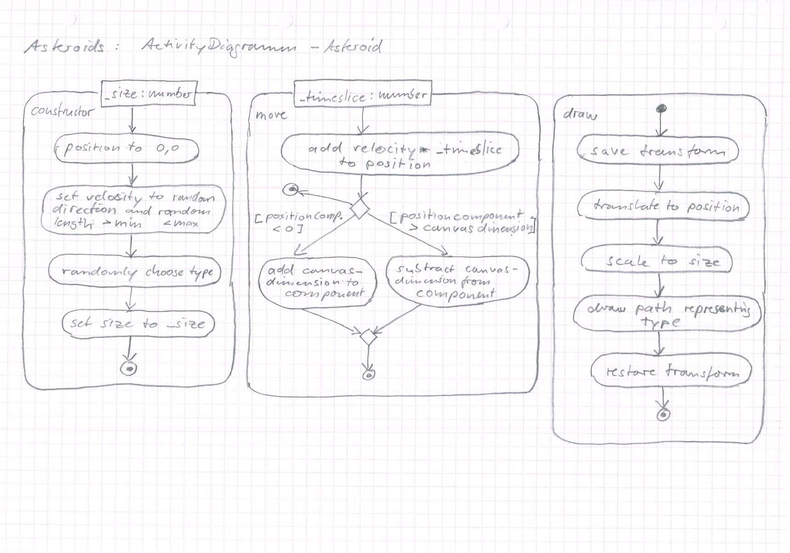
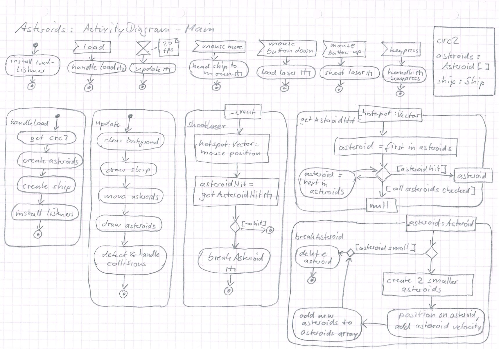

# L09_Classes
  

<small>Quelle: https://www.thepositiveencourager.global/alan-kay-on-creativity-3</small>

Als Sohn eines Wissenschaftlers und einer Künstlerin hat Alan Kay nie zwischen Kunst und Wissenschaft unterschieden. Während er als Jazzgitarrist und Gitarrenlehrer Geld verdiente, erwarb er seinen Bachelorabschluss in Mathematik und Molekularbiologie, einen Masterabschluss in Elektrotechnik und den Ph.D. in Informatik. Er prägte maßgeblich den Begriff der objektorientierten Programmierung.  

## Objektorientierung
Dieses Entwurfsparadigma für Software erlaubt eine intuitive Modellierung und Konzeption auch komplexer Softwareanwendungen.  

Aus deiner Erfahrung weißt Du, dass sich die von dir wahrgenommene Realität aus einer Unzahl von materiellen (Autos, Häuser, Lebewesen, Möbel etc.) und immateriellen (Sprache, Gefühle, Konten, Identitäten etc.) Teilen zusammensetzt. Diese Umwelt vollständig zu beschreiben ist wohl unmöglich, die einzelnen Teile aber kannst Du auf unterschiedlichen Abstraktionsebenen schon besser erfassen. Dabei vereinfachst, klassifizierst und generalisierst Du und baust im Kopf ein Modell der Realität auf, was dir erlaubt Vorhersagen zu treffen, auch wenn Du nicht alle Details deiner aktuellen Umgebung kennst. Du weißt was ein Hund ist, obwohl es den Hund gar nicht gibt. Es gibt immer nur ganz spezifische Exemplare von Hund. Trotzdem gehst Du davon aus, dass ein dir völlig unbekannter Hund bellen kann. Du weißt, dass ein Hund in der Regel vier Beine hat, eine Schnauze und einen Schwanz, dass er neben bellen auch die Fähigkeit hat zu knurren und zu beißen und manchmal furchtbar zu stinken.  

## Abstraktion
Ähnlich gehst Du beim objektorientierten Entwurf vor. Wenn Du ein System planst, überlegst Du, aus welchen Teilen es sich zusammensetzt, welche gleichartigen Teile es gibt, wie Du diese beschreiben kannst und wie die Teile mit ihrer Umwelt interagieren. Du abstrahierst und generalisierst und kannst für verschiedene Klassen von Teilen Eigenschaften identifizieren, die das einzelne, tatsächlich existierende Teil näher beschreiben. Bei der Klasse Hund könnte das beispielsweise die Größe oder die Fellfarbe sein. Diese Eigenschaften sind in gewissen Grenzen variabel, ohne dass das beschriebene Tier kein Hund mehr wäre. Es bleibt ein Hund, auch wenn es manchmal schwer zu glauben ist.  

  
<small><a href="https://zaypa.com/wie-wahle-ich-deinen-hund-fur-dich-und-deine-familie.html">https://zaypa.com/wie-wahle-ich-deinen-hund-fur-dich-und-deine-familie.html</a></small>

> **Abstraktion** ist das erste Prinzip der Objektorientierung!

## Modellierung
Bislang hatten wir komplexere Datenstrukturen mit Interfaces irgendwo im Code beschrieben. Damit haben wir schon Eigenschaften von Objekten angegeben. Beispielsweise besitzen alle Vektoren aus dem vorangegangenen Kapitel die Eigenschaften x und y, bei jedem einzelnen tatsächlich erschaffenen Vektor sind sie mit individuellen Werten definiert. Was mit diesen Vektoren aber geschieht, ist an ganz anderen Stellen im Code implementiert. So werden Vektoren addiert oder skaliert und der Code dafür muss jedes mal neu geschrieben werden.

> **FunFact:** Schau dir einmal im kompilierten Javascript-Code an, was von Interfaces übrig bleibt... sie sind komplett verschwunden. Interfaces sind lediglich ein Anweisung für den Compiler mit der Du angibst, welche Datenstruktur Du willst, damit er dir helfen kann, dich daran zu halten.  

Bei der objektorientierten Modellierung definierst Du nicht nur die Eigenschaften, sondern auch die Aktivitäten, die ein Objekt der beschriebenenen Klasse ausführen können soll. So wie der Hund beißen, bellen, knurren und stinken kann, kann der Vektor vielleicht seine Länge ändern, oder durch Addition mit einem anderen Vektor zu einem resultierenden Vektor werden und so weiter. Im Diagramm schreibst Du hierzu einfach unter dem Feld für den Namen des Typs und dem Feld für die Eigenschaften nun ein drittes Feld, in dem Du die Aktivitäten auflistest.  



Bislang hattest Du Interfaces nur als Randnotiz mit in die Aktivitätsdiagramme eingetragen. Nun lernst Du einen neuen Diagrammtyp kennen: **das Klassendiagramm**. Hier wird dargestellt, wie die Klassen aufgebaut sind und miteinander in Beziehung stehen.  

- [x] Wo hast Du so etwas bloß schon mehrmals gesehen?

## Implementation  
Die im Diagramm dargestellte Vektorklasse kann folgendermaßen implementiert werden

```typescript
class Vector {
    x: number;
    y: number;

    scale(_factor: number): void {
        this.x *= _factor;
        this.y *= _factor;
    }

    add(_addend: Vector): void {
        this.x += _addend.x;
        this.y += _addend.y;
    }
}
```

Vector ist jetzt nicht mehr nur eine Objektstruktur, die sich mit einem Interface beschreiben lässt, Vector ist jetzt eine Klasse. So wird nun statt `interface` das reservierte Wort `class` benutzt. Die Aktivitäten werden wie gewohnt als Funktionen implementiert, aber das Schlüsselwort `function` wird nicht mehr angegeben.

> **Hinweis:** Funktionen innerhalb von Klassen werden "Methoden" genannt. Objekte der Klasse verfügen nun über Methoden mit denen sie sich und ihre Umwelt beeinflussen können.


## Kapselung
Das Programm, dass einen solchen Vektor nutzt, muss nun nicht mehr wissen, wie man einen Vektor skaliert oder einen zweiten hinzuaddiert. Es genügt zu wissen, dass man es tun kann und welche Parameter der Vektor hierzu braucht. Den Rest macht der Vektor selbst. Damit wird der Vektor zu einer Black-Box, deren interne Arbeitsweise nicht bekannt sein muss, um sie zu verwenden. Der Vektor ist "gekapselt". 

> **Kapselung** ist das zweite Prinzip der Objektorientierung!

## Instanzierung
Der obenstehende Code beschreibt die Klasse Vektor, es existiert aber noch kein Exemplar eines Objektes dieser Klasse. Die Erzeugung eines solchen erfolgt, ganz anders als bei der Arbeit mit Interfaces, mit der Anweisung `new`. Diesen Vorgang nennt man auch Instanzierung, denn es wird eine Instanz der Klasse geschaffen.

- [x] Aus welchen Zusammenhängen kennst Du `new` bereits?
- [x] Implementiere die Vektorklasse in einem neuen `namespace` und füge darunter die untenstehenden Zeilen an. 

```typescript
let v1: Vector = new Vector();
v1.scale(2);
console.log(v1);
```  
- [x] Teste das Programm im Browser oder mit Node. Welche Konsolenausgabe erhältst Du?
- [x] Verfolge das Programm mit dem Debugger bis hinein in die Methode `scale` der Klasse. Was hat es mit dem Schlüsselwort `this` auf sich?
- [x] Zu Beginn der Klasse werden die Eigenschaften x und y deklariert. Ergänze den Code an dieser Stelle so, dass sie auch gleich mit dem Wert 0 definiert werden. Was ändert sich beim nächsten Test und Debuggen?
- [x] Spendiere der Klasse eine neue Methode `set(_x: number, _y: number)` welche den Eigenschaften eines Objektes der Klasse die Werte von `_x` bzw. `_y` zuweist. Lasse v1 vor dem Aufruf von `scale` diese Methode ausführen mit Werten die Du dir ausdenkst. Was geschieht jetzt?

## Klasse vs. Objekt
Häufig werden die Begriffe Klasse und Objekt verwechselt oder unscharf gebraucht. Das führt zu Verwirrung und Fehlern. Auch wenn der Unterschied in diesem Text bereits mehrfach herausgestellt wurde, soll an dieser Stelle noch einmal explizit darauf eingegangen werden.
Eine Klasse beschreibt die Struktur, die ein Objekt derselben aufweisen soll, und die Methoden, die mit einem solchen Objekt verknüpft werden. Sie ist vergleichbar mit dem Hunde-Genom oder mit dem Hausbauplan eines Architekten. Ist die Klasse definiert, können beliebig viele Objekte der Klasse erzeugt werden, so wie ein ganzer Hundewurf, eine Siedlung oder ein ganzes Array voller Vektoren. Jedes dieser Objekte besitzt die in der Klasse angegebenen Eigenschaften, gegebenenfalls mit individuellen Werten, wie Fellfarbe, Dachziegeltyp oder Koordinate.  


Ein Objekt einer Klasse kann zudem die in der Klasse definierten Methoden nutzen, ohne dass eine Referenz auf das Objekt der Methode als Parameter übergeben werden muss. Stattdessen wird das Objekt innerhalb der Methode automatisch mit dem reservierten Wort `this` referenziert. Der Aufruf der Methode erfolgt mit Hilfe der Punkt-Syntax `object.method(...)`. Da das Objekt eine Instanz einer bestimmten Klasse ist, wird damit die Methode eindeutig identifiziert, auch wenn andere Klassen über eine Methode gleichen Namens verfügen sollten.

## Constructor
Die Hausbau-Metapher führt dich gleich zu einem weiteren interessanten Aspekt. Der Architekt, also Du, macht zwar den Plan, gebaut wird ein Haus aber von einem Bauunternehmer. Im Englischen ist das der Constructor.  

Auch bei der Instanzierung von Objekten kommt ein Constructor zum Einsatz, den Du im Deutschen wiederum Konstruktor nennen kannst. Er ist eine besondere Methode, die automatisch aufgerufen wird, wenn die Anweisung `new` ausgeführt wird und kümmert sich darum, dass das Objekt ordentlich gebaut wird. Ein Standardkonstruktor ist in Javascript immer dabei und tritt nicht in Erscheinung. Du kannst aber für jede Klasse einen eigenen Konstruktor definieren.   

Ein Konstruktor ist dann von Bedeutung, wenn weitere Informationen zum Bau des Objektes einfließen sollen oder währenddessen zwingend noch weitere Aktivitäten ausgeführt werden müssen. Bei einem Haus sollte der Constructor vielleicht wissen, welche Ziegel er nun tatsächlich auflegen soll, da diese Eigenschaft des Hauses variabel ist. Wird ein Hund konstruiert, soll vielleicht gleich die Gemeinde informiert werden, damit sie die Hundesteuer eintreiben kann.

Bei der Vektorklasse erscheint es sinnvoll, bei der Konstruktion eines Vektors gleich die Komponenten mitzugeben, so dass die Eigenschaften x und y des Vektors sofort die gewünschten Werte erhalten.

```typescript
class Vector {
    x: number;
    y: number;

    constructor(_x: number, _y: number) {
        this.set(_x, _y);
    }

    set(_x: number, _y: number): void {
        this.x = _x;
        this.y = _y;
    }

    ...
}
```
Der Konstruktor verlangt nun zur Instanzierung eines Vektors zwingend die Übergabe zweier Werte. TypeScript wird einen Fehler melden, wenn Du versuchst einen Vektor wie zuvor nur mit `new Vector();` zu instanzieren. `new Vector(10, -3)` dagegen wird akzeptiert und der Vektor wird mit den gegebenen Werten angelegt.

> **Hinweis:** Die set-Methode ist übrigens die, welche Du weiter oben schon hättest implementieren sollen. Falls es nicht geklappt hat, kannst Du hier spicken...

## Konventionen
Im Umgang mit Klassen und Objekten solltest Du dich unbedingt an einige Konventionen halten:

- Jede Klasse wird in einer eigenen Datei implementiert
- Der Dateiname entspricht dem Namen der Klasse (z.B. `Vector` findet sich in Vector.ts)
- Die Namen der Methoden wiederholen nicht den Klassennamen (`scale` statt `scaleVector`)
- Der Klassenname beschreibt das Wesen genau einer Instanz der Klasse, nicht mehrerer (`Vector` statt `Vectors`)

# Asteroids
Mit diesen Basisregeln des objekorientierte Entwurfs kann man sich schon daran machen, eine komplexe interaktive Anwendung zu konzipieren und zu implementieren. Als Beispiel für diese und die folgenden Lektionen wird das Videospiel "Asteroids" (Atari 1979) in seiner ursprünglichen Arcade-Version herangezogen. 

> **FunFact:** Asteroids ist einer der größten Erfolge in der Geschichte der Videogames und Ataris meistverkaufter Münzautomat. Es gab allerdings eine dominante Strategie, die es geübten Spielern erlaubte nach Einwurf nur einer Münze stundenlang zu spielen und dabei so viele Bonus-Schiffe anzuhäufen, dass der Automat, dann vom Spieler allein gelassen, noch lange Zeit brauchte um alle Schiffe zu zerstören...  

- [x] Falls dir Asteroids nicht bekannt ist, schau dir den entsprechenden Wikipedia-Artikel und dieses Youtube-Video an: https://www.youtube.com/watch?v=82mbTdpPM58  (ab 0:18)

## Anwendungsfalldiagramm


- [x] Wenn dir das Anwendungsfalldiagramm nicht gleich einleuchtet, schau dir den Wikipedia-Artikel und das Video genau an und versuche, die einzelnen Anwendungsfälle dem Geschehen zuzuordnen.
- [x] Beachte, dass im Diagramm viele Anwendungsfälle aufgeführt sind, die das System selbständig bewältigen muss. Was vom Player gesteuert ist, ist auch mit ihm verbunden.

## UI-Scribble
  

Um das Spiel interessanter zu machen, insbesondere für die Übungszwecke in diesem Kurs, wird eine etwas andere Verteidigungsmechanik für das Raumschiff konzipiert. Statt einzelner kleiner Projektile, wie die Ufos sie verschießen, werden Laserstrahlen eingesetzt, die in ihrem Kreuzungspunkt ein vernichtendes Kraftfeld erzeugen. Somit kann die Maus als Steuerung besser genutzt und die zusätzliche Herausforderung eines Energiemanagements für den Spieler geschaffen werden.

## Klassendiagramm
Bei der objektorientierte Modellierung kommt ein weiterer Diagrammtyp hinzu, den Du nutzen solltest, bevor Du mit den detaillierten Aktivitätsdiagrammen beginnst. Dabei identifizierst Du zunächst die verschiedenen Objekttypen, die in deiner Anwendung eine Rolle spielen. Sofern es sich dabei um Objekte handelt, die eine sichtbare Repräsentation haben, kannst Du sie im UI-Scribble identifizieren.  

### Fünf Fragen 
Für jeden Objekttyp stellst Du dir dann die folgenden Fragen, wobei "es" ein beispielhaftes Objekt des Typs meint.

1. was hat es?
1. was kann es?    
1. was weiß es?
1. wer hält es?
1. was ist es?

Die ersten beiden Fragen führen dich direkt zur Darstellung der einzelnen Klassen im Diagramm. Kümmern wir uns zunächst um die Asteroiden...

**Video: Definition der Asteroiden als Klassendiagramm**  
<a href="https://drive.google.com/open?id=1dFHMtRSFcMl_cLpCfRz988-xA4czNTss"></a>
<a href="Material/Asteroids_ClassDiagram.jpg"></a>

## Aktivitätsdiagramm
Jetzt kannst Du die einzelnen Methoden mit Hilfe von Aktivitätsdiagrammen konzipieren. 

<a href="https://drive.google.com/open?id=1h5Rk6mLYFN1OLIPtppyL34DWh9_k5aWy"></a>
<a href="Material/Asteroids_ActivityDiagram-Asteroid.jpg"></a>

## Implementation
<a href="https://drive.google.com/open?id=1E2H-k11Zwf9Smd-cpIKd0wTIYQriNOxS"></a>  

## Zeitsignale
Die Animation mit Hilfe einer Schleife zu bewerkstelligen ist nicht einfach machbar, da der Browser dann nur mit der Schleife beschäftigt ist und keine Zeit mehr hat, das Bild anzuzeigen. Stattdessen soll er das Bild anzeigen und dann warten, bis einige Zeit vergangen ist um das nächste Bild zu zeichnen und anzuzeigen und so weiter.  
Du weißt bereits, dass EventListeners erhalten und aktiv bleiben, auch wenn das Hauptprogramm bereits beendet ist. Das gilt auch für Zeitsignale! Im Aktivitätsdiagramm ist für diese ein eigenes Symbol als Startknoten definiert, das an eine Sanduhr erinnert. Damit kannst Du nun leicht einen "Herzschlag" für deine Anwendung definieren.  


In Javascript/TypeScript stehen dir folgende Optionen zur Realisierung solcher Zeitsignale zur Verfügung.  

### window.setTimeout (handler, time, args...)
Die Anweisung bewirkt, dass die `handler`-Funktion nach Ablauf der mit `time` in Millisekunden angegebenen Zeit aufgerufen wird, gemessen ab dem Zeitpunkt des Anweisungsaufruf. Weitere Parameter (`args...`) können der Funktion dabei übergeben werden.

### window.setInterval (handler, time, args...)
Die Anweisung bewirkt, dass die `handler`-Funktion in dem mit `time` angegebenen zeitlichen Abstand periodisch aufgerufen wird. Weitere Parameter (`args...`) können der Funktion dabei übergeben werden.

### window.requestAnimationFrame(handler)
Die Anweisung bewirkt, dass die `handler`-Funktion periodisch in einem für die grafische Aufbereitung sinnvoll erscheinendem Zeitintervall aufgerufen wird. Über dieses entscheidet der Browser, Chrome versucht eine Bildwiederholrate von 60 Bildern pro Sekunde zu erreichen (Frames per second, fps).

## Hauptprogramm
<a href="https://drive.google.com/open?id=1wvfbzvyh9_n9CbKR15ZQKmlit4atP3xv"></a>
<a href="Material/Asteroids_ActivityDiagram-Main.jpg"></a>

> **Hinweis:** Nicht alles lässt sich von vorneherein festlegen, manches musst Du ausprobieren, um ein Gefühl dafür zu bekommen, wie ein gutes Nutzungserlebnis erreicht werden kann. In der Konzeption musst Du abschätzen, welche Tests erforderlich sind und wie Du diese ermöglichst. Du musst zudem selbst Prototypen entwickeln können, um kleinere Sachen alleine zu implementieren und auszuprobieren ohne dafür einen Stab von Leuten zu beschäftigen!

<a href="https://drive.google.com/open?id=1IH1YgYeGSmxsyckkAmYa9sl6qsGnn2sd"></a>

Ein Problem tritt auf bei der Übergabe der Position an den optionalen Parameter `_position` im Constructor der Asteroid-Klasse. Da Vector ein komplexer Typ ist, hält eine Variable dieses Typs lediglich eine Referenz auf ein Vektorobjekt (siehe [Werte vs. Referenzen](https://JirkaDellOro.github.io/EIA2-Inverted/L01_Recap%26Foundation#werte-vs-referenzen)). Durch die Zuweisung des Parameterinhaltes an das Objektattribut wurde also kein neues Vektorobjekt erzeugt, sondern nur die Referenz erneut genutzt. Die Bruchstücke referenzieren also das gleiche Vektorobjekt und haben daher die gleiche Position.

- [x]  Löse das Problem, in dem Du nicht die Referenz zuweist, sondern mit den Informationen des Parameters ein neues Positionsobjekt instanzierst und dieses zuweist.
- [x] Erweitere die Vektorklasse um eine Methode `copy()`, welche ein neues Vektorobjekt zurückliefert, das die gleichen Attributwerte hat wie der Vektor der sie ausführt.
- [x] Nutze diese Methode um das obige Problem noch eleganter zu lösen.
- [x] Skaliere die Linienstärke in der draw-Methode der Asteroid-Klasse entsprechend des size-Attributs umgekehrt proportional hoch.
