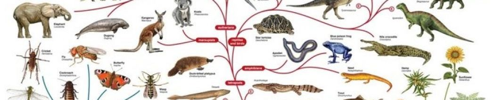
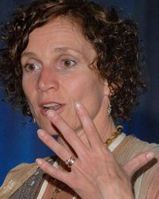
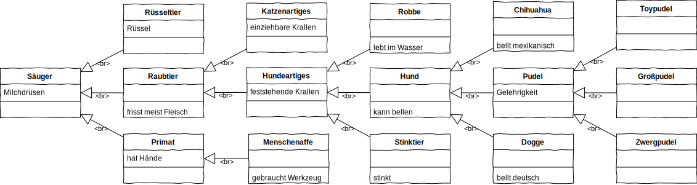
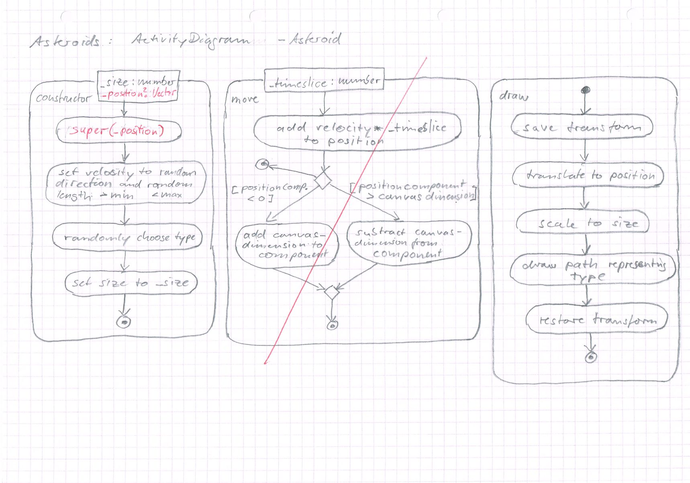

# L10_Inheritance



## Generalisierung vs Spezialisierung


1987 stellte Bararbara Liskov auf einer Konferenz einen Kerngedanken der objektorientierten Modellierung vor. Danach soll ein Objekt einer Klasse durch ein Objekt einer Sub-Klasse dieser Klasse ersetzt werden können, ohne dass das Programm, welches das Objekt verwendet, verändert werden muss. 1993 formalisierte sie zusammen mit Jeannette Wing was heute als das **Liskov'sche Substitutionsprinzip** bekannt ist.

Bezogen auf Hunde kann das Liskov'sche Substitutionsprinzip folgendermaßen beispielhaft dargestellt werden:  
Wenn Hunde grundsätzlich bellen können, dann können auch Subklassen von `Hund`, wie `Dogge`, `Chihuahua` und `Pudel` bellen. Wenn Du also an einem Haus klingelst, an dem ein Schild "Warnung vor dem Hund" steht, darfst Du davon ausgehen, dass ein Hund bellen wird. Es ist nicht erforderlich, dass auf dem Schild "Warnung vor dem Pudel" steht, auch wenn der Hund in dem Haus ein Pudel sein sollte.  

`Pudel` ist eine Spezialisierung von `Hund`, `Hund` ist die Generalisierung von `Pudel`.  

Pudel gelten als besonders gelehrig und werden daher gerne für besondere Tricks und im Zirkus eingesetzt. Dabei ist es wiederum unerheblich, ob es sich um Toy-, Zwerg-, oder Großpudel handelt. Diese sind Spezialisierungen von Pudel, die sich in der Varianz der Größe unterscheiden.  

Der `Hund` kann weiter generalisiert werden, denn er gehört zu der Familie der `Hundeartigen`, zu denen beispielsweise auch Bären, Robben und Stinktiere gehören. Zusammen mit den `Katzenartigen` stellen die `Hundeartigen` die `Raubtiere` die wiederum zu der Klasse der `Säugetiere` gehören, von denen auch der `Mensch` eine Spezialisierung darstellt.  

## Darstellung im Klassendiagramm
In der Biologie teilt man ein in Klassen, Rassen, Arten, Gattungen, Familien, Ordnungen und so weiter. Bei der objektorientierten Modellierung muss man lediglich Klassen unterscheiden in Super- und Subklassen. 

Die Superklasse stellt die Generalisierung einer Subklasse dar, die Subklasse eine Spezialisierung der Superklasse.

Im Klassendiagramm verweisen Pfeile mit einer dreieckigen und leeren Spitze von der Subklasse auf ihre Superklasse und stellen so diese Beziehung dar. Der oben angeführte Exkurs in die Biologie, der übrigens keiner wissenschaftlichen Überprüfung standhält, könnte im Klassendiagramm folgendermaßen aussehen.  



- [x] Studiere das Diagramm und mache dir die Beziehung zwischen Sub- und Superklasse klar.
- [x] Beschreibe nur anhand des Diagramms die Eigenschaften und Fähigkeiten eines Zwergpudels.
- [x] Sollten die verschiedenen Pudel eigene Subklassen bilden? Was wäre eine Alternative?
- [x] Wie hilft dir ein solches Diagramm und die Betrachtung von Generalisierung und Spezialisierung im Umgang mit Lebewesen? Beschreibe es an diesem Beispiel. 

## Vererbung
In diesem Zusammenhang spricht man auch von Vererbung (Inheritance). Eine Superklasse vererbt alle ihre Eigenschaften und Methoden an die Subklasse, so wie es bei obigem Stammbaum der Arten gezeigt ist.

> **Vererbung** ist das dritte Prinzip der Objektorientierung!

Wegen der Vererbungsbeziehung werden Superklassen manchmal auch als Elternklassen und Subklassen als Kindklassen bezeichnet. Das führt aber zur Verwirrung, da die manche Laufzeitbeziehungen zwischen Objekten, beispielsweise im DOM, bereits als Parent-Child-Beziehung bezeichnet wird. Weitere Begriffe sind Ober- und Unterklasse, Basis- und Abgeleitete Klasse und weitere. In dieser Lektion werden weiter strikt die Bezeichnungen Super- und Subklasse genutzt.

## Regeln für die Modellierung
Ein Dompteur im Zirkus muss nicht nur die Eigenheiten jeder Hunderasse in seiner Truppe kennen, sondern sogar die jeder einzelnen Instanz. Dem Schalterbeamten "in Zollhafe von modernes Planet" genügte dagegen zu wissen, ob eine Lebensform ein Säuger ist, um das richtige Zimmer zuzuweisen ([siehe Ijon Tichy, Folge 2, 4:23 - 5:33](https://www.youtube.com/watch?v=_DSCXsIR03Q))

Bei der Modellierung eines Systems solltest Du diese zwei Regeln beachten:
- jeder Teil darf nur so schlau wie nötig sein
- jeder Teil muss so dumm wie möglich sein  

Jeder Teil soll also nur das von seiner Umwelt und anderen Teilen wissen, was unbedingt erforderlich für die eigene Funktion ist!

# Ufos in Asteroids
Unter Berücksichtigung der oben genannten Prinzipien wird Asteroids weiter entwickelt.

## Erweiterung des Klassendiagramms
<div align="center"><video controls width="30%"> 
  <source src="http://games.hs-furtwangen.de/EIA2_Video/L10_V1_Classdiagram.mp4" type="video/mp4"> 
<a href="http://games.hs-furtwangen.de/EIA2_Video/L10_V1_Classdiagram.mp4"></a>
</video>  
<a href="Material/Asteroids_ClassDiagram.jpg"></a>
<a href="Material/Asteroids_ActivityDiagram-Moveable.jpg"></a>
<a href="Material/Asteroids_ActivityDiagram-Asteroid.jpg"></a>
</div>

## Implementation Moveable, Refaktorierung Asteroid   
<div align="center"><video controls width="30%"> 
  <source src="http://games.hs-furtwangen.de/EIA2_Video/L10_V2_Implementation1.mp4" type="video/mp4"> 
<a href="http://games.hs-furtwangen.de/EIA2_Video/L10_V2_Implementation1.mp4"></a>
</video>  
</div>

> **`extends`** erweitert eine Superklasse um eine Subklasse!  
> **`super(...)`** ruft aus der Subklasse den Constructor der Superklasse auf!  
> **`super.methode(...)`** ruft aus der Subklasse die `methode` der Superklasse auf!

## Polymorphie
Griechisch πολύς (polýs) = „viel“ und μορφή (morphé) = "Form, Gestalt". Hunde sind vielgestaltig, das wurde in diesen Lektionen bereits ausgiebig behandelt. Die einzelnen Hunderassen können aber nicht nur anders aussehen, sondern sich vielleicht auch unterschiedlich verhalten. Ein Jagdhund wird beim Anblick einer Herde Schafe vielleicht gerne hineinrennen und eines reißen, ein Hütehund eher um die Herde herumlaufen und sie beisammen halten. Für jemanden, der mit diesen Hunden spazierengeht, so wie die angeblich 200.000 professionellen Gassigeher in den USA, ist dabei vordringlich wichtig, genug Leinen und Halsbänder zu haben, um die Hunde bei sich halten zu können. Die Rasse ist unerheblich.

> **Polymorphie** ist das vierte Prinzip der Objektorientierung!

Im Asteroids-Programm sind derzeit zwei Klassen implementiert, die von Moveable erben, also zwei Subklassen der Superklasse Moveable. Anders ausgedrückt hat Moveable derzeit drei Gestalten: Moveable, Asteroid und Projectile. Sie unterscheiden sich in Aussehen und Verhalten

| Klasse | Aussehen | Bewegung |
|---|---|---|
|Moveable|keines|Geradlinig mit Umlauf am Rand
|Asteroid|Felsbrocken| wie Moveable
|Projectile| kleiner Punkt| wie Moveable aber Reichweite begrenzt

Damit sich die Instanzen der Klassen bewegen und darstellen können, ruft das Hauptprogramm deren `move`- und `draw`-Methoden auf. Dabei ist es dem Hauptprogramm aber völlig egal, ob es sich dabei um Asteroiden oder Projektile handelt, solange sie Moveables sind und somit diese Methoden entweder geerbt haben oder sie neu implementieren (überschreiben). Das Hauptprogramm kann mit allen Gassi gehen ...

Nach dem Liskov'schen Substitutionsprinzip muss Folgendes möglich sein, auch wenn Moveable vielgestaltig ist:

```typescript
let m: Moveable = new Moveable();
let a: Moveable = new Asteroid(1);
let p: Moveable = new Projectile(new Vector(0, 0), new Vector(0, 0));
```

Beachte, dass die Variablen m, a und p alle mit dem Typ Moveable deklariert wurden, sie aber unterschiedliche Objekt-Typen referenzieren.

- [x] Implementiere diese drei Zeilen und lasse dir die Variablen in der Konsole ausgeben oder schaue sie dir im Debugger an.

Wenn Vorangegangenes möglich ist, dann muss auch Folgendes möglich sein:

```typescript
let moveables: Moveable[] = [];
moveables.push(new Asteroid(1));
moveables.push(new Projectile(new Vector(0, 0), new Vector(0, 0)));
```

- [x] Überprüfe auch dies mit einer entsprechenden Implementation

## Aktivitätsdiagramm Hauptprogramm  

<div align="center"><video controls width="30%"> 
  <source src="http://games.hs-furtwangen.de/EIA2_Video/L10_V3_ActivitydiagramMain.mp4" type="video/mp4"> 
<a href="http://games.hs-furtwangen.de/EIA2_Video/L10_V3_ActivitydiagramMain.mp4"></a>
</video>  
<a href="Material/Asteroids_ActivityDiagram-Main.jpg"></a>
</div>

## Implementation bei Nutzung der Polymorphie

<div align="center"><video controls width="30%"> 
  <source src="http://games.hs-furtwangen.de/EIA2_Video/L10_V4_Implementation2.mp4" type="video/mp4"> 
<a href="http://games.hs-furtwangen.de/EIA2_Video/L10_V4_Implementation2.mp4"></a>
</video>  
</div>

> **`a instanceof B`** prüft, ob das Objekt `a` eine Instanz der Klasse `B` ist.

- [x] Konzipiere die Ufos! Dabei musst Du unter anderem folgende Designentscheidung treffen:
  - wer soll die Projektile erzeugen? Wird diese Aufgabe von den Ufos übernommen oder vom Hauptprogramm?
    - wenn Ufo: wie kommen die Projektile in das Moveable-Array um verwaltet zu werden?
    - wenn Hauptprogramm: wie erkennt das Hauptprogramm, dass das Ufo ein Projektil abfeuert? 

>**Hinweis:** Der Pfad zum Zeichnen der Ufos wird bereits von der Funktion `createUfoPath()` erzeugt. 
