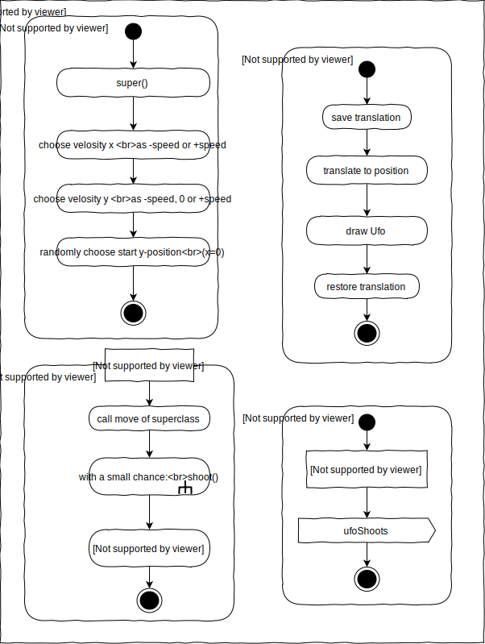
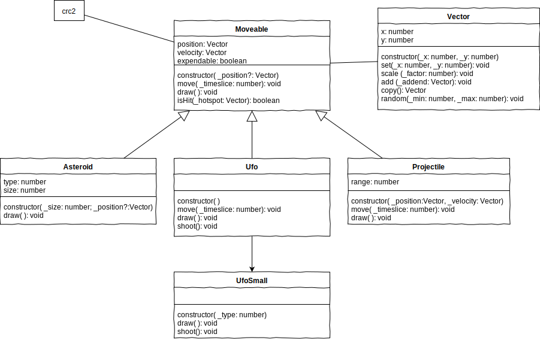

# L11 Advanced


<hr>  

**Einschub**: Eine Lösung für die letzte Übung von Lektion 10 mit CustomEvents, die bereits in [Lektion03](../L02_Events/README.md#customevents) kurz angerissen wurden.  
<div align="center"><video controls width="30%"> 
  <source src="http://games.hs-furtwangen.de/EIA2_Video/L11_V1_UFOs_181219_MixedSharp.mp4" type="video/mp4"> 
<a href="http://games.hs-furtwangen.de/EIA2_Video/L11_V1_UFOs_181219_MixedSharp.mp4"></a>
</video><a href="Material/draw.io/Asteroids_ActivityDiagram-Ufo.svg"></a>
<a href="Material/draw.io/Asteroids_ActivityDiagram-Main_2.svg"></a>
</div>

<hr>  

Die objektorientierte Modellierung bietet noch einige zusätzliche Möglichkeiten, welche die Entwicklung und Wartung von Softwaresystemen vereinfachen und verbessern. Komplexere Software wird meist im Team entwickelt, verschiedene Teile, Module und Klassen werden von unterschiedlichen Leuten entworfen, implementiert und genutzt. Es ist ungemein hilfreich und praktisch, wenn diese Mechanismen genutzt werden, um Missverständnisse zwischen den Teammitgliedern zu vermeiden oder Fehler bei der Programmierung von vorneherein auszuschließen.

- [x] Entwirf für diese Lektion ein kleines Programm bestehend aus einer Superklasse, einer Subklasse davon, einem Hauptprogramm und einer HTML-Datei, welche deine Skripte lädt. Die Funktion ist zunächst irrelevant, es geht nur um Struktur.

## `Abstract`
### Abstrakte Klasse
Von der Klasse `Moveable` bei Asteroids werden keine Objekte instanziert, nur von den Subklassen. `Moveable` ist somit eine völlig abstrakte Klasse, sie stellt wie "Hund" lediglich ein Konzept, eine Idee, dar (vergleiche Platons Ideenlehre). Mit dem reservierten Wort `abstract` kann eine Klasse als solche gekennzeichnet werden. Der Versuch, ein Objekt dieser Klasse zu instanzieren, wird nun bereits vom TypeScript-Compiler geahndet.  

- [x] Markiere deine Superklasse als abstrakt, in dem Du einfach `abstract` vor `class` schreibst. Versuche im Hauptprogramm ein Objekt der Klasse erzeugen zu lassen und beachte die Fehlermeldungen.

Objekte der Subklassen können dennoch weiter die Methoden der abstrakten Superklasse nutzen.

- [x] Überprüfe diese Aussage, indem Du in deiner Superklasse eine Methode implementierst und diese aus einem Objekt der Subklasse heraus aufrufen lässt.

### Abstrakte Methode
Es gibt aber auch Methoden, die in der abstrakten Superklasse nicht sinnvoll implementiert werden können, sondern nur in den Subklassen. `draw()` in `Moveable` ist hierfür ein gutes Beispiel. Dennoch muss die Superklasse `Moveable` die Methode `draw` aufweisen, damit das Hauptprogramm alle `Moveable`s einfach verwalten und deren `draw`-Methoden aufrufen kann.  

Solche Methoden abstrakter Klassen sollten ebenfalls mit `abstract` markiert werden. Dann muss dort kein Rumpf implementiert werden und es wird erzwungen, dass die Methode in der Subklasse definiert werden muss.

- [x] Markiere eine neue Methode deiner abstrakten Superklasse als abstrakt. Erhältst Du eine Fehlermeldung, wenn Du diese Methode in der Subklasse nicht definierst?

> **Hinweis**: Du kannst die Abstraktion schon beim Entwurf im Klassendiagramm darstellen, hierzu werden die entsprechenden Klassen- und Methodennamen lediglich kursiv geschrieben. 

## Static
In die entgegengesetzte Richtung zielt das Prinzip der statischen Methoden und Eigenschaften von Klassen. Diese können nämlich genutzt werden, ohne dass eine Instanz der Klasse geschaffen werden muss. Die Klasse, oder ein Teil davon, wird also sehr konkret. Hierfür genügt es, das reservierte Wort `static` der Deklaration einer Methode oder Eigenschaft voran zu stellen.  

Bei Asteroids könnten statische Methoden in der Vektorklasse hilfreich sein. Folgende Zeile aus `isHit` beispielsweise ist recht unschön

```typescript 
let difference: Vector = new Vector(_hotspot.x - this.position.x, _hotspot.y - this.position.y);
```
Es wäre besser lesbar, wenn die Vektorklasse die Differenz zweier Vektoren berechnen und den resultierenden Vektor liefern könnte. Das ist einfach in der Vektorklasse zu implementieren

```typescript
static getDifference(_v0: Vector, _v1: Vector): Vector
  let vector: Vector = new Vector(_v0.x - _v1.x, _v0.y - _v1.y);
  return vector
}

```
Nun steckt die Komplexität der Erzeugung eines neuen Vektors und der komponentenweisen Subtraktion in der Vektorklasse und die neue Klassenmethode `getDifference` kann einfach und intuitiv verwendet werden.
```typescript
let difference: Vector = Vector.getDifference(_hotspot, this.position);
```

- [x] Definiere in deiner Superklasse eine statische Eigenschaft und eine statische Methode. Lasse das Hauptprogramm die Eigenschaft in der Konsole ausgeben und die Methode aufrufen. Nutze statt einer Objektreferenz nun einfach den Klassennamen hierfür.

> **Hinweis**: Im Klassendiagramm werden statische Methoden oder Eigenschaften durch Unterstreichung gekennzeichnet!

## Gültigkeit
Variablen, die innerhalb eines mit geschweiften Klammern abgegrenzten Code-Block mit `let` deklariert werden, sind nur innerhalb des entsprechenden Blocks gültig. Dabei können sie andere Variablen gleichen Namens, die ausserhalb des Blocks gültig sind "verdecken". Dies wird in folgendem simplen Beispiel sichtbar.

```typescript
let x: string = "I'm valid outside";
{
  let x: string = "I'm valid inside";
  console.log(x);
}
console.log(x);
```
Erzeugt wird die Ausgabe
```plaintext
I'm valid inside
I'm valid outside
```
Es ist erkennbar, dass für die Dauer der Ausführung des Blocks zwei Variablen namens `x` existierten, denn der Inhalt der "äußeren" wurde nicht verändert. Die "innere" verlor dagegen nach Beendigung des Blocks ihre Gültigkeit. Die verließ ihren "Scope" und der von ihr belegte Speicher wird wieder freigegeben. Die "äußere" aber existiert weiterhin und ihr Inhalt wird ausgegeben.

Solche Blöcke können Schleifenkörper oder if-Blocks abgrenzen, Funktions- oder Methodenrümpfe, Klassen, Objekte und Namespaces. Wie in obigem Beispiel ist es auch möglich, obgleich selten, einen Block zu definieren, ausschließlich um einen Gültigkeitsbereich abzugrenzen.

- [x] Untersuche den Code "Scopes" im Anhang zu dieser Lektion und bringe ihn entweder in der Konsole oder im Browser zum Laufen. In diesem Code wird zehnmal die Variable x als `string` deklariert und mit unterschiedlichen Zeichenketten definiert. Die Werte bezeichnen den Gültigkeitsbereich.
- [x] Erkläre die Ausgaben und die beiden Abweichungen.

## Sichtbarkeit
Es existieren also mehrere Gültigkeitsbereiche nebeneinander und ineinander verschachtelt. Insbesondere dann, wenn aus einem Bereich in einen anderen zugegriffen werden soll, so wie das Asteroid-Hauptprogramm beispielsweise auf die Eigenschaften oder Methoden der Moveables zugreift, kann schnell Verwirrung entstehen. Denn manche Informationen bieten die Klassen und Objekte tatsächlich für den Zugriff "von Außen" als Schnittstelle an, anderes dagegen brauchen sie lediglich für die interne Funktion. Hier kann ein Zugriff zu Fehlern führen

Bei der objektorientierten Modellierung können durch Sichtbarkeitsmodifikatoren Eigenschaften und Methoden gegen den Zugriff geschützt werden. Das erhöht nicht nur die Sicherheit, sondern macht es bei der Entwicklung im Team für alle sehr viel leichter, die richtigen Zugriffe zu finden und auszuwählen. Diese Modifikatoren sind lediglich reservierte Worte, die bei der Deklaration der Methoden und Eigenschaften voran gestellt werden.

### `public`
Der Zugriff ist völlig öffentlich. Dies ist auch die Standardsichtbarkeit, wenn kein Modifikator angegeben wird. Daher konnte Asteroids bisher funktionieren. Eine Analogie könnte ein Vorgarten sein, in den jeder hineinlaufen und mit den Dingen dort hantieren kann.

> **Hinweis**: Im Klassendiagramm wird `public` mit dem Zeichen `+` markiert

### `private`
Der Zugriff ist nur Objekten der gleichen Klasse erlaubt. In den meisten Fällen greift also das Objekt selbst auf seine eigenen Eigenschaften und Methoden zu. Eine Analogie könnte das Schlafzimmer der Eltern sein, auf dessen Interieur nur die Erwachsenen im Haus haben.

> **Hinweis**: Im Klassendiagramm wird `private` mit dem Zeichen `-` markiert

### `protected`
Der Zugriff ist nur Objekten der gleichen Klasse und deren Subklassen erlaubt. Eine Analogie ist der Rest des Hauses, den Eltern und Kinder nutzen können, aber anderen, die nicht zur Familie gehören, verschlossen bleibt.

> **Hinweis**: Im Klassendiagramm wird `protected` mit dem Zeichen `#` markiert

<div align="center"><video controls width="30%"> 
  <source src="http://games.hs-furtwangen.de/EIA2_Video/L11_V2_UpdateClasses.mp4" type="video/mp4"> 
<a href="http://games.hs-furtwangen.de/EIA2_Video/L11_V2_UpdateClasses.mp4"></a>
</video>  
</div>

### `readonly`
Unterschiedliche Programmiersprachen können noch weitere Modifikatoren anbieten. Erwähnenswert ist für TypeScript noch `readonly`, das mit den vorangegangenen Modifikatoren kombiniert werden kann. Eine so gekennzeichnete Eigenschaft kann nur direkt bei der Deklaration oder im Konstruktor definiert, danach der Wert aber nicht mehr geändert werden. Es entspricht somit dem Schlüsselwort `const` für übliche Variablen.

## Zugriffsfunktionen 
### `set`
Manchmal ist es wünschenswert, dass eine Eigenschaft eines Objektes verändert werden kann, so als wäre sie `public`, aber dass das Objekt selbst von der geplanten Änderung erfährt und noch eingreifen kann oder erforderliche Prozesse dabei auslöst. Beispielsweise könnte das Objekt überprüfen, ob der einzutragende Wert innerhalb bestimmter Grenzen liegt und die Übernahme verweigern, wenn dies nicht so ist. Hierzu könnte es also eine Methode anbieten und das eigentlich Attribut als `private` deklarieren, um nur selbst darauf Zugriff zu haben.

```typescript
private value: number;

setValue(_newValue: number): void {
  if (_newValue < 100)
    this.value = _newValue;
}
```
Soll nun also die Eigenschaft `value` des Objektes `instance` verändert werden, wird die Anweisung `instance.setValue(...)` genutzt. Da solche Anwendungsfälle häufig auftreten und die Schreibweise `instance.value = ...` für die Veränderung einer Eigenschaft schlicht einfacher und intuitiver erscheint ist, gibt es einen speziellen Methodentyp: den "Setter"

```typescript
private valuePrivate: number;

set value(_newValue: number): void {
  if (_newValue < 100)
    this.valuePrivate = _newValue;
}
```

Nun wird beispielsweise bei der Anweisung `instance.value = 59;` automatisch diese Setter-Methode aufgerufen und das, was auf der rechten Seite des Zuweisungsoperators steht, hier `59`, als Parameter übergeben. Gleiches geschieht auch bei den kombinierten Zuweisungsoperatoren (siehe Anhang). Zu beachten ist, dass es nun gar keine Eigenschaft `value` in der Klasse mehr gibt, denn das würde einen Namenskonflikt mit dem Setter bedeuten. Daher wird intern im Beispiel das Attribut intern mit `valuePrivate` bezeichnet. Von "außen" betrachtet aber verfügt `instance` über eine Eigenschaft `value` die nun eine besondere Funktionalität aufweist und nicht unkontrolliert verändert werden kann. 

- [x] Die Vektorklasse verfügt bereits über eine Methode `set(...)`. Ist das ein "Setter"?

### `get`
Das Pendant zu `set` ist natürlich `get`. Damit kann beispielsweise eine Eigenschaft gelesen werden, die gar nicht gespeichert ist, sondern erst berechnet wird, wenn jemand danach fragt. Ein Kandidat für einen sogenannten "Getter" könnte ein Attribut `length` der Vektorklasse sein. Die Länge eines Vektors lässt sich leicht mit dem Satz des Pythagoras berechnen, Javascripts `Math`-Objekt hält hierfür die Methode `hypot` bereit. Da die Elemente des Vektors sich ständig ändern, wäre es unnötiger Aufwand, bei jeder Änderung die Länge zu berechnen und zu speichern. Mit 

```typescript
get length(): number {
    return Math.hypot(this.x, this.y);
}
```

erscheint es von außen betrachtet aber so, als wäre diese Eigenschaft ständig vorhanden, denn sie kann einfach mit z.B. `let speed: number = velocity.length;` abgerufen werden. Die Anweisung verschleiert, dass es sich eigentlich um den Aufruf einer Methode handelt.

> **Hinweis:** Zugriffsfunktionen werden im Klassendiagramm standardmäßig nicht markiert, sondern schlicht als Eigenschaft dargestellt.

## Asteroid Reloaded

<div align="center"><video controls width="30%"> 
  <source src="http://games.hs-furtwangen.de/EIA2_Video/L11_V3_AsteroidReloaded.mp4" type="video/mp4"> 
<a href="http://games.hs-furtwangen.de/EIA2_Video/L11_V3_AsteroidReloaded.mp4"></a>
</video>  
<a href="Material/draw.io/Asteroids_ClassDiagram.svg"></a>
</div>

## Aufzählungstypen
Häufig ist es erforderlich, eine Information mit einem Datentyp zu beschreiben, der nur eine enge und diskrete Auswahl an Werten beschreiben kann. Das simpelste Beispiel für einen solchen Datentyp ist `boolean`. Hier sind nur zwei Werte zulässig `true` und `false`. Der Versuch, einer Variablen dieses Typs beispielsweise ein `maybe` zuzuweisen, scheitert.

Du kannst selbst solche Aufzählungstypen mit dem reservierten Wort `enum` (Enumeration [engl]: Aufzählung) kreieren.

```typescript
enum TASK {
    WATCH,
    PATROL,
    CHASE,
    SLEEP
}
```
Der Typ im Beispiel könnte genutzt werden, um die Aufgaben eines Wachhundes zu bezeichnen. Ein Objekt vom Typ des Wachhundes könnte dann über eine Eigenschaft `task` verfügen, welche nur diese vier Werte annehmen kann.

```typescript
class Watchdog extends Dog {
    private task: TASK = TASK.WATCH;

    update(): void {
        switch (this.task) {
            case TASK.SLEEP:
                ...
                break;
            case TASK.WATCH:
                ...
                break;
            ...
        }
    }
}
```

Wird die Methode `update` des Wachhundes nun zyklisch abgearbeitet, können je nach aktuellem `task` unterschiedliche Aktivitäten bzw. Verhaltensmethoden aufgerufen werden. Der `switch` stellt bereits das hierfür erforderliche Konstrukt dar.

- [x] wie könnten die zugehörigen Aktivitäten aussehen? Erstelle grobe Aktivitätsdiagramme hierfür.

Ohne den speziellen Aufzählungstyp wäre `task` vielleicht einfach vom Typ `number`. Dann gäbe es die Aufgaben 0, 1, 2 und 3 und man müsste an anderer Stelle festhalten, welche Zahl welche Aufgabe bedeutet. Zudem wären dann auch Zahlen gültig, zu denen gar keine Aufgabe definiert ist. Da sind Fehler vorprogrammiert. `task` könnte aber auch vom Typ `string` sein und mit den Werten `"sleep"`, `"watch"` und so weiter besetzt werden. Dann wäre das Programm wieder lesbar, ist aber sehr fehleranfällig, denn falsche Schreibweisen wie `"petrol"`schleichen sich ein.

Mit Hilfe des Aufzählungstyps aber kann TypeScript schon beim Schreiben des Codes die richtigen Vorschläge machen, die zulässigen Werte zur Auswahl stellen und Fehler sofort erkennen.

> **Hinweis**: Laut UML-Standard wird eine Enumeration im Klassendiagramm durch die Markierung `<<enumeration>>` gekennzeichnet. Analog gilt das für Interfaces mit `<<interface>>`
