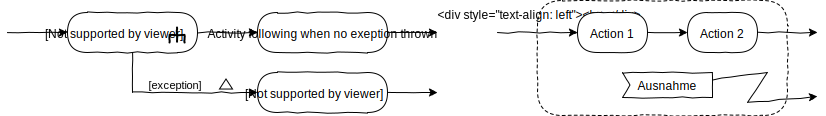

# L12_Addition

<a href="https://www.youtube.com/watch?v=PK_yguLapgA"></a>
<small>Quelle: https://docplayer.net/docs-images/66/55611304/images/11-0.jpg</small>

- [x] Klicke auf das Bild, wenn Du sehen möchtest, wie ein kleiner Softwarefehler 290 Millionen Euro in Rauch aufgehen lässt.

In diesem Kapitel lernst Du noch einige fortgeschrittene Strukturen kennen, die interaktive Anwendungen flexibler, wartbarer und sicherer machen. Auch wenn Du sie im Kurs vielleicht nicht verwendest, solltest Du sie gesehen und verstanden haben. Zudem werden einige Konstrukte vorgestellt, die nicht unbedingt empfehlenswert, aber weit verbreitet sind, und dich bei deinen Recherchen im Netz irritieren könnten.

## Standardparameter
Neben dem Fragezeichen gibt es noch eine andere Möglichkeit optionale Parameter bei der Funktions- oder Methodendeklaration vorzusehen. Dabei gibt man einfach nach der Deklaration des formalen Parameters einen Zuweisungsoperator und dann einen Standardwert an. Wird nun beim Aufruf kein Parameter übergeben, erhält der formale Parameter automatisch den Standardwert. Praktisch ist das beispielsweise für den Konstruktor der Vector-Klasse.
```typescript
constructor(_x: number = 0, _y: number = 0) {
    this.set(_x, _y);
}
```
Nun kann ein neuer Vector einfach mit dem Aufruf `new Vector()` erzeugt werden, die Koordinaten haben dann automatisch beide den Wert 0. Es muss also nicht im Methodenrumpf geprüft werden, ob Parameter übergeben wurden um auf diesen Fall zu reagieren. Werden aber Parameterwerte übergeben, werden diese verwendet.

## Eigenschaftsparameter
Eigenschaften eines Objektes mit Werten zu definieren, die dem Konstruktor übergeben werden, ist ein sehr häufiges Muster. Daher ist in Typescript eine Kurzschreibweise möglich. Dabei werden die Eigenschaften mit der Signatur des Konstruktors durch die Liste der formalen Parameter deklariert.  

```typescript
class Test {
  constructor (public a: number, protected b: number, private c: number) {
  }
}
```  

Eine Instanz der Klasse Test verfügt nun über die Eigenschaften a, b und c, obwohl diese nicht in der Klasse deklariert wurden, sondern in der Konstruktorsignatur. Erzeugt mit `let test: Test = new Test(1, 2, 3);` sind die Eigenschaften dann mit den Werten 1, 2 und 3 definiert.  

Diese Schreibweise "versteckt" allerdings die Eigenschaften in der Signatur und der Coding-Style der Lektionen kann nicht sinnvoll eingehalten werden, da es sich gleichzeitig um Parameter und Eigenschaften handelt. Daher wurde diese Schreibweise nicht verwendet, soll hier aber erwähnt sein.

## Ausnahmebehandlung
In den vorangegangenen Lektionen wurde das Thema Fehlerbehandlung weitestgehend ausgeklammert. Lediglich wenn TypeScript durch die strikten Einstellungen des Compilers und des Linters Fehlerquellen angezeigt hat, wurde der Code entsprechend angepasst.  

Gerade wenn ein System mit anderen Systemen oder mit Menschen kommuniziert, entstehen viele Fehler zur Laufzeit und sind schwer vorhersehbar. Wird zudem versucht, alle möglichen Fehler durch Verzweigungen im Code abzufangen, steigt die Komplexität des Programms rasant an.

```typescript
interface Greet {
    greet: string;
}
let greets: Greet[] = [{ greet: "Hi" }, { greet: "Hallo" }, { greet: "Servus" }];

let input: string | null = prompt("Lass dich grüßen!", "Gib hier eine Zahl ein");
let greet: string = greets[Number(input)].greet;
alert(greet);
console.log("Done");
```

- [x] Implementiere das obenstehende Mini-Programm in einem eigenen Namespace und lasse es im Browser laufen. Was geschieht, wenn Du eine Zahl jenseits 0, 1 und 2 eingibst oder beliebige Zeichen?

Wenn das Programm seinen Dienst quittiert, tut es dies leise. Das Nutzeri hat keine Ahnung was passiert, sofern er nicht Medienkonzeption in Furtwangen studiert und deswegen selbstverständlich die Entwicklerkonsole geöffnet hat. Dort erscheint eine Fehlermeldung.

- [x] Erkläre den Fehler!

Vielleicht ist der Fehler aber gar nicht so gravierend, dass das Programm beendet werden müsste. Oder das Nutzeri sollte darüber informiert werden, dass etwas schiefgelaufen ist, so dass es die Ursache prüfen kann. Im Beispiel könnte man natürlich einfach abfragen, ob die Eingabe gültig ist. Es gibt aber noch einen anderen Mechanismus, der auch mit noch unbekannten Fehlerquellen umgehen kann: **Exception-Handling!**

### Error-Objekt
JavaScript kann bei einem solchen Ausnahmefehler (Exception), der zum Absturz des Programms führt, automatisch ein Error-Objekt erzeugen. Ähnlich einem Event, das durch das DOM weitergereicht wird, kann dieses Objekt durch das Programm gereicht, eher sogar "geworfen" werden. Dieses Objekt enthält Informationen über das Problem, die ausgewertet werden können. Damit müssen also nicht alle Fehler präventiv vermieden werden, sondern sie können im Nachhinein behandelt werden.  

### `try`
Um den Mechanismus zu nutzen wird zunächst der Code-Block eingegrenzt, der den zu behandelnden Fehler provozieren könnte. Dies geschieht, wie üblich, durch Einfassen in geschweifte Klammern, nun aber mit dem reservierten Wort `try` davor. Damit wird JavaScript angewiesen, zu versuchen den Code im Block auszuführen und ein Error-Objekt zu werfen, wenn etwas schief geht.

### `catch`
An diesen Block muss sich nun direkt ein Block anschließen, der mit dem reservierten Wort `catch` versehen ist. Jetzt wird auch die Wurf-Analogie deutlich, denn hier wird das Error-Objekt aufgefangen und kann innerhalb des Blocks verarbeitet werden. Dazu wird nach der `catch`-Anweisung ein formaler Parameter deklariert, wie es auch bei Funktionen oder Methoden üblich ist. Allerdings kommt eine Eigenheit von TypeScript zum Tragen: wie bei der `for..in`- und der `for..of`-Loop ist keine Typ-Annotation erlaubt.

Mit `try` und `catch` gestaltet sich obiger Code zum Beispiel so:

```typescript
namespace L12_Exception {
    interface Greet {
        greet: string;
    }
    let greets: Greet[] = [{ greet: "Hi" }, { greet: "Hallo" }, { greet: "Servus" }];

    try {
        let input: string | null = prompt("Lass dich grüßen!", "Gib hier eine Zahl ein");
        let greet: string = greets[Number(input)].greet;
        alert(greet);
    } catch (_error) {
        alert("Tschüss!");
        console.log(_error);
    }
    console.log("Done");
}
```

- [x] Erweitere deinen Beispielcode entsprechend und experimentiere dann damit.

### `finally`
Nach dem `catch`-Block kann sich noch ein `finally`-Block anschließen. Der Code darin wird auf jeden Fall ausgeführt, egal ob es eine Exception gab oder nicht. Selbst wenn der Beispielcode in einer Funktion definiert ist, und sowohl im `try`- als auch im `catch`-Block eine `return`-Anweisung steht, die Funktion dort also zurückkehrt, wird zuvor noch der `finally`-Block abgearbeitet. Die Ausgabe "Done" aber kommt dann nicht mehr.

### `throw`
Du kannst auch selbst eine Exception erzeugen und werfen lassen. Das entspricht etwa der Erzeugung eines CustomEvents, das Du durch das DOM schickst. Das Error-Objekt wird die Kette der Funktionsaufrufe zurück geschickt, bis es in einer der aufrufenden Funktionen von einem `catch`-Block verarbeitet wird. Geschieht letzteres nicht, kommt es als "Unhandled Exception" auf der Konsole raus...

Das bedeutet, dass nun neben `return` und `await` eine dritte Möglichkeit zur Verfügung steht, um Funktionen zu beenden oder zu unterbrechen. Je nach Anwendungsfall kann die Verwendung von `throw` äußerst effizient sein.

- [x] Verfolge den Code "Exception" im Anhang zu dieser Lektion mit dem Debugger!

### Darstellung im Aktivitätsdiagramm
Es gibt zwei Perspektiven um die Ausnahmebehandlung im Aktivitätsdiagramm darzustellen. Bei der "Außenansicht" wird nur gezeigt, dass eine Aktivität mit einer Ausnahme beendet werden kann und wie der Fluss dann weitergeht. Dazu kann hier - eben ausnahmsweise - die Aktivität zwei Abflüsse haben, die dann aber nicht eine parallele Weiterverarbeitung bedeuten. Denn einer davon ist mit einem kleinen Dreieck gekennzeichnet und gegebenenfalls, wie bei einem bedingten Fluss, mit einer Information zu der Ausnahmebedingung in eckigen Klammer.


Die "Innenansicht" zeigt den inneren Aufbau eines unterbrechbaren Bereiches und die Signale, die eine Ausnahmebehandlung erforderlich machen. Der Rahmen des Bereiches wird gestrichelt dargestellt, der Abfluss vom Signalempfang als gezackte Linie. Neben der gezackten Linie und dem Dreieck an einer Linie gibt es noch die Darstellung mit einem Blitzsymbol an der Linie.

## Funktions-Objekt
Funktionen sind in JavaScript, wie alles andere, Objekte. Sie können beispielsweise mit Hilfe von Variablen referenziert werden. Folgendes ist also möglich:

```typescript
function doSomething(_parameter: number): string {
   ...
}

let doToo: Function = doSomething;
doToo(42);
```

Das Ergebnis ist das gleiche wie beim Aufruf `doSomething(42);` denn `doToo` und `doSomething` referenzieren das gleiche Funktionsobjekt.

### Anonyme Funktionen
Die Funktion kann auch gleich bei der Erzeugung einer Variablen zugeordnet werden, dann ist es nicht erforderlich einen Funktionsnamen zu vergeben. Die Funktion selbst ist dann "anonym".

```typescript
let doSomething: Function = function(_parameter: number): string {
   ...
}
```

Die Funktionserzeugung ist gleichbedeutend mit der im Beispiel darüber. Allerdings kann `doSomething(...)` nun erst nach der Definition aufgerufen werden, was eher unschön ist.

Anonyme Funktionen werden häufig dort genutzt, wo sie als Parameter übergeben werden und nicht als mehrfachverwendbare Objekte im Zugriff bleiben müssen. Beispiel:

```typescript
setTimeout(function (): void {
        console.log("Timeout");
    },         2000);
```

Der Timeout-Funktion wird das anonyme Funktionsobjekt sofort übergeben und nach zwei Sekunden wird es aufgerufen. Danach ist das Funktionsobjekt Müll und wird vom Garbage Collector irgendwann entsorgt. 

Für solche kleinen Funktionen ist diese Anonymität akzeptabel, grundsätzlich vermindern solche Konstrukte aber eher die Lesbarkeit und Wartbarkeit des Programms.

### Arrow-Functions
Seit 2015 ist in JavaScript eine weitere Schreibweise für Funktionen üblich, die etwas kryptischer aussieht, aber im Wesentlichen gleichbedeutend ist mit der dir bekannten und etwas intuitiveren Schreibweise mit `function`.

```typescript
let doSomething: Function = (_parameter: number): string => {
   ...
};
```
Aus dem reservierten Wort `function` vor der Parameterliste ist nun der Doppelpfeil zwischen dem Rückgabetyp und dem Funktionskörper geworden.

### this-binding
Ein Unterschied aber ist die Funktionalität innerhalb von Klassen. Wird eine Arrow-Function als Methode deklariert, wird sie in der Konsole als Eigenschaft angezeigt. Interessanter aber ist der Unterschied bei der Verwendung als Event-Handler.   
- Innerhalb klassischer Methoden verweist `this` dann auf das Event-Target und nicht auf die Instanz der Klasse. Das führt häufig zu unerwarteten Fehlern. 
- Bei Arrow-Functions dagegen verweist `this` weiterhin, wie zu erwarten, auf die Instanz. Daher ist diese Schreibweise in dem Fall zu bevorzugen.
- Es gibt auch die Möglichkeit, eine klassische Methode so zu modifizieren, dass auch sie als Event-Handler die Instanz mit `this` referenziert. Hierzu existiert die Funktion `bind` des Funktionsobjektes. 

- [x] Wenn Du dies besser verstehen möchtest, experimentiere etwas mit dem Code "FunctionObject" im Anhang.

## Drag&Drop
Eine wichtige Standardfunktionalität des DOM wurde in diesem Kurs bislang noch nicht behandelt. Insbesondere bei Desktopanwendungen ist es sehr üblich, Objekte direkt zu manipulieren, nicht also über Formularelemente, sondern beispielsweise per drag & drop. Die Verwendung ist recht einfach:

- `draggable` ist eine Eigenschaft, definiert in der Klasse HTMLElement. Erhält sie den Wert `true` verändert sich das Maus-Verhalten auf dem entsprechenden Element.
- wird die Maustaste gedrückt, während sich der Mauscursor über dem Element befindet, wird ein Event vom Typ `dragstart` gefeuert.
- das Event-Objekt ist vom Typ `DragEvent` und verfügt über eine Eigenschaft `dataTransfer`, die ein Objekt vom Typ `DataTransfer` referenziert.
- die Methode `setData(key, value)` fügt `dataTransfer` Informationen hinzu. 
- ein HTMLElement, auf dem dann der Drop stattfinden können soll, muss diesen zulassen. Dazu muss es auf ein `dragover`-Event hören und mit `event.preventDefault()` sein Standardverhalten unterbinden, welches die Ablehnung des Drops ist.
- nun kann es auf ein `drop`-Event reagieren, wobei dem entsprechendem Handler das beim `drag` erzeugte und mit zusätzlichen Informationen versorgte Event übergeben wird.
- mit `getData(key)` können die Informationen ausgelesen und verarbeitet werden, zum Beispiel um das Drop-Ziel zu verändern.

- [x] Im Anhang befindet sich ein kleines Beispielprogramm "DragDrop" mit einer rudimentären Implementation des DOM-Drag&Drop-Mechanismus, mit dem noch viel mehr möglich ist. Schaue es dir an! 

## Garbage Collection
Wenn eine Variable ihren Gültigkeitsbereich verlässt, wird der von ihr belegte Speicher freigegeben und steht wieder für andere Informationen zur Vefügung. Bei Variablen, die auf Objekte verweisen, wird aber nur der Verweis gelöscht, das referenzierte Objekt dagegen bleibt im Speicher, denn es könnten noch andere Variablen darauf verweisen. Diese würden dann ins Leere deuten und Fehler erzeugen. Werden die Objekte allerdings nie gelöscht, wird der Speicher immer mehr zugemüllt und es kommt irgendwann zu einem Programmversagen.

Bei einem JavaScript-Programm wird der Speicher daher von einem Algorithmus, dem sogenannten "Garbage Collector" überwacht. Dieser durchforstet in unregelmäßgen Zeitabständen den Speicher, findet Objekte die nicht mehr gebraucht werden und löscht diese. In den meisten Fällen geschieht das völlig unmerklich, bei Animationen allerdings kann dieser Vorgang zu sichtbaren Störungen führen, wenn ein Bild einmal etwas länger stehen bleibt als andere. Durch Wiederverwendung von Objekten kann der Effekt minimiert werden.

## Debugger in VSCode
### Node-Programme
In der Lektion zum Server wurde bereits kurz der interne Debugger von VSCode vorgestellt. Da bei Node-Programmen der Browser nicht beteiligt ist, kann dessen Debugger nicht genutzt werden um den Programmablauf zu prüfen. Beim Umgang mit dem Debugger von VSCode sind noch einige Informationen sehr nützlich. 
Da VSCode gleichzeitige mehrere Projekte verwalten kann, braucht der Debugger beim Start die Information, welches Programm ausgeführt und verfolgt werden soll. Im einfachsten Fall, wenn der Debugger "No Configurations" anzeigt, startet er das Programm, das gerade im fokussierten Editor-Fenster angezeigt wird. Mit Hilfe des Menüsystems lassen sich aber auch gezielt Konfigurationen definieren, diese werden in einer Datei `launch.json` im Ordner `.vscode` gespeichert, die der Debugger automatisch dabei anlegt. 

- [x] Öffne den Ordner `X01_Appendix` mit VSCode, navigiere zur Debug-Ansicht und darin zu `Open launch.json` bzw. `Open Configurations`. Nun sollte dir die Datei `launch.json` angezeigt werden.
- [x] Studiere den ersten Eintrag im Array `configurations`. Beachte, dass `${workspaceFolder}` ein Platzhalter ist, an dessen Statt der Pfad zu dem Verzeichnisses eingesetzt wird, dass Du mit VSCode geöffnet hattest. In unserem Fall also der Pfad zu `X01_Appendix`.
- [x] Finde den Namen dieser ersten Konfiguration an anderer Stelle im Debug-View. Stelle dann sicher, dass diese Konfiguration genutzt wird, wenn Du den Debugger startest.
- [x] Starte nun den Debugger z.B. mit F5 oder Klick auf den grünen Pfeil.
- [x] Beobachte die Ausgabe im Debug-Terminal und im Editor-Fenster.

Zeile 3 enthält die bekannte Anweisung `debugger` deswegen wurde hier der Programmfluss angehalten und dir wird das Control-Panel mit den Optionen angezeigt, die Du schon vom Browserdebugger kennst. Statt diese Anweisung in den Code zu schreiben, kann man natürlich auch, wie üblich, Breakpoints einfach durch Klick vor der Zeilennummer einsetzen.

- [x] Führe zwei mal einen "Step over" aus um die nächste Konsolenausgabe zu sehen.
- [x] Erkläre, woher der Gruß kommt, der nun erscheint.

### Browser-Programme
Aber auch bei Browser-Programmen muss man nicht auf den Komfort des VSCode-Debuggers verzichten. Über einen lokalen Server kann VSCode mit dem Browser kommunizieren und das laufende Programm kontrollieren. Hierfür ist noch ein wenig Einrichtung erforderlich. Das folgende Beispiel beschreibt dies für die Nutzung von Chrome.

- [x] Installiere die Extension "Debugger for Chrome" in VSCode.
- [x] Betrachte den zweiten Eintrag der `configurations` in `launch.json`. Analog zu `programm` gibt es hier den Eintrag `url`. Hier ist der Pfad zu der auszuführenden HTML-Datei hinterlegt, bezogen auf das Wurzelverzeichnis eines lokalen Fileservers, dem Verzeichnis, dass Du mit VSCode geöffnet hattest.
- [x] Starte den Fileserver im Wurzelverzeichnis mit `npx serve` oder, wenn Du "serve" bereits global installiert hattest, einfach mit `serve`.
- [x] Aktiviere die Debug-Konfiguration "Launch DebugBrowser with Chrome" von `launch.json`.
- [x] Starte den Debugger. Beachte, dass nun Chrome mit der Web-App gestartet wird.
- [x] Erkläre, woher jetzt die Grußnachricht kommt. 

## Teamarbeit
**Git** hat noch mehr Funktionen als die bisher genutzten, sehr wichtig für die Teamarbeit sind dabei "Branches" und "Forks". 

### Branches
Dabei können mehrere Versionen des gleichen Repositories gleichzeitig gespeichert werden, sie werden als Branches bezeichnet. Bislang hast Du nur mit dem `master`-Branch gearbeitet. Insbesondere, wenn mehrere Leute am oder mit dem Code arbeiten, ist es äußerst wünschenswert, einen Branch mit einem stabilen und getesteten Zustand zu halten (oft `master`), während es weitere Branches gibt, auf denen die Fortentwicklung und Experimente etc. stattfinden. Ist dann in einem Branch etwas entstanden, das in den `master` einfließen soll, so kann **git** diese Verschmelzung, im Englischen "merge" genannt, übernehmen. Nur wenn es Konflikte gibt, also in beiden zu verschmelzenden Branches die gleiche Datei verändert wurde, muss ein Mensch entscheiden, welcher Code erhalten bleiben soll.  

### Forks
Mit diesem System ist auch die Open-Source-Entwicklung in einer Community möglich, ohne dass die Teammitglieder in einer festgelegten Struktur arbeiten und sich noch nicht einmal kennen müssen. Jedes kann sich auf Github einen Klon (**Fork**) eines öffentlichen Repositories auf seinen Github-Bereich erstellen lassen, und daran arbeiten. Entsteht dabei etwas, das für das Original nützlich sein könnte, kann man einen "Pull-Request" verschicken, in dem automatisch die Veränderungen enthalten sind. Die Entwickleris des Originals können diese begutachten und bei Bedarf in ihr Repository "mergen".

## Plattformen
Die technische Basis, die für diese Modulreihe "Entwicklung interaktiver Anwendungen" herangezogen wird, entstammt der Webtechnologie. Das bedeutet aber nicht, dass deine Konzeption sich auf Internetseiten beschränken muss. Mit dem, was Du jetzt gelernt hast, kannst Du vollwertige native Apps und Desktop-Programme konzipieren und entwickeln. Hierzu verwendest Du Techniken, die deine Software auf eine erweiterte Plattform hieven, im Inneren arbeitet dabei weiter ein Browser und/oder Node, das Nutzeri bekommt davon aber nichts mit.

### Electron
Wird von GitHub selbst entwickelt und verwendet Node.js sowie Chromium, die Entwicklerversion des Chrome-Browsers. Der Funktionsumfang wird erweitert um Systemfunktionen wie Zugriffe auf das Dateisystem, so dass aus deiner Web-App eine vollwertige, native Desktopanwendung für Windows, Mac und Linux werden kann. 

Du arbeitest übrigens schon eine Weile mit einer solchen Anwendung, den Visual Studio Code ist eine Electron-App!

### Cordova/PhoneGap
Cordova und PhoneGap sind zwei im Wesentlichen identische Produkte, die denselben Ursprung haben und von Apache beziehungsweise Adobe weiterentwickelt werden. Ihnen liegt das gleiche Prinzip zugrunde wie Electron, allerdings für mobile Android- und iOS-Geräte. So kann deine WebApp über die entsprechenden Stores vertrieben werden und im Betrieb auf GPS, Beschleunigungssensoren, Kamera etc. zugreifen.

Die Wikipedia mobile App ist eine PhoneGap-Anwendung!

### Progressive Web Apps
Seit 2015 schickt sich ein weiteres Modell an den App-Markt aufzumischen: Progressive Web Apps. Diese kommen zunächst wie eine gewöhnliche Web-App daher, installieren aber beim ersten Besuch einen "Service-Worker" auf dem Smartphone. Diese Software lädt gezielt Inhalte herunter und speichert sie auf dem Gerät, um die Funktionalität der App auch zu erhalten, wenn keine Internetverbindung besteht. Es wird zudem angeboten, eine Verknüpfung auf dem Home-Screen zu erstellen, sie kann im Vollbildmodus gestartet und Push-Nachrichten vom Server angezeigt werden, auch wenn die App gerade nicht aktiv ist. Dadurch wirkt die PWA wie eine vollwertige native App bei minimalem Mehraufwand gegenüber der reinen Web-Entwicklung. Der riesige Vorteil: ist erst einmal ein potenzielles Nutzeri über eine Suchmaschine auf dem Angebot gelandet, muss es dieses nicht erst wieder verlassen und in den Store geleitet werden um dort die Installation einer App und später den Start derselben in die Wege zu leiten, sondern die Nutzung der App hat bereits begonnen!

Der mobile Twitter Client ist eine Progressive Web App

# Abschluss
<div align="center">
  <a href="http://hdl.handle.net/10900.3/OER_GZLPLYRR"></a>
  <br>  
  <a href="http://hdl.handle.net/10900.3/OER_GZLPLYRR"> L12 Addition: Extro</a>
</div>


## eiaSteroids
Das Beispielprojekt hat nun auch diesen eigenen und eigenwilligen Namen bekommen. Schau es dir genau an, insbesondere die finale Dokumentation. Es ist beispielhaft für deine Abschlussarbeit und Du solltest dich daran orientieren! Hier geht's also zu [**eiaSteroids**](../X01_Appendix/eiaSteroids)
