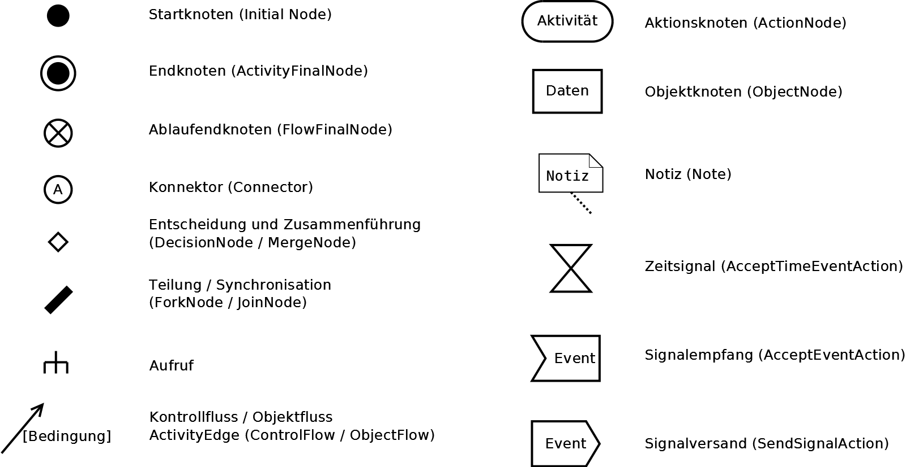

<button onclick="printMe()">Test</button>
## Anhang

# 1. Unified Modelling Language

## 1.1. Activity Diagrams

### 1.1.1. Elements

### 1.1.2. Basic flow structures
<table>
<th align="left">Linear</th>
<tr></tr>
<tr><td></td></tr>
<tr><td><pre lang="typescript">
console.log("Hello");
</pre></td></tr>
</table>

<table>
<th align="left">Conditional</th>
<tr></tr>
<tr><td></td></tr>
<tr><td><pre lang="typescript">
...
if (!(x > 1))
  console.log("Hello");
</pre></td></tr>
</table>

<table>
<th align="left">Exclusive Conditional</th>
<tr></tr>
<tr><td></td></tr>
<tr><td><pre lang="typescript">
...
if (x > 1)
  console.log("Goodbye");
else
  console.log("Hello");
console.log(", my dear");
</pre></td></tr>
</table>

  

<table>
<th align="left">Multiple Conditions</th>
<tr></tr>
<tr><td></td></tr>
<tr><td><pre lang="typescript">
...
let patronus: string;
switch (person) {
  case "Harry":
    patronus = "Deer";
    break;
  case "Hermine":
    patronus = "Otter";
    break;
  case "Ron":
    patronus = "Rat";
    break;
  default:
    patronus = "not found";
    break;
}
console.log(patronus);
</pre></td></tr>
</table>

### 1.1.3. Loops

<table>
<th align="left">Pre Test</th>
<tr></tr>
<tr><td></td></tr>
<tr>
<table><tr><td valign="top">Option 1<pre lang="typescript">
let i: number = 0;
while (i < 10) {
  console.log(i);
  i++;
}
</pre></td><td valign="top">Option 2<pre lang="typescript">
for (let i: number = 0; i < 10; i++)
  console.log(i);
</pre></td></tr>
</table></tr>
</table>

<table>
<th align="left">Post Test</th>
<tr></tr>
<tr><td></td></tr>
<tr><td><pre lang="typescript">
let i: number = 0;
do {
  console.log(i);
  i++;
} while (i < 10);
</pre></td></tr>
</table>

<table>
<th align="left">Complex Control</th>
<tr></tr>
<tr><td></td></tr>
<tr><td><pre lang="typescript">
for (let i: number = b; i > 1; i/=2) {
  if (i == 3)
    continue;
  if (i == a)
    break;
  console.log(i);
}
</pre></td></tr>
</table>

