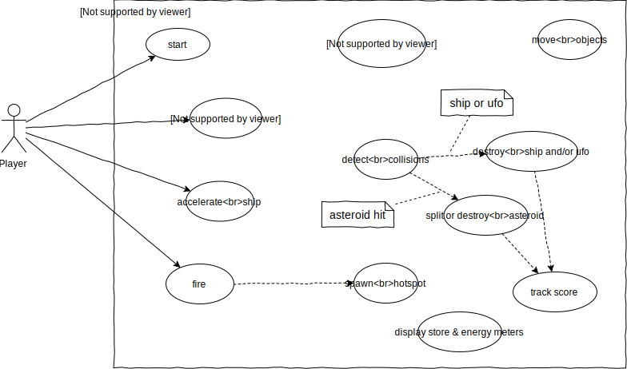
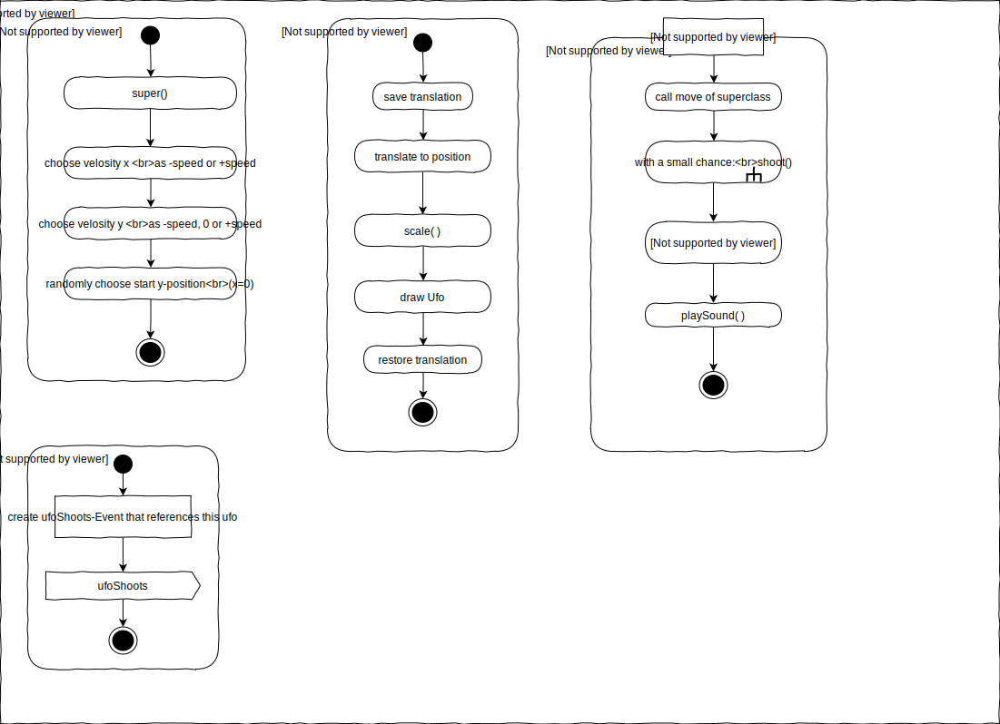

Welcome to this example project demonstrating the skills taught in the course  
**Entwicklung interaktiver Anwendungen II (EIA2)**  
at the Hochschule Furtwangen University (HFU)  
to the students of the curriculum Medienkonzeption (MKB)  

## Design
Most prominent are the skills to design complex software solutions using UML diagrams, specifically use-case, activity- and class-diagrams. Thus, browse the design documentation below first:  

- [Design Documentation](#design-documentation)  

## Production
Programming skills are required to prove the designs and to reiterate them. Also a designer must be capable of creating prototypes herself in order to tinker and come up with new ideas. Click on the link below to play the game designed:  

<a href="
https://jirkadelloro.github.io/EIA2-Inverted/X01_Appendix/eiaSteroids/eiaSteroids.html
">
https://jirkadelloro.github.io/EIA2-Inverted/X01_Appendix/eiaSteroids/eiaSteroids.html
</a>  

Find the code here:  

<a href="
https://github.com/JirkaDellOro/EIA2-Inverted/tree/master/X01_Appendix/eiaSteroids
">
https://github.com/JirkaDellOro/EIA2-Inverted/tree/master/X01_Appendix/eiaSteroids

## Reference
For completeness, this project also offers a code documentation automatically created by [TypeDoc](https://typedoc.org/), based on the comments in the code files in JSDoc format. See here:
<a href="
https://jirkadelloro.github.io/EIA2-Inverted/X01_Appendix/eiaSteroids/Documentation/Code/index.html
">
https://jirkadelloro.github.io/EIA2-Inverted/X01_Appendix/eiaSteroids/Documentation/Code/index.html

## Tools
These are the tools used for this project and throughout the course.
- [HTML5](https://developer.mozilla.org/en-US/docs/Web/Guide/HTML/HTML5)
- [TypeScript](https://www.typescriptlang.org/)
- [Visual Studio Code](https://code.visualstudio.com/)
- [git](https://git-scm.com/)
- [Github](https://github.com/)
- [draw.io](https://www.draw.io/)

## Notice
eiaSteroids was created by Prof. Jirka Dell'Oro-Friedl at the HFU in 2020.  
If you have any questions, please contact me at del@hs-furtwangen.de

  

# Design Documentation
The following documentation is a compilation of the finalized UML-diagrams created during the design, the production and the documentation of eiaSteroids. The first drafts where created with draw.io, the second draft by hand during the video shootings for the online course. Scans of the handmade diagrams can be found in the online course.  
The activity diagrams are not complete, since many small functions were trivial or already designed on similar entities. Also, in contrast to the first scribble, there is no hyperjump. Instead, a more interesting energy handling was designed which included a shield to protect the players spaceship at the cost of energy loss.

## Scribble

  

## Use-Case-Diagram

  

## Class-Diagram

  

## Activity-Diagrams: main program
  

  

## Activity-Diagram: Moveable
 

  

## Activity-Diagram: Asteroid
 

  

## Activity-Diagram: Projectile
 

  

## Activity-Diagram: Ufo
 

  

## Activity-Diagram: Ship
 

